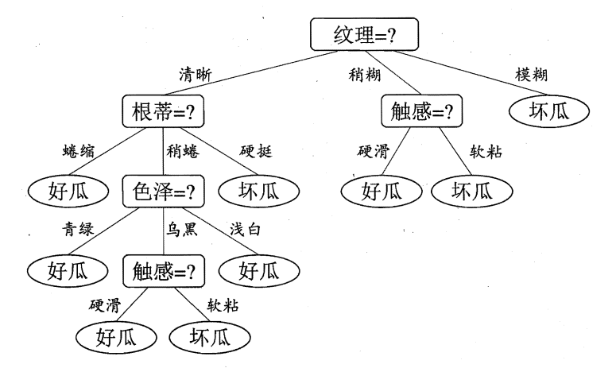

## 2. 图10-9所示的候选解排除算法的运行，没有显示产生的候选概念，而是产生由于过于一般，或过于特殊，或由于被其他概念包含而被排除的候选概念。重新做一次执行处理，显示这些概念和每个概念被排除的原因。

开始
初始化G为空间中最一般的概念； $G: {obj(X,Y,Z)}$
初始化S为第一个训练正例； $S: {obj(small, red, ball)}$
对于负例 $obj(small, blue, ball)$
  排除S中匹配该负例的成员。（无）
  使用不能匹配该负例的最一般的特化替换G。 $G: {obj(X, red, Z)}$
  排除G中比此更特殊的假设。（无）
对于正例 $obj(large, blue, ball)$
  排除G中不能匹配该正例的成员。（无）
  使用S的每个元素，若其不能匹配该正例，则使用匹配该正例的最特殊的泛化替换S。 $S: {obj(X, red, ball)}$
  排除S中比此更一般的假设。（无）
对于负例 $obj(large, red, cube)$
  排除S中匹配该负例的成员。（无）
  使用不能匹配该负例的最一般的特化替换G。 $G: {obj(X, red, Z)}$
  排除G中比此更特殊的假设。（无）
最终G=S且两个集合都只有一个概念，所以算法找到了与所有数据相一致的概念。 ${obj(X, red, Z)}$

## 4. 用10.4.3节中的信息论选择函数，详细说明ID3是怎么从表10-1中的实例建造图10-14中的树的。一定要说明用于每个测试的信息增益的计算和给出测试选择结果的计算。
$$
Ent(D) = -(\frac{6}{14} \log_2 \frac{6}{14} + \frac{3}{14} \log_2 \frac{3}{14} + \frac{5}{14} \log_2 \frac{5}{14})
$$

$$
Ent(D_1) = -(\frac{3}{4} \log_2 \frac{3}{4} + \frac{1}{4} \log_2 \frac{1}{4})
$$

$$
Ent(D_2) = -(\frac{2}{5} \log_2 \frac{2}{5} + \frac{1}{5} \log_2 \frac{1}{5} + \frac{2}{5} \log_2 \frac{2}{5})
$$

$$
Ent(D_3) = -(\frac{1}{5} \log_2 \frac{1}{5} + \frac{1}{5} \log_2 \frac{1}{5} + \frac{3}{5} \log_2 \frac{3}{5})
$$

$$
Gain(D, 信用历史) = Ent(D) - \sum_{v=1}^3 \frac{|D^v|}{|D| Ent(D^v)}
$$

$$
Ent(D_1) = -(\frac{4}{7} \log_2 \frac{4}{7} + \frac{1}{7} \log_2 \frac{1}{7} + \frac{2}{7} \log_2 \frac{2}{7})
$$

$$
Ent(D_2) = -(\frac{2}{7} \log_2 \frac{2}{7} + \frac{2}{7} \log_2 \frac{2}{7} + \frac{3}{7} \log_2 \frac{3}{7})
$$

$$
Gain(D, 债务) = Ent(D) - \sum_{v=1}^2 \frac{|D^v|}{|D| Ent(D^v)}
$$

$$
Ent(D_1) = -(\frac{2}{3} \log_2 \frac{2}{3} + \frac{1}{3} \log_2 \frac{1}{3})
$$

$$
Ent(D_2) = -(\frac{6}{11} \log_2 \frac{6}{11} + \frac{2}{11} \log_2 \frac{2}{11} + \frac{3}{11} \log_2 \frac{3}{11})
$$

$$
Gain(D, 抵押) = Ent(D) - \sum_{v=1}^2 \frac{|D^v|}{|D| Ent(D^v)}
$$

$$
Ent(D_1) = 0
$$

$$
Ent(D_2) = -(\frac{2}{4} \log_2 \frac{2}{4} + \frac{2}{4} \log_2 \frac{2}{4}) = 1
$$

$$
Ent(D_3) = -(\frac{5}{6} \log_2 \frac{5}{6} + \frac{1}{6} \log_2 \frac{1}{6})
$$

$$
Gain(D, 收入) = Ent(D) - \sum_{v=1}^3 \frac{|D^v|}{|D| Ent(D^v)}
$$

...

## 6. 为某个领域的一些实例建立一个简单的表格（例如用物种对动物分类），并通过ID3算法建立一棵决策树。
| 编号 | 色泽 | 根蒂 | 敲声 | 纹理 | 脐部 | 触感 | 好瓜 |
| ---- | ---- | ---- | ---- | ---- | ---- | ---- | ---- |
| 1    | 青绿 | 蜷缩 | 浊响 | 清晰 | 凹陷 | 硬滑 | 是   |
| 2    | 乌黑 | 蜡缩 | 沉闷 | 清晰 | 凹陷 | 硬滑 | 是   |
| 3    | 乌黑 | 蜡缩 | 浊响 | 清晰 | 凹陷 | 硬滑 | 是   |
| 4    | 青绿 | 蜷缩 | 沉闷 | 清晰 | 凹陷 | 硬滑 | 是   |
| 5    | 浅白 | 蜷缩 | 浊响 | 清晰 | 凹陷 | 硬滑 | 是   |
| 6    | 青绿 | 稍蜷 | 浊响 | 清晰 | 稍凹 | 软粘 | 是   |
| 7    | 乌黑 | 稍蜷 | 浊响 | 稍糊 | 稍凹 | 软粘 | 是   |
| 8    | 乌黑 | 稍蜷 | 浊响 | 清晰 | 稍凹 | 硬滑 | 是   |
| 9    | 乌黑 | 稍蜷 | 沉闷 | 稍糊 | 稍凹 | 硬滑 | 否   |
| 10   | 青绿 | 硬挺 | 清脆 | 清晰 | 平坦 | 软粘 | 否   |
| 11   | 浅白 | 硬挺 | 清脆 | 模糊 | 平坦 | 硬滑 | 否   |
| 12   | 浅白 | 蜷缩 | 浊响 | 模糊 | 平坦 | 软粘 | 否   |
| 13   | 青绿 | 稍蜷 | 浊响 | 稍糊 | 凹陷 | 硬滑 | 否   |
| 14   | 浅白 | 稍蜷 | 沉闷 | 稍糊 | 凹陷 | 硬情 | 否   |
| 15   | 乌黑 | 稍蜷 | 浊响 | 清晰 | 稍凹 | 软粘 | 否   |
| 16   | 浅白 | 蜷缩 | 浊响 | 模糊 | 平坦 | 硬滑 | 否   |
| 17   | 青绿 | 蜡缩 | 沉闷 | 稍糊 | 稍凹 | 硬滑 | 否   |

$$
\begin{array}{l}
\operatorname{Ent}\left(D^{1}\right)=-\left(\frac{3}{6} \log _{2} \frac{3}{6}+\frac{3}{6} \log _{2} \frac{3}{6}\right)=1.000 \\
\operatorname{Ent}\left(D^{2}\right)=-\left(\frac{4}{6} \log _{2} \frac{4}{6}+\frac{2}{6} \log _{2} \frac{2}{6}\right)=0.918 \\
\operatorname{Ent}\left(D^{3}\right)=-\left(\frac{1}{5} \log _{2} \frac{1}{5}+\frac{4}{5} \log _{2} \frac{4}{5}\right)=0.722
\end{array}
$$

$$
\begin{aligned}
\operatorname{Gain}(D, \text { 色泽 }) & =\operatorname{Ent}(D)-\sum_{v=1}^{3} \frac{\left|D^{v}\right|}{|D|} \operatorname{Ent}\left(D^{v}\right) \\
& =0.998-\left(\frac{6}{17} \times 1.000+\frac{6}{17} \times 0.918+\frac{5}{17} \times 0.722\right) \\
& =0.109 .
\end{aligned}
$$

类似的, 我们可计算出其他属性的信息增益:

$$
\begin{array}{l}
\operatorname{Gain}(D \text {, 根蒂 })=0.143 ; \operatorname{Gain}(D, \text { 敲声 })=0.141 ; \\
\operatorname{Gain}(D, \text { 纹理 })=0.381 ; \operatorname{Gain}(D, \text { 脐部 })=0.289 ; \\
\operatorname{Gain}(D \text {, 触感 })=0.006 .
\end{array}
$$

显然，属性“纹理”的信息增益最大，于是它被选为划分属性

$$
 \operatorname{Gain}\left(D^{1}\right. , 色泽  )=0.043 ; \operatorname{Gain}\left(D^{1}\right. , 根蒂  )=0.458 ;
 \operatorname{Gain}\left(D^{1}\right. , 敲声  )=0.331 ; \quad \operatorname{Gain}\left(D^{1}\right. , 脐部  )=0.458 ;
 \operatorname{Gain}\left(D^{1}\right. , 触感  )=0.458 .
$$

“根蒂”、“脐部”、“触感”3个属性均取得了最大的信息增益，任选其一作为划分。

