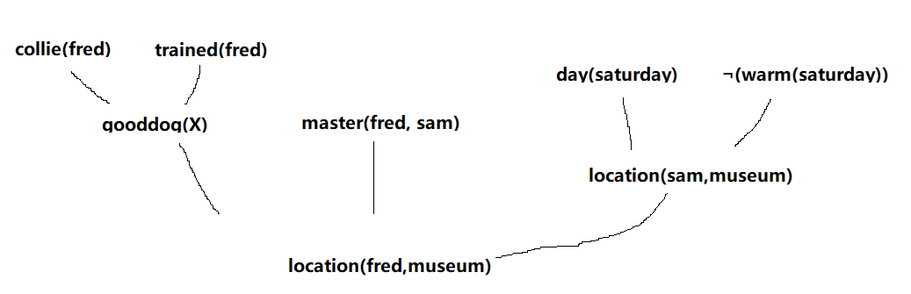

## 3. 用归结法回答例3.3.4中的询问。
1. Fred是一只柯利狗。
   $collie(fred)$
2. Sam是Fred的主人。
   $master(fred, sam)$
3. 这一天是星期六。
   $day(saturday)$
4. 星期六很冷。
   $\neg (warm(saturday))$
5. Fred是训练有素的。
   $trained(fred)$
6. 长毛垂耳狗是很好的狗，训练有素的柯利狗也是如此。
   $\forall X [spaniel(X) \vee (collie(X) \wedge trained(X)) \rightarrow gooddog(X)]$
7. 如果一条狗是好狗，而且它有主人，那么他应该和主人在一起。
   $\forall (X, Y, Z) [gooddog(X) \wedge master(X, Y) \wedge location(Y, Z) \rightarrow location(X, Z)]$
8. 如果是星期六，而且天气很暖和，那么Sam就在公园里。
   $(day(saturday) \wedge warm(saturday) \rightarrow location(sam, park))$
9. 如果是星期六，而且天气不暖和，那么Sam就在博物馆里。
   $(day(saturday) \wedge \neg warm(saturday) \rightarrow location(sam, museum))$

---

1. $collie(fred) \qquad P$
2. $trained(fred) \qquad P$
3. $\forall X [spaniel(X) \vee (collie(X) \wedge trained(X)) \rightarrow gooddog(X)] \qquad P$
4. $(collie(X) \wedge trained(X)) \rightarrow gooddog(X) \qquad E$
5. $gooddog(fred) \qquad I(1,2,4)$
6. $day(saturday) \qquad P$
7. $\neg (warm(saturday)) \qquad P$
8. $(day(saturday) \wedge \neg warm(saturday) \rightarrow location(sam, museum)) \qquad P$
9. $location(sam, museum) \qquad I(6,7,8)$
10. $master(fred, sam) \qquad P$
11. $\forall (X, Y, Z) [gooddog(X) \wedge master(X, Y) \wedge location(Y, Z) \rightarrow location(X, Z)] \qquad P$
12. $location(fred, museum) \qquad I(5,9,10)$

## 13. 将下面的谓词演算表达式化为子句形式：
$$
\forall (X) (p(X) \rightarrow \{\forall (Y) [p(Y) \rightarrow p(f(X, Y))] \wedge \neg A(Y) [q(X, Y) \rightarrow p(Y)]\})
$$

- $p(X) \rightarrow \{\forall (Y) [p(Y) \rightarrow p(f(X, Y))] \wedge \neg A(Y) [q(X, Y) \rightarrow p(Y)]\}$
- $\neg p(X) \vee \{\forall (Y) [p(Y) \rightarrow p(f(X, Y))] \wedge \neg A(Y) [q(X, Y) \rightarrow p(Y)]\}$
- $\{\neg p(X) \vee [p(Y) \rightarrow p(f(X, Y))]\} \wedge \{\neg p(X) \vee \neg A(Y) [q(X, Y) \rightarrow p(Y)]\}$
- 
- $\neg p(X) \vee [p(Y) \rightarrow p(f(X, Y))]$
- $\neg p(X) \vee [\neg p(Y) \vee p(f(X, Y))]$
- $\neg p(X) \vee \neg p(Y) \vee p(f(X, Y))$
- 
- $\neg p(X) \vee \neg A(Y) [q(X, Y) \rightarrow p(Y)]$
- $\neg p(X) \vee \neg A(Y) [\neg q(X, Y) \vee p(Y)]$
- $\neg p(X) \vee [\neg A(Y) \wedge \neg q(X, Y) \vee \neg A(Y) \wedge p(Y)]$
- $\neg p(X) \vee \neg A(Y) \wedge \neg q(X, Y) \vee \neg A(Y) \wedge p(Y)$
- 
- $\neg p(X) \vee \neg A(Y)$
- $\neg q(X, Y) \vee \neg A(Y) \wedge p(Y)$