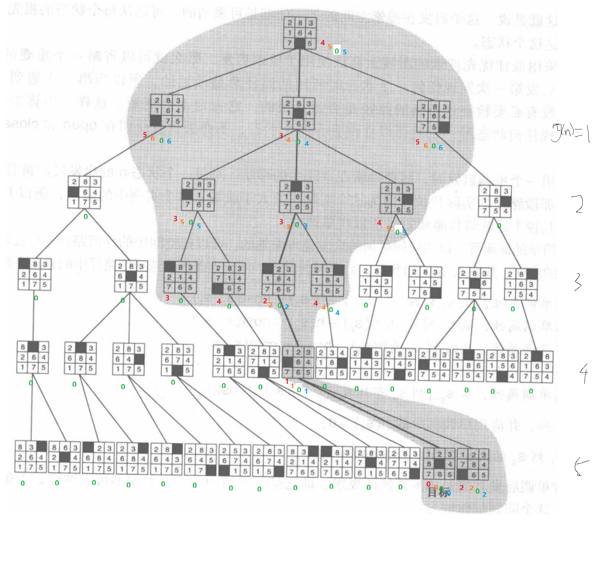

### 6. 把图4-14所示的三种8格拼图游戏的启发与错位牌的距离和加上直接颠倒数乘2这个启发进行比较。考虑以下这几个方面：
a. 估计到目标距离的精度。这需要你首先导出最短路径解，然后再以其为标准。
b. 信息度。哪一个启发会最有效地修剪空间？
c. 8格拼图游戏的这三种启发都是单调的吗？
d. 可采纳性。这三种启发中的哪一个是以到达目标的路径的实际代价为上限的？在一般情况下证明你的结论，或者给出一个反例。

<!-- 精度：最少查询次数和实际查询次数的比。 -->
启发：
- 错位牌数：5/13=0.38461538461538461538461538461538
- 错位的距离和：5/11=0.45454545454545454545454545454545
- 2*直接颠倒数：5/46=0.10869565217391304347826086956522
- 错位的距离和+2*直接颠倒数：5/11=0.45454545454545454545454545454545

信息度：
对于两个 $A^{*}$ 启发 $h_1$ 和 $h_2$，如果对于搜索空间中的所有状态n都满足 $h_1(n) \le h_2(n)$，那么就说 $h_2$ 比 $h_1$，具有更高的信息度。

由以上搜索树可以发现，启发“错位的距离和”能够有效的修剪空间。

单调性指的是：对于所有的状态 $n_i$ 和 $n_j$，其中 $n_j$ 是 $n_i$ 的后继，$h(n_i)-h(n_j) \le cost(n_i, n_j)$，由此可以判断四个启发都是单调的。

关于可采纳性，我认为四个算法都是以其到达目标的实际代价为上限的，h(n) < 真实代价。如果h(n)经常都比从n移动到目标的实际代价小（或者相等），则A\*保证能找到一条最短路径。h(n)越小，A\*扩展的结点越多，运行就得越慢。越接近Dijkstra算法。
