**什么是机器学习？**
- 机器学习是研究如何使用计算机来模拟人类学习活动的一门学科。——研究计算机获取新知识和新技能、识别现有知识、不断改善性能、实现自我完善的方法。
- 学习是一个有特定目的的知识获取过程，其内在行为是获取知识、积累经验、发现规律，其外在表现是使系统性能得到改进、系统实现自我完善、自适应环境。
- 机器学习是智能系统不断地积累经验以改善系统性能的过程。

机器学习的方法
- 归纳学习
- 类比学习
- 基于解释的学习
- 遗传算法
- 人工神经网络
- 随机方法


## 10.1 基于符号学习的框架
学习过程的总体模型
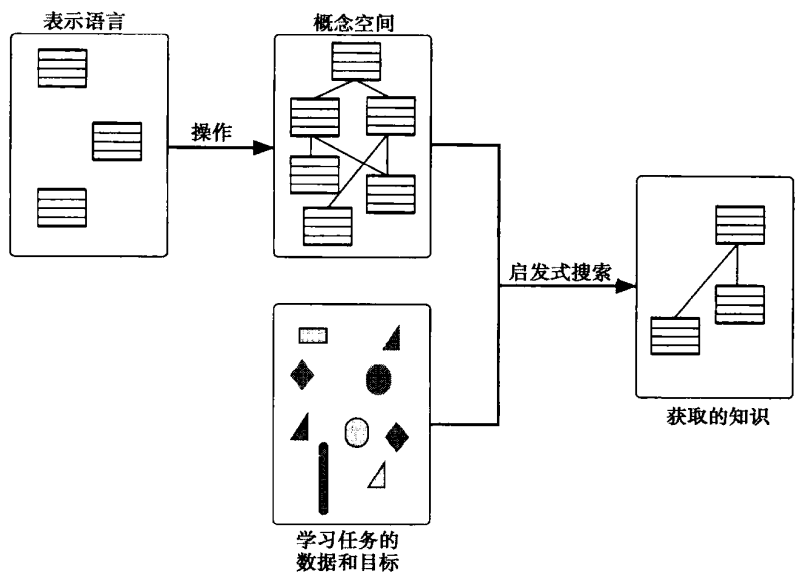

### 1. 学习任务的数据和自标。
- 概念学习算法，初始状态是目标类的一组正例（通常也有反例），学习的目标是得出一个通用的定义，它能够让学习器辨识该类的未来的实例。
- 基于解释的学习，试图从单一的训练实例和预先给定的特定领域的知识库中推出一个泛化的概念。
- 概念聚类算法，阐释了归纳问题的另外一种情况：这些算法的初始状态是未分类的实例集合，而不是从已经分好类的实例集合进行学习。

### 2. 所学知识的表示
例如，两个“球”的实例（但是不足以学习概念）可以表示如下：
- $size(obj1, small) \wedge color(obj1, red) \wedge shape(obj1, round)$
- $size(obj2, large) \wedge color(obj2, red) \wedge shape(obj2, round)$

“球”的泛化概念可以定义为：$size(X, Y) \wedge color(X, Z) \wedge shape(X, round)$

### 3. 操作的集合
$size(obj1, small) \wedge color(obj1, red) \wedge shape(obj1, round)$

用变量来替换单个常量，产生出下面的泛化：
- $size(obj1, X) \wedge color(obj1, red) \wedge shape(obj1, round)$
- $size(obj1, small) \wedge color(obj1, X) \wedge shape(obj1, round)$
- $size(obj1, small) \wedge color(obj1, red) \wedge shape(obj1, X)$
- $size(X, small) \wedge color(X, red) \wedge shape(X, round)$

### 4. 概念空间
上面讨论的表示语言和操作定义了潜在概念定义的空间。

### 5. 启发式搜索
- $size(obj1, small) \wedge color(obj1, red) \wedge shape(obj1, round)$
- $size(obj2, large) \wedge color(obj2, red) \wedge shape(obj2, round)$
- $size(X, Y) \wedge color(X, red) \wedge shape(X, round)$

Patrick Winston的程序学习结构化概念的一般定义，如积木世界中的“拱门”。
训练数据是一系列概念的正例和反例：属于该类别的积木实例，以及小差别（near miss）的实例。

概念“拱门”的实例和小差别的实例
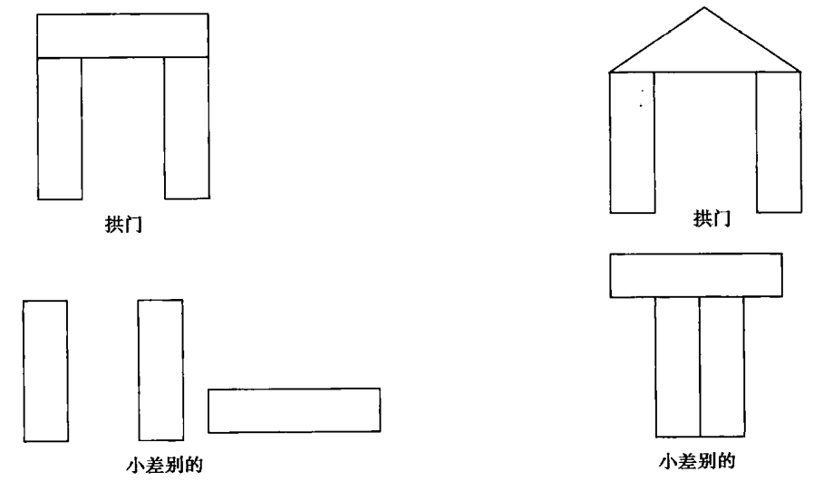

对包含多个实例的描述的泛化
- a)拱门的一个例子和它的网络描述
  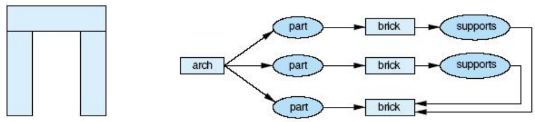
- b)另外一个拱门的例子和它的网络描述
  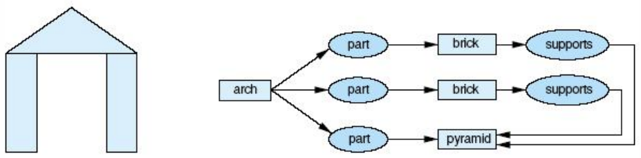
- c)给定砖和棱锥都是多边形的背景知识
  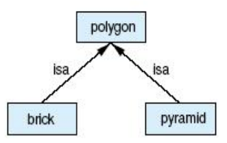
- d)包含着这两个例子的泛化
  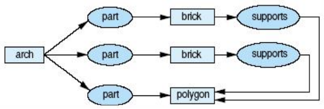

排除小差别的描述的特化（注：在图c中为a加了约束以使其不与b匹配）
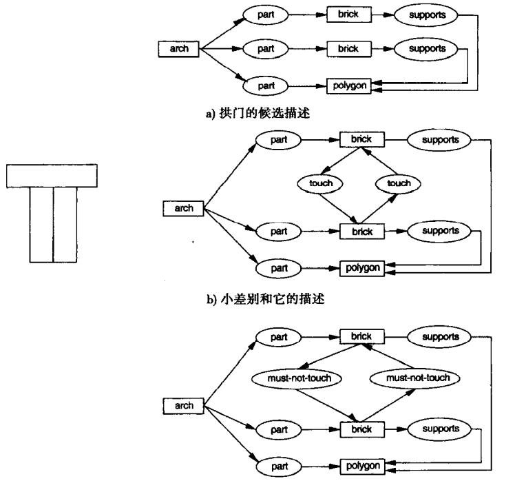


## 10.2 变形空间搜索
变形空间搜索（version space search）把归纳学习解释为对概念空间的搜索。变形空间搜索利用了这样一个事实：泛化操作对空间中的概念进行排序，然后用这个顺序来指导搜索。

### 10.2.1 泛化操作符和概念空间
泛化和特化是定义一个概念空间的最常用的两种操作。机器学习中用到的最主要的泛化操作有：
1. 用变量替换常量。$color(ball, red) \Rightarrow color(X, red)$
2. 从合取表达式中去掉一些条件。$shape(X, round) \wedge size(X, small) \wedge color(X, red) \Rightarrow shape(X, round) \wedge color(X, red)$
3. 对表达式增加一个析取式。$shape(X, round) \wedge size(X, small) \wedge color(X, red) \Rightarrow shape(X, round) \wedge size(X, small) \wedge (color(X, red) \vee color(X, blue))$
4. 用属性的超类来替换属性。$color(X, red) \Rightarrow color(X, primary_color)$

表达式p比q更泛化当且仅当 $P \supseteq Q$。“更泛化”关系定义了逻辑语句空间上的一个偏序关系。我们用符号 $\ge$，来表示这种关系，$p \ge q$ 表示p比q更泛化。
如果概念p比q更泛化，我们说p覆盖q。我们这样定义覆盖关系：令p(x)和q(x)为分类对象概念的正例描述。换句话说，对于物体x，有 $p(x) \rightarrow positive(x)$ 和 $q(x) \rightarrow positive(x)$。p覆盖q当且仅当 $q(x) \rightarrow positive(x)$ 是 $p(x) \rightarrow positive(x)$ 的逻辑结果。

$color(X, Y) \ge color(ball, Z) \ge color(ball, red)$
- $Sizes = \{large, small\}$
- $Colors = \{red, white, blue\}$
- $Shapes = \{ball, brick, cube\}$

这些对象可以用谓词 $obj(Sizes, Colors, Shapes)$ 来表示。

一个概念空间
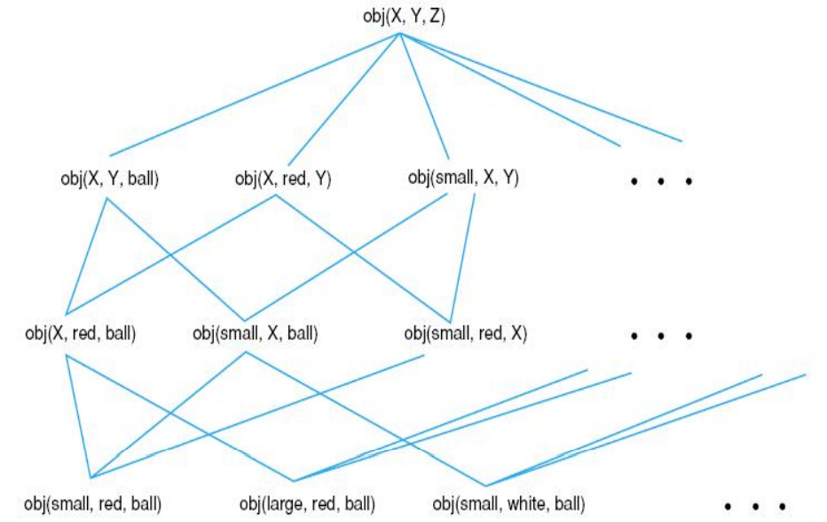

### 10.2.2 候选解排除算法
本节讨论三种搜索概念空间的算法。前两个算法缩减变形空间的方向分别是：由特殊到一般和由一般到特殊。第三种算法，称为候选解排除，它把这两种办法结合起来成为双向搜索。

对假设集S，我们如下定义特殊到一般的搜索：
```
开始
初始化S为第一个正例；
N为目前所见的所有反例集合；
对每个正例p
    开始
    对每个s∈S，如果s不匹配p，用匹配p的最特殊的泛化来替换s；
    排除S中比S中其他假设更一般的假设；
    排除匹配N中已有反例的S中的假设；
    结束；
对每个反例n
    开始
    排除匹配n的S的所有成员；
    添加n到N中，以检查后来的假设防止超泛化；
    结束；
结束
```

在这个算法中，反例导致了对候选概念的特化，算法用正例来排除过于特殊化的概念。
```
开始
初始化G使其包含空间中最一般的概念；
P包含当前见到的所有正例；
对每个反例n
    开始
    对每一个匹配n的g∈G，用不匹配n的最一般特化来替换g；
    排除G中比G中其他假设更特殊的所有假设；
    排除G中不能匹配P中某些正例的所有假设；
    结束；
对每个正例p
    开始
    排除G中不能匹配p的所有假设；
    把p添加到P中；
    结束；
结束
```

反例在防止超泛化中的作用


学习概念“球”的概念空间由特殊到一般的搜索
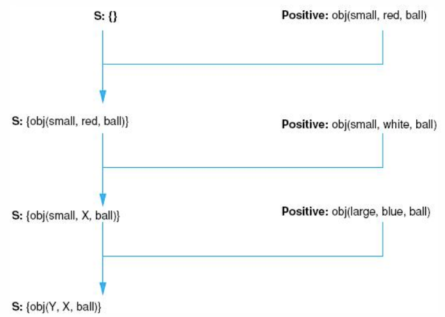

算法特化G并泛化S直到它们收敛在目标概念上。算法定义如下：
```
开始
初始化G为空间中最一般的概念；
初始化S为第一个训练正例；
对每个新正例p
    开始
    排除G中不能匹配p的所有成员；
    对每个s∈S，如果s不匹配p，用匹配p的最特殊的泛化来替换s；
    排除S中比S中其他假设更一般的假设；
    排除S中比G中某些假设更一般的假设；
    结束；
对每个新反例n
    开始
    排除匹配n的S的所有成员；
    对每一个匹配n的g∈G，用不匹配n的最一般的特化来替换g；
    排除G中比G中其他假设更特殊的所有假设；
    排除G中比S中某些假设更特殊的所有假设；
    结束；
    如果G=S并且两个集合都只有一个概念，则算法就找到了与所有数据相一致的概念，算法就终止；
    如果G和S为空集，则不存在这样的概念：它覆盖所有的正例，而不覆盖一个反例；
    结束
```

学习概念“红球”的候选解排除算法
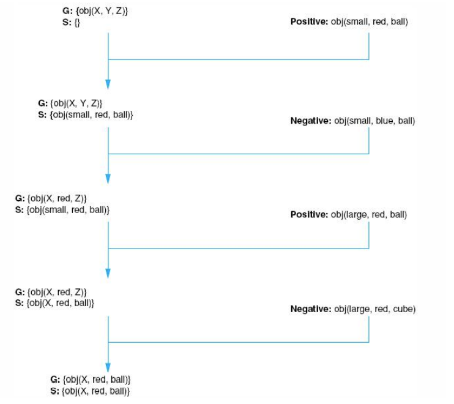

候选解排除算法中G和S集合的收敛边界
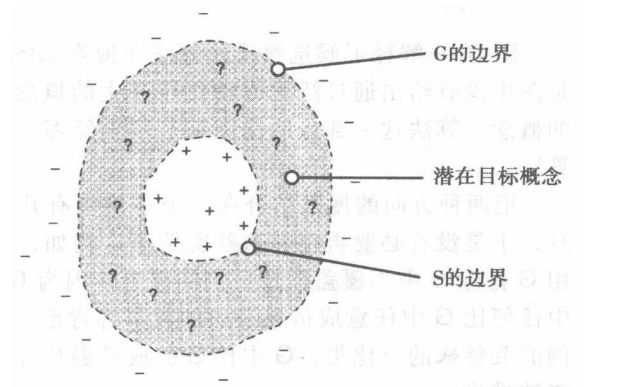

**基于描述空间的归纳学习方法**
- 在Mitchell提出的描述空间方法中，根据概念的一般性和特殊性把概念空间表示成偏序集的形式。
- 偏序集的最大元素G称为零描述。
- 零描述是概念空间中恒真的概念描述，是概念中最一般的概念的集合。
- 偏序集的最小元素S是所有训练实例，是概念空间最特殊的概念集合。

**消除候选者算法**
1. 初始化概念空间 $H = <G, S>$，其中，G为零描述集合，S为训练集合，初始化时，S中只含第一个正例。
2. 接受一个新的训练实例。如果实例为正例，则从G中删去所有与该例不相容的概念，并更新集合S，尽可能小地对S进行一般化，以相容这个新的正实例；如果实例为反例，则首先从S中删去所有与该例相容的概念，并更新集合G，尽可能小地特殊G中的元素，以便它们不相容这个反例。
3. 如果 $G \neq S$，则重复步骤（2）；否则输出H。

...


## 10.3 ID3决策树归纳算法
ID3和候选解排除算法一样，从实例中归纳概念。
ID3用决策树来表示概念，这种表示使我们能够用测试特定属性的方法决定对象的分类。

借贷应用中信用历史的数据
| NO. | 风险 | 信用历史 | 债务 | 抵押 | 收入            |
| --- | ---- | -------- | ---- | ---- | --------------- |
| 1   | 高   | 坏       | 高   | 无   | 0-15000美元     |
| 2   | 高   | 未知     | 高   | 无   | 15000-35000美元 |
| 3   | 中等 | 未知     | 低   | 无   | 15000-35000美元 |
| 4   | 高   | 未知     | 低   | 无   | 0-15000美元     |
| 5   | 低   | 未知     | 低   | 无   | 超过35000美元   |
| 6   | 低   | 未知     | 低   | 无   | 超过35000美元   |
| 7   | 高   | 坏       | 坏   | 无   | 0-15000美元     |
| 8   | 中等 | 坏       | 坏   | 充分 | 超过35000美元   |
| 9   | 低   | 好       | 好   | 无   | 超过35000美元   |
| 10  | 低   | 好       | 好   | 充分 | 超过35000美元   |
| 11  | 高   | 好       | 好   | 无   | 0-15000美元     |
| 12  | 中等 | 好       | 好   | 无   | 15000-35000美元 |
| 13  | 低   | 好       | 好   | 无   | 超过35000美元   |
| 14  | 高   | 坏       | 坏   | 无   | 15000-35000美元 |

信用风险评定的决策树


信用风险评定的简化的决策树
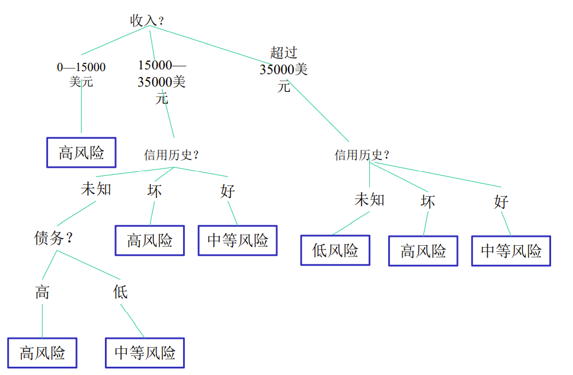

ID3算法假定可能性最大的树是能覆盖所有训练实例的最简单的决策树。

奥卡姆剃刀：如果少做就能完成，多做的就是徒劳——如无必要，勿增实体。

### 10.3.1 自顶向下决策树归纳
归纳算法初始状态是对目标类别正确分类的成员的样本。ID3根据以下算法建造决策树：
```
function induce_tree(example_set, Properties)
begin
if all entries in example_set are in the same class
  then return a leaf node labeled with that class
  else if Properties is empty
    then return leaf node labeled with disjunction of all classes in example_set
    else begin
      select a property, P, and make it the root of the current tree;
      delete P from Properties;
        for each value, V, of P,
          begin
            create a branch of the tree labeled with V;
            let partition_v be elements of example_set with values V for property P;
            call induce_tree(partition_v, Properties), attach result to branch V
          end
    end
end
```

**基于决策树的归纳学习方法**
Hunt提出的概念学习系统CLS（Concept Learning System）是一种基于决策树的归纳学习系统。1979年，J.R.Quinlan在CLS基础上进行了发展，提出了ID3算法，该算法不仅能方便地表示概念的“属性-值”信息结构，而且能从大量实例中有效地生成相应的决策树模型。

决策树构造算法CLS
1. 如果训练实例集T中所有实例的分类结果均为C，则返回C。
2. 从属性表AttList中任选一个属性作为检测属性。
3. 若属性 $A_i$ 的值域 $ValueType(A_i)$ 中有s个不同的取值，则将T分成s个子集 $T_1, T_2, ..., T_S$，每个子集的所有元素的属性 $A_i$ 的取值相同。
4. 更新属性表，从属性表Attrlist中删除检测属性 $A_i$。
5. 对每个子集 $T_k$，若子集 $T_k$ 中的所有实例的分类结果均为 $C_j$，则生成叶节点 $C_j$；若子集中 $T_k$ 所有实例的分类结果有两个或两个以上，则对子集 $T_k$ 和更新后的属性表转到步骤2），递归调用CLS构造算法，生成 $T_k$ 的子树。

...

### 10.3.2 测试选择的信息论方法
我们可以把实例的每个属性看成是对它的分类增加一定数量的信息。
信息论提供了度量一条消息的信息含量的数学基础。

Shannon对这些进行了形式化，定义一条消息中的信息量为每条可能消息出现概率p的函数，即 $- \log_2 p$。给定消息空间 $M = \{m_1, m_2, ..., m_n\}$ 和每条消息出现的概率 $p(m_i)$，消息M的信息含量期望如下式：
$$
I[M] = (\sum_{i=1}^{n} -p(m_i) \log_2 (p(m_i))) = E[- \log_2 p(m_i)]
$$

消息的信息含量用比特来度量。例如掷普通硬币结果的消息的信息含量是：
$$
I[Coin toss] = -p(heads) \log_2 (p(heads)) - p(tails) \log_2 (p(tails))
             = - \frac{1}{2} \log_2 (\frac{1}{2}) - \frac{1}{2} \log_2 (\frac{1}{2})
             = 1 bit
$$

假设有训练实例集C。如果我们把有n个值的属性P作为当前树的根节点，这将把C分成子集 $\{C_1, C_2, ..., C_n\}$。在把P当作根节点后完成树所需的信息的期望为：
$$
E[P] = \sum_{i=1}^{n} \frac{|C_i|}{|C|} I[C_i]
$$

从属性P得到的增益通过树的总信息量减去完成树的信息期望来计算：
$$
gain(P) = I[C] - E[P]
$$

**ID3算法**
- 由于CLS决策树构造算法每次从属性表AttrList中任选一个属性 $A_i$ 作为检测属性来扩展生成决策树，按照训练集T中所有实例的属性Ai的取值来划分实例子集，因此，CLS算法的开销较大，效率较低。
- Quinlan提出了ID3算法，对检测属性的选择给出一种启发式规则，这个规则选择平均信息量（熵）最小的属性检测 $A_i$，因此又称为最小熵原理。

若选择属性表 $AttrList = \{A_1, A_2, ..., A_n\}$ 中的属性任选一个属性 $A_i$ 为检测属性，则由 $A_i$ 的值域 $ValueType(A_i) = \{V_1, ..., V_s\}$ 的s个取值把训练实例集T分为s个子集：$T = \Cup_{K=1}^{S} T_K^{(i)}$
子集 $T_K^{(i)}$ 中的所有实例的属性 $A_i$ 的取值为 $V_k$。
T中的实例的分类结果组成了分类结果表 $Class = \{C_1, C_2, ..., C_j, ..., C_m\}$，若分类结果为 $C_j$ 的实例数为 $e_j, 1 \le j \le m$，且 $\sum_{j=1}^{m} e_j = |T|$
|T|表示训练实例集T中的实例总数，则实例分类结果为 $C_j$ 的概率为：$P_j = \frac{e_j}{|T|}$

定义训练实例集T的平均信息量为：
$$
I(T) = -\sum_{j=1}^{m} P_j \log_2 P_j = -\sum_{j=1}^{m} \frac{e_j}{|T|} \log_2 \frac{e_j}{|T|} = - \frac{(\sum_{j=1}^{m} e_j \log_2 \frac{e_j}{|T|})}{|T|}
$$

类似可定义 $T_K^{(i)}$ 的实例平均信息量为：
$$
I(T_K^{(i)}) = - \frac{(\sum_{j=1}^{m} e_j^{(i)} \log_2 \frac{e_j^{(i)}}{|T_K^{(i)}|})}{|T_K^{(i)}|}
$$
其中，$e_j^{(i)}$ 为子集 $T_K^{(i)}$ 中分类结果 $C_j$ 的实例数，$T_K^{(i)}$ 为子集中实例总数，$\sum_{j=1}^{m} e_j^{(i)} = |T_k^{(i)}|$

若选择属性 $A_i$ 作为检测属性将训练集T分为s个子集后，可由各实例子集的实例总信息量 $|T_K^{(i)}| • I(T_K^{(i)})$ 之和对实例集|T|的实例总数T的平均值来表示为实例集T的平均信息量。
即：$I(T, A_i) = \frac{\sum_{K=1}^{S} |T_K^{(i)}| • I(T_K^{(i)})}{|T|}$

**选择属性 $A_i$ 作为检测属性来将实例集T划分子集的启发式规则**
选择属性作为检测属性，应由属性 $A_i$ 的不同值把实例集划分为若干子集之前与之后的实例平均信息量的差最大，即使得 $GI(T, A_i) = I(T) - I(T, A_i)$ 的值最大。$GI(T, A_i)$ 可认为是属性 $A_i$ 对训练实例集T的信息量，因此，启发式规则实际是选择信息量最小的属性作为检测属性 $A_i$ 来划分实例集。

...
