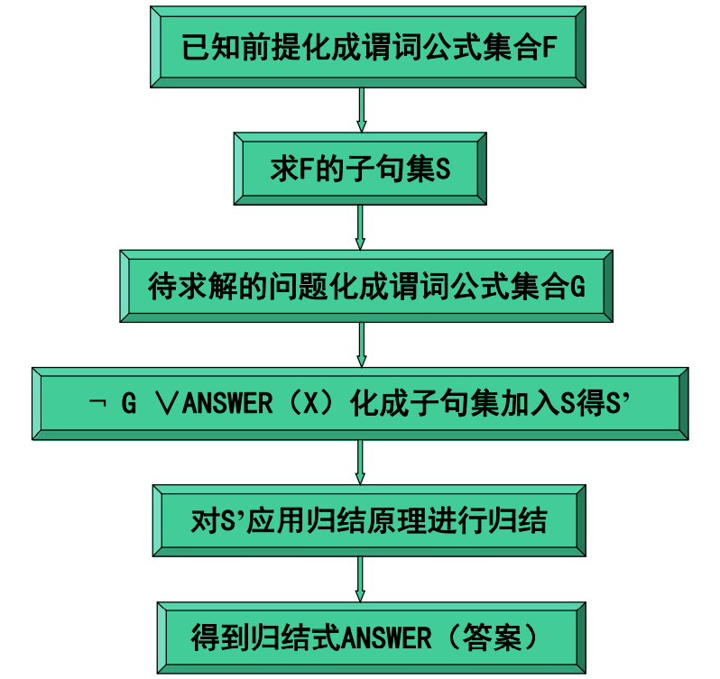

## 14.2 归结定理证明

### 14.2.1 概述

归结是命题演算或谓词演算中的一种定理证明技术，已经成为人工智能问题求解研究的一部分。
归结是一个可靠的推理规则，当用来生成一个反驳时，归结又是完备的。

归结反驳证明包括以下步骤：

1. 将前提或公理转化为子句形式。
2. 将要证明的命题取反，转化为子句形式，加人公理集合。
3. 归结这些子句，生成可以从逻辑上推导出的新子句。
4. 通过生成空子句得出矛盾。
5. 用来得出空子句的代换是那些使得取反后的目标的反（即最初要证明的）为真的代换。

归结反驳证明要求将公理和目标的反化为一种正规的形式，称为子句形式。

- 子句形式将逻辑数据库表示为文字的析取的集合。
- 文字是一个原子表达式或原子表达式的反。

归结的最一般形式称为二元归结。

### 14.2.2 为归结反驳生成子句形式

归结证明过程需要将数据库中描述一个状态的所有语句转化为一个标准形式，称为子句形式。
数据库采用的形式可以看作是析取子句的合取。
合取的原因是组成数据库的所有子句在同一时刻都假定为真。

将任意的谓词演算语句集合化简为子句形式。
1. 首先，使用第2章中已经证明的等式：$a \rightarrow b \equiv \neg a \vee b$ 消去 $\rightarrow$。
2. 然后，化简反的范围。可以使用第2章中的几个变换来实现，包括：
   - $\neg (\neg a) \equiv a$
   - $\neg (\exists X) (a(X)) \equiv (\forall X) \neg a(X)$
   - $\neg (\forall X) b(X) \equiv (\exists X) \neg b(X)$
   - $\neg (a \wedge b) \equiv \neg a \vee \neg b$
   - $\neg (a \vee b) \equiv \neg a \wedge \neg b$
3. 然后，通过重命名所有变量进行标准化，使得不同量词限制的变量具有惟一的名字。
   - $((\forall X) a(X) \vee (\forall X) b(X)) \equiv (\forall X) a(X) \vee (\forall Y) b(Y)$
4. 将所有量词不改变顺序全部移到左边。
   - 第4步后，子句称为前束范式，因为所有量词都在前面作为前缀，表达式或母式跟在后面。
5. 在此，所有存在量词都可以被一个称为斯柯伦化（skolemization）的过程消除。
6. 去掉所有全称量化。
7. 然后将表达式转化为析取子句的合取形式。
8. 将合取分为单独的子句。
9. 最后一步要再次分开地来标准化变量。

### 14.2.3 二元归结证明过程
**归结原理**
定义：若P是原子谓词，则称P与 $\neg P$ 为互补文字。

1、命题逻辑中的归结原理

定义：设 $C_1$ 与 $C_2$ 是子句集中的任意两个子句，如果 $C_1$ 中的文字 $L_1$ 与 $C_2$ 中的 $L_2$ 互补，那么从 $C_1$ 和 $C_2$ 中分别消去 $L_1$ 和 $L_2$，并将而个子句中余下的部分析取，构成一个新子句 $C_{12}$，则称这一过程为归结，称 $C_{12}$ 为 $C_1$ 和 $C_2$ 的归结式，称 $C_1$ 和 $C_2$ 为 $C_{12}$ 的亲本子句。

定理：归结式 $C_{12}$ 是其亲本子句 $C_1$ 与 $C_2$ 的逻辑结论。

定理证明：设 $C_1 = L \vee C_1', C_2 = \neg L \vee C_2'$
通过归结可得到：$C_{12} = C_1' \vee C_2'$
$C_1$ 和 $C_2$ 是 $C_{12}$ 的亲本子句。
因为：$C_1 ' \vee L \Leftrightarrow \neg C_1' \rightarrow L$
$\neg L \vee C_2' \Leftrightarrow L \rightarrow C_2'$
所以：$C_1 \wedge C_2 = (\neg C_1' \rightarrow L) \wedge (L \rightarrow C_2')$
根据假言三段论得到：$(\neg C_1' \rightarrow L) \wedge (L \rightarrow C_2') \Rightarrow \neg C_1' \rightarrow C_2'$
因为：$\neg C_1' \rightarrow C_2' \Leftrightarrow C_1' \vee C_2' = C_{12}$
所以：$C_1 \wedge C_2 \Rightarrow C_{12}$
可知 $C_{12}$ 是其亲本子句 $C_1$ 和 $C_2$ 的逻辑结论。

推论1：设 $C_1$ 与 $C_2$ 是子句集S中的两个子句，$C_{12}$ 是它们的归结式，若用 $C_{12}$ 代替 $C_1$ 和 $C_2$ 得到新子句集 $S_1$，则由 $S_1$ 的不可满足性可推出原子句集S的不可满足性，即 $S_1 的不可满足性 \Rightarrow S的不可满足性$。

推论2：设 $C_1$ 与 $C_2$ 是子句集S中的两个子句，$C_{12}$ 是它们的归结式，若把 $C_{12}$ 加入S中得到新子句集 $S_2$，则S与 $S_2$ 在不可满足的意义上是等价的，即 $S_2的不可满足性 \Rightarrow S的不可满足性$。

2、谓词逻辑中的归结原理
设 $C_1$ 与 $C_2$ 两个没有相同变元的子句，$L_1$ 和 $L_2$ 分别是 $C_1$ 和 $C_2$ 中的文字，若 $\sigma$ 是 $L_1$ 和 $\neg L_2$ 的最一般合一，则称 $C_{12} = (C_1 \sigma - \{L_1 \sigma\}) \cup (C_2 \sigma - \{L_2 \sigma\})$ 为 $C_1$ 和 $C_2$ 的二元归结式，$L_1$ 和 $L_2$ 称为归结式的文字。

定义：子句 $C_1$ 和 $C_2$ 归结式是下列的二元归结式之一：
1. $C_1$ 和 $C_2$ 的二元归结式。
2. $C_1$ 和 $C_2$ 的因子 $C_2 \sigma_2$ 的二元归结式。
3. $C_1$ 的因子 $C_1 \sigma_1$ 与 $C_2$ 的二元归结式。
4. $C_1$ 的因子 $C_1 \sigma_1$ 与 $C_2$ 的因子 $C_2 \sigma_2$ 二元归结式。

**归结反演**
定义：应用归结原理证明结论为真的过程称为归结反演。

设F为已知前提的公式集，Q为目标公式（结论），用归结反演证明Q为真的步骤是：
1. 否定Q，得到 $\neg Q$。
2. 把 $\neg Q$ 并入到公式集F中，得到 $\{F, \neg Q\}$。
3. 把公式集 $\{F, \neg Q\}$$ 化为子句集S。
4. 应用归结原理对子句集S中的子句进行归结，并把每次归结得到的归结式都并入S中。如此反复进行，若出现了空子句，则停止归结，此时就证明了Q为真。

...

### 14.2.4 归结策略和简化技术
子句的可能组合会导致组合爆炸。
启发式搜索在归结证明过程中非常重要，它也是问题求解弱方法。

- 宽度优先策略
- 成组支持策略
- 单个优先策略
- 线性输入形式策略
- 其他策略和简化技术

### 14.2.5 从归结反驳中抽取解答
**基于归结反演的问题求解步骤**
1. 把已知前提用谓词公式表示出来，并且化为相应的子句集S。
2. 把待求解的问题也用谓词公式表示出来，然后把它的否定式与谓词ANSWER构成一个析取式，ANSWER是一个为了求解问题而专设的谓词，其变元必须与问题公式的变元完全一致。
3. 把此析取式化为子句集，并且把该子句集并入到子句集S中，得到子句集S’。
4. 对S’应用归结原理进行归结。
5. 若得到归结式ANSWER，则答案就在ANSWER中。

...
