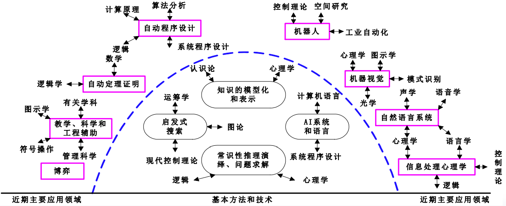
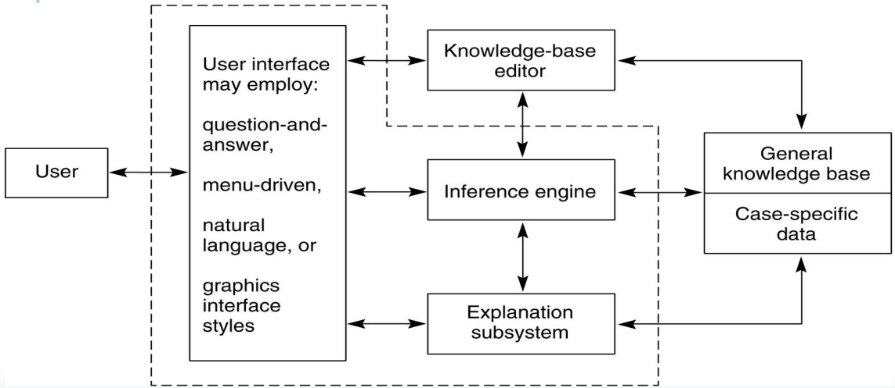
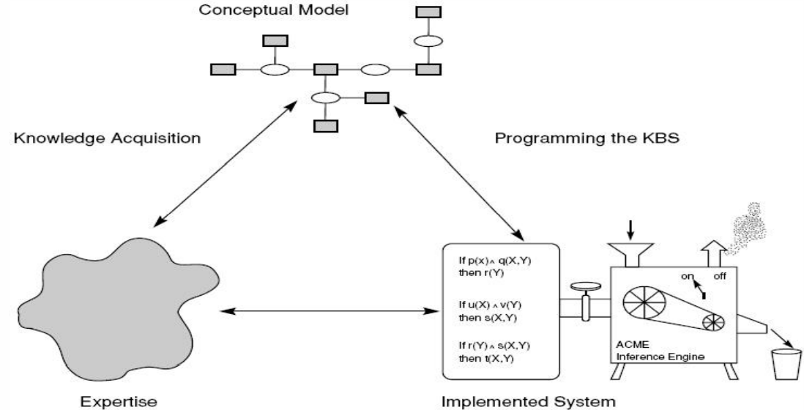
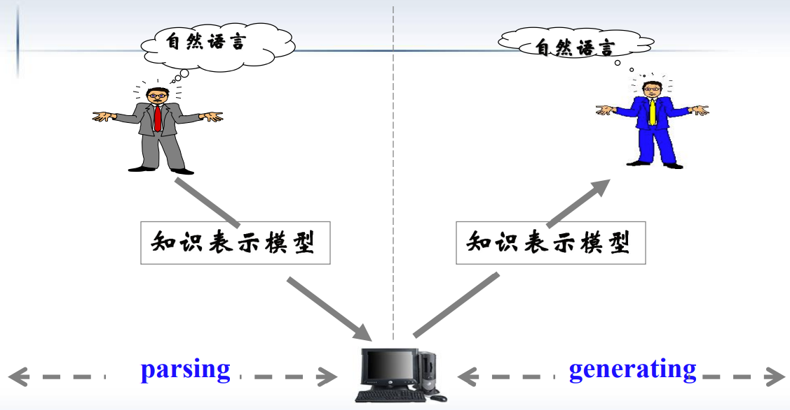

结构化问题 与 非结构化问题
- 结构化问题（简单问题）
  - 问题具有良好的结构，可以用一个算法得到解决。
  - 如“排序问题”可以通过各种排序算法得到解决。
  - 问题具有确定性。只要算法正确、输入正确，则结果一定是正确的。
- 非（半）结构化问题（复杂问题）
  - 非结构化问题它的定义为: 该问题具有不确定性。

知识系统 与 传统程序
- 求解结构化问题的传统程序 = 算法 + 数据结构
- 求解非结构化、半结构化问题的知识系统 = 知识 + 推理

传统程序和专家系统的不同
| 特征       | 传统程序         | 专家系统         |
| ---------- | ---------------- | ---------------- |
| 由……控制   | 语句次序         | 推理机           |
| 控制与数据 | 隐含在一起       | 明确分开         |
| 控制能力   | 强               | 弱               |
| 由……求解   | 算法             | 规则和推理机     |
| 求解搜索   | 少或者没有       | 多               |
| 问题求解   | 算法的正确性     | 规则             |
| 输入       | 假设正确         | 不完整、错误     |
| 意外输入   | 难以处理         | 照样处理         |
| 输出       | 总是正确         | 依赖于问题的不同 |
| 解释       | 没有             | 通常有           |
| 应用       | 数值、文件和文本 | 符号推理         |
| 执行       | 一般是顺序       | 随机             |
| 程序设计   | 结构化设计       | 很少或没有结构   |
| 修改       | 难               | 较易             |
| 扩充       | 要作很大改动     | 可逐步增加       |

人类拥有八大智能
> 语言智能、数学逻辑智能、空间智能、身体运动智能、音乐智能、人际智能、自我认知智能、自然认知智能 —— 与生俱来。
> - 从内涵上讲，应该是知识 + 思维。
> - 从外延上讲，就是发现规律、运用规律的能力和分析问题、解决问题的能力（或者说获取知识、处理知识、运用知识的能力）

脑智能和群智能
- 脑智能（Brain Intelligence, BI）人脑的宏观心理层次的智能表现。
- 群智能（Swarm Intelligence, SI）由群体行为所表现出的智能。
- 脑智能和群智能属于不同层次的智能：
  - 脑智能:个体智能（Individual Intelligence, II）
  - 群智能:社会智能（Social Intelligence, SI）、系统智能（System Intelligence, SI）。

智能的层次结构
- 高层智能：以大脑皮层（抑制中枢）为主，主要完成记忆、思维等活动。
- 中层智能：以丘脑（感觉中枢）为主，主要完成感知活动。
- 低层智能：以小脑、脊髓为主，主要完成动作反应活动。

> 微观生理层次上的低级神经元的群智能形成了宏观层次上高级的脑智能。

人工智能定义
- 人工智能是研究如何制造出人造的智能机器或智能系统，来模拟人类的智能活动，以延伸人类智能的科学。
- 人工智能是一门以知识为核心的、研究知识的获取、知识的表达、知识的使用的科学。
- 人工智能是计算机科学的一个分支，是研究使计算机表现出人类智能的学科。

> 它涉及计算机科学、脑科学、神经生理学、心理学、哲学、语言学、逻辑学、信息论、控制论等多个学科，是一门综合性的交叉和边缘学科。

人工智能基于当前的计算机技术:
- 用于知识表示的数据结构，
- 应用知识所需的算法，
- 执行过程中使用的语言和编程技术

人工智能扩展了计算机的功能

## 1.1 从伊甸园到第一台电子计算机：对智能、知识和人类技能的态度

### 1.1.1 人工智能基础的简要历史
亚里士多德指出了物质（matter）与形式（form）之间的区别：雕像是用青铜材料做成人的形式。为很多现代概念奠定了哲学基础，比如符号计算和数据抽象。
在计算（即使是数字计算）中，我们是在操纵电磁材料形式的模式，这些材料形式的改变代表求解过程的多个方面。

亚里士多德的三段论：
- 所有人都会死
- 苏格拉底是人
- 苏格拉底会死

为什么要在关于人工智能的书中讨论包含心身的问题呢？
1. 通过把意识从物理世界中分离出来，笛卡儿和有关的思想家建立了一个重要的理论：对世界看法的结构不一定要与其对应的物质结构完全相同。这正是AI、认识论、心理学、高等数学以及大多数现代文学等领域的方法学基础，即精神过程有其自身的存在形式；遵循其自身的法则；其本身可以被研究和学习。
2. 在把意识和身体分离开后，哲学家们发现有必要找到一种方式把它们联系起来，因为精神和肉体的相互作用是人类存在的关键。

哲学标出了人工智能的重要思想
- 亚里士多德（Aristotle）（公元前384 — 322），古希腊伟大的哲学家、思想家，研究人类思维规律的鼻祖，为形式逻辑奠定了基础，提出了推理方法，给出了形式逻辑的一些基本定律，创造了三段论法。
- 培根（Bacon）（1561 — 1626），英国哲学家和自然科学家，系统地提出了归纳法，成为和亚里士多德的演绎法相辅相成的思维法则。他强调了知识的重要作用，指出“知识就是力量”。

数学使人工智能成为一门规范科学
- 莱布尼茨（Leibnitz）（1646 — 1716），德国数学家和哲学家，提出了关于数理逻辑的思想，即把形式逻辑符号化，从而对人的思维进行运算和推理的思想。
- 布尔（Boole）（1815 — 1864），英国数学家、逻辑学家，初步实现了莱布尼茨关于思维符号化和数学化的思想，提出了一种崭新的代数系统——布尔代数。
- 歌德尔（Gödel）（1906 — 1978），美籍奥地利数理逻辑学家，研究形式系统的完备性和可判定性问题，指出了把人的思维形式化和机械化的某些极限，在理论上证明了有些事情是机器做不到的。

电子计算机是人工智能的“载体”
- 帕斯卡（Pascal）（1623 — 1662，法国物理学家和数学家） 制成世界上第一台会演算的机械加法机（1642）。
- 巴比奇（Babbage）（1791 — 1871，英国数学家）制成可用来计算简单数学表的差分机。冯·诺依曼（John von Neumann）（ 1903 — 1957，美籍匈牙利数学家）提出了以二进制和程序存储控制为核心的通用电子数字计算机体系结构原理，奠定了现代电子计算机体系结构的基础。
- 莫克利（J.W.Mauchly）（1907 — 1980，美国数学家）和他的学生埃克特（J.P.Eckert），于1946年研制成功了世界上第一台通用电子数字计算机ENIAC。

为AI贡献想法、观点和技术的学科
- 哲学（公元前428年至今）：标出了AI的大部分重要思想
- 数学（约800年至今）：使AI成为一门规范科学
- 经济学（1776年至今）：决策理论
- 神经科学（1861年至今）：网络，并行处理…
- 心理学（1879年至今）：认知理论
- 计算机工程（1940年至今）：AI的“载体”
- 控制论（1948年至今）：反馈的思想
- 语言学（1957年至今）：知识表示、语法

### 1.1.2 理性主义和经验主义学派对人工智能的影响
- 理性主义者（rationalist）：外部世界可以通过清晰明确的数学思想重建。
- 经验主义者（empiricist）：所有的东西都是通过感官进入大脑的。
  - 感知
  - 思考、记忆、想象

我们如何感知概念？知识如何生起？
- 联想
- 重复的经验
- 语义网络，机器学习，联结主义网络

### 1.1.3 形式逻辑的发展
思想：计算化、形式化、机械化
...

分析机
- 存储器和处理器的分离
- 一种数字而非模拟的机器
- 基于执行穿孔卡上编码的一系列操作的可编程性

布尔系统
- 为二进制算术提供了基础
- 说明了非常简单的形式系统也具有逻辑的全部能力。

弗雷格：用于自动推理的一阶谓词演算工具：
- 一种表达的语言
- 表达意义的理论
- 用于推断新的真表达式的逻辑合理的演算。

形式逻辑：人工智能的重要表示工具

### 1.1.4 图灵测试

- John Searl质疑图灵测试对测定计算机智能的意义有多大？
- 陆汝钤院士认为，图灵测试永远不可能在图灵定义的层面上真正的实现！

### 1.1.5 智能生物和社会模型：主体理论
智能的社会模型
- 智能来源于文化和社会，因此是自然发生的。
- 智能是由大量非常简单、相互影响的半自动个体组成的集体行为来反映的，这些个体被称为主体。

关于智能的面向主体和自然发生的观点包含了如下要点：
1. 主体是自动的或半自动的。
2. 主体是“基于情景的”。
3. 各个主体是相互影响的。
4. 构成一个主体社会。
5. 在这种环境中智能现象是“自然发生的”。

**人工智能各学派的起源**
- 符号主义（symbolicism）认为人工智能源于数理逻辑。
  - 用一个符号系统在计算机上形式化地描述和模拟人的思维活动过程。
- 联结主义（connectionism）认为人工智能源于仿生学，特别是人脑模型的研究。
  - 利用人工神经网络模仿人类智能，智能的基本单元是神经元，由许多人工神经元联接起的人工神经网络可以具有自学习和自适应功能，能更好地模仿人类智能。
- 行为主义（actionism）认为人工智能源于控制论。
  - 智能取决于感知和表现为行动，智能行为只能在现实世界中与周围环境交互作用而表现出来，提出智能行为的“感知－动作”模式。

**人工智能学科结构**

## 1.2 人工智能应用领域概述

### 1.2.1 博弈
棋盘游戏
- 如：西洋跳棋、国际象棋、15格拼图游戏
- 一套完善的游戏规则

博弈与启发
- 博弈过程可能产生惊人庞大的搜索空间。
- 要搜索这些庞大而且复杂的空间需要使用强大的技术来判断备择状态，探索问题空间。
- 这些技术被称为启发（heuristic），而且成为AI研究的一个主要领域。
- 启发是一种很有用但是可能出错的问题求解策略。

> 1997年，当IBM公司的“深蓝”超级电脑将棋盘上的一个兵走到C4的位置上时，国际象棋世界冠军卡斯帕罗夫对“深蓝”的人机大战落下帷幕，“深蓝” 以3.5：2.5的总比分战胜卡斯帕罗夫。
> 2016年3月9日， AlphaGo打败了著名世 界围棋冠军韩籍棋手李 世石九段。这么庞大的 计算量，就算是倾尽人 类所有的资源都远远不 能达到，那么AlphaGo 是如何做到打败李世乭 的呢？答案是它是会思 考的，它是会学习的！
> ...

### 1.2.2 自动推理和定理证明
自动定理证明、自动推理、谓词演算、Prolog、人类帮助

> 50年代中期，世界上最早的启发式程序“逻辑理论家”，证明了数学名著《数学原理》中的38个定理。经改进后，62年证明了该书中全部的52个定理。被认为是用计算机探讨人类智力活动的第一个真正的成果。

吴文俊——定理证明的“吴方法”
- 吴文俊教授提出了“数学机器化”。
- 1977年，吴文俊关于平面几何定理的机械化证明首次取得成功。
- 1984年，创立了定理机器证明的“吴方法”（代数消元法）。
- 2000年，获我国最高科学技术奖。

### 1.2.3 专家系统
- DENDRAL（1968，化学专家系统，用于美国国家航空航天局航天器收集物质的化学测量，来推算其有机分子的可能结构）：启发式知识
- MYCIN（医疗诊断专家系统，用于诊疗脊髓脑膜炎和血液传染病）：用不确定的或不完整的信息进行推理；清楚而合乎逻辑的解释。
- PROSPECTOR（根据地理信息判断可能位置和矿床类型）
- 用于配置VAX计算机的XCON

典型专家系统的体系结构

构建专家系统的基本流程

专家系统的不足：
1. 难以表征问题域的深层知识。
2. 缺乏鲁棒性和灵活性。
3. 不能提供深入的解释。
4. 难以验证。
5. 不会根据经验学习。

### 1.2.4 自然语言理解和语义学
- 目标：开发出可以理解并产生人类语言的程序。
- 它是人类智能的一个基本特征。
- 可以提高计算机的可用性。
- 当前这些程序已经在某些特定的环境下取得了成功。

真正的理解必须依赖于对话领域的广泛背景知识、该领域的习惯用语，以及能够应用上下文知识处理人类言语中正常省略和模糊性的能力。
- 在目前的研究中采用了随机模型来刻画语法和语义。
- 对语言的完全计算理解仍然是目前尚无法达到的。

### 1.2.5 对人类表现建模
人类行为建模是人类认知理论形成和检验的强有力的工具。

### 1.2.6 规划和机器人学
规划就是假定机器人可以执行特定的原子动作，并试图找到能够完成更高层任务的动作序列，比如穿过一个充满障碍的屋子。
人类在规划中使用的一种方法是分层问题分解。

...

### 1.2.7 人工智能的语言和环境
- LISP（List Processing, s-exp, recursion）
- PROLOG（Programming in Logic, descriptive language）
- 现在很多人工智能系统都是用通用语言构建的，比如C++和Java。

> 好工匠都有自己善用的工具

### 1.2.8 机器学习
### 1.2.9 其他表示：神经网络和遗传算法
【见：机器学习笔记】

### 1.2.10 AI和哲学
人工智能的根源：哲学、数学和社会学。
不仅是这些传统学科的产物，而且也为这些学科做出了贡献。

## 1.3 人工智能小结
人工智能研究所针对的问题特征包括：
1. 利用计算机来进行推理、模式识别、学习或其他形式的推断。
2. 集中于不存在算法解的问题。这也是为什么启发式搜索是一种主要的AI问题求解技术的原因。
3. 致力于那些利用不精确、不完全或没有良好定义的信息来求解的问题，而且要通过表示的形式方法来使程序员可以弥补这些问题。
4. 推理目标是问题域的显著定性特征。
5. 除了处理语法形式问题外，还要试图处理语义含义问题。
6. 答案可能既不精确也不最优，但从某种意义上来说是“充分的”。
7. 使用大量针对某一领域的知识来求解问题。这是专家系统的基础。
8. 使用元层次的知识来实现对问题求解策略的更周密控制。

**人工智能有多危险？**
最近，在国际人工智能联合会议（International Joint Conference on ArtificialIntelligence，IJCAI）上，超过1000名科技专家共同撰写了一封信，警告自动化武器可能带来的危险。“人工智能军备竞赛是个可怕的想法。”

AI先生——Eric Horvitz也上传了一段为人工智能辩护的影片。
他说：“看看电脑计算已经为我们带来多少难以置信的改变，在社会经济、医疗应用方面等等。人工智能改变了许多事。”“这会带来很多的希望，带来很多可能的好处，当然也存在隐忧。我觉得还是有很多问题亟待解决，但我期待经由人类的引导，人工智能将带来更多正面效应。”

通过这次会议，人工智能的安全性问题又一次引发众人讨论，这对人工智能技术本身来说，无疑具有积极意义。

机器人不可能拥有思想和创造力
- 例如，牛顿坐在苹果树下，一颗苹果掉下来打在他的头上，于是开始思考为什么苹果是往下掉，而不是往上飞？最后发现了“万有引力”定律。
- 例如，法国著名画家曾花了一年的时间画一棵树，于是有人问他为什么一棵树画了一年，他回答：树在春天、夏天、秋天和冬天，都有不一样的姿态，不一样的神采，如果不能观察一年，怎么知道它真实的生命是什么样子？
- “树”只是一个概念，人工智能可以理解，但树木的生命它无法理解，机器无法感受万物都充满生命，对世界缺乏理解。
- 人工智能依托海量的数据进行训练，在遵循规则领域，只要有规则，随着人工智能技术的发展，会比人类做的更好。
- 例如，谷歌的阿尔法狗，经过训练和学习后，可以轻松击败人类围棋高手。然而它并没有“智慧”，爱因斯坦：“专家只是训练有素的狗”，我们不应只是做个专家，而是进一步利用知识提升到“智慧”。
- 阿尔法狗就是利用数据训练出来的“狗”，不能利用数据创造“智慧”，就如它并不能从数据中洞察达·芬奇的《蒙娜丽莎》之谜。——人工智能仅仅是“人类智慧传承”。

> 人工智能领域的进展更多的是工程推进而不是理论突破，”我们没有更好的算法，仅仅是有更多的数据“——任重道远。
