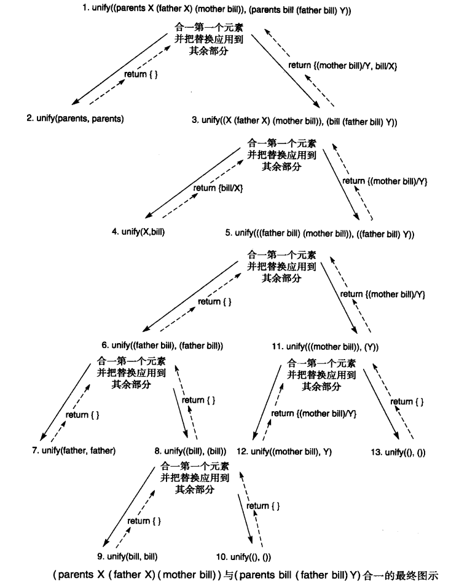

## 2.0 简介
谓词演算是用于人工智能的一种表示语言。
其优点包括：
- 明确的形式语义
- 可靠和完备的推理规则


## 2.1 命题演算（选读）

### 2.1.1 符号和语句
命题演算符号包括：
- 命题符号：P, Q, R, S, ...
- 真值符号：true， false
- 连结词：$\wedge, \vee, \neg, \to, \equiv$

命题符号表示命题或对世界的陈述，它可能是真的也可能是假的。英语字母表靠近末尾的大写字母表示命题。命题演算中的语句是由这些原子符号根据以下规则组成的。

命题演算语句：每个命题符号和真值符号都是一条语句。
- 语句的非（negation）是一条语句。
- 两条语句的合取（conjunction） 或 与（and）是一条语句。
- 两条语句的析取（disjunction） 或 或（or）是一条语句。
- 一条语句对另一条的蕴涵（implication）也是一条语句。
- 两条语句的等价（equivalence）是一条语句。
- 合法的语句又被称为合式公式（well-formed formula）或WFF。

在 $P \wedge Q$ 形式的表达式中，P和Q被称为合取项（conjunct）。
在 $P \vee Q$ 形式的表达式中，P和Q被称为析取项（disjunct）。
在蕴涵 $P \to Q$ 中，P是前提（premise）或者叫前项（antecedent）；Q是结论（conclusion）或者叫后项（consequent）。

在命题演算语句中，符号`()`和`[]`用来把符号组合成为子表达式，从而控制计值顺序和含义。

一个表达式是命题演算的一条语句或合式公式，其充要条件是，它是由合法的符号按上述规则的某个序列来形成的。
这就是我们的原始语句，它是通过应用一系列的合法规则来构建的，所以是合式的。

### 2.1.2 命题演算的语义
解释：为命题语句赋真值。严格地讲，解释就是把命题符号映射到集合 $\{T, F\}$。

命题演算语义：对一个命题集合的解释就是为每一个命题符号赋真值，要么是T，要么是F。
符号true的赋值总是T，符号false的赋值总是F。
语句的解释（也就是真值）按以下原则决定：
- 非的真值是这样的：$\neg P$，其中P是任意命题符号，如果对P的赋值是T，那么对 $\neg P$ 的赋值是F；如果对P的赋值是F，那么对 $\neg P$ 的赋值是T。
- 仅当两个合取项的真值都是T时，合取 $\wedge$ 的真值是T，否则是F。
- 仅当两个析取项的真值都是F时，析取 $\vee$ 的真值是F，否则是T。
- 仅当蕴涵 $\to$ 的前提（即蕴涵前面的符号）是T而且后项（即蕴涵后面的符号）是F时，蕴涵的真值时F，否则是T。
- 仅当等价 $\equiv$ 两边表达式对于所有可能解释都有相同真值时，等价的真值是T，否则是F。

经常使用真值表（truth table）来描述复合命题的真值赋值。
对于命题表达式P、Q和R：
- $\neg(\neg P) \equiv P$
- $(P \vee Q) \equiv (\neg P \to Q)$
- 换质换位定律：$(P \to Q) \equiv (\neg Q \to \neg P)$
- 德摩根定律：$\neg(P \vee Q) \equiv (\neg P \wedge \neg Q)$
  - 和 $\neg (P \wedge Q) \equiv (\neg P \vee \neg Q)$
- 交换律：$(P \wedge Q) \equiv (Q \wedge P) $
  - 和 $(P \vee Q) \equiv (Q \vee P)$
- 结合律：$((P \wedge Q) \wedge R) \equiv (P \wedge (Q \wedge R))$
- 结合律：$((P \vee Q) \vee R) \equiv (P \vee (Q \vee R))$
- 分配律：$P \vee(Q \wedge R) \equiv (P \vee Q) \wedge (P \vee R)$
- 分配律：$P \wedge(Q \vee R) \equiv (P \wedge Q) \vee (P \wedge R)$

可以利用像这样的恒等式把命题演算变换成语法不同但逻辑等价的形式。
也可以利用这些恒等式代替真值表来证明两个表达式的等价性：通过一系列恒等式把一个表达式变换成另一个表达式。

> 命题逻辑的表示方法有较大的局限性，它无法描述客观事物的结构及逻辑特征，也不能把不同事物的共同特征表述出来。


## 2.2. 谓词演算
在命题演算中，每个原子符号（P、Q，等等）表示一个命题。我们没有办法做到判断断言的各个部分。谓词演算提供了这种能力。
通过推理规则可以操纵谓词演算表达式，判断它的每个组成成分，并且推理出新的语句。
谓词演算还允许表达式中含有变量。变量使我们可以建立关于实体类的通用断言。

### 2.2.1 谓词的语法和语句
用以构成谓词演算符号的字符表由以下3部分组成：
1. 英文字母，包括大写和小写。
2. 数字0, 1, ..., 9。
3. 下划线_。

谓词演算的符号以字母开始，后面可以跟有这些合法字符的任意序列。

注意：提高可读性；谓词演算的符号可以表示变量、常量、函数或谓词。

谓词演算符号或项的概念可以总结为以下的定义：
1. 真值符号true和false（这是保留符号）。
2. 常量符号是以小写字母开始的符号表达式。
3. 变量符号是以大写字母开始的符号表达式。
4. 函数符号是以小写字母开始的符号表达式。函数具有附带的元数用以指出被映射到值域中每一元素的定义域的元素个数。

函数表达式是由元数为n的一个函数常量，后跟用括号包围并用逗号分隔的n个参数项 $t_1, t_2, ..., t_n$ 组成的。
谓词演算项是常量、变量或函数表达式中的一种。

谓词和原子语句：谓词符号是以小写字母开始的符号。
谓词有一个与之关联的正整数，被称为谓词的元数或“参数个数”。具有相同名字但不同元数的谓词被视为是不同的谓词。
原子语句是元数为n的谓词常量，后跟以用括号包围并用逗号分隔的n个谓词项 $t_1, t_2, ..., t_n$。
真值true和false也是原子语句。
原子语句又被称为原子表达式、原子或命题。

一阶谓词演算包括两个变量量词符号 $\forall$ 和 $\exists$，约束包含变量的语句的含义。

谓词演算中的语句按以下方式归纳定义。
每一条原子语句都是一条语句。
1. 如果 $s$ 是一条语句，那么它的非 $\neg s$ 是一条语句。
2. 如果 $s_1$ 和 $s_2$ 是语句，那么它们的合取 $s_1 \wedge s_2$ 是一条语句。
3. 如果 $s_1$ 和 $s_2$ 是语句，那么它们的析取 $s_1 \vee s_2$ 是一条语句。
4. 如果 $s_1$ 和 $s_2$ 是语句，那么它们的蕴涵 $s_1 \to s_2$ 是一条语句。
5. 如果 $s_1$ 和 $s_2$ 是语句，那么它们的等价 $s_1 \equiv s_2$ 是一条语句。
6. 如果X是一个变量，s是一条语句，那么 $\forall Xs$ 是一条语句。
7. 如果X是一个变量，s是一条语句，那么 $\exists Xs$ 是一条语句。

递归算法verify_sentence指出了检验一个表达式是否是语句的一种方法。

### 2.2.2 谓词演算的语义
表达式的真值依赖于常量、变量、谓词和函数讨论域中的对象和关系的映射。
论域中关系的真值决定了对应表达式的真值。

解释：设论域D是非空的集合。
D上的解释就是D中的实体对谓词演算表达式的每个常量、变量、谓词和函数符号的指派。
具体来说：
1. 把每个常量指派为D中的一个元素。
2. 把每个变量指派为D中的一个非空子集；这些是对变量允许进行的置换。
3. 把每个元数为m的函数f定义在D的m个参量之上并定义一种从 $D^m$ 到D的映射。
4. 把每个元数为n的谓词p定义在D的n个参量之上并定义一种从 $D^n$ 到{T, F}的映射。

给定一种解释，表达式的含义就是对解释所赋的真值。

谓词演算表达式的真值：假定E是一个表达式，I是E在非空定义域D上的解释。
E的真值由以下方式决定：
1、常量的值是I所指派的D的元素。
2、变量的值是I所指派的D的元素集合。
3、函数表达式的值是D的一个元素，这个元素通过对由解释I所指派的参数值求值函数的方式获得。
4、真值符号“true”的值是T，“false”的值是F。
5、原子语句的值要么是T，要么是F，这是由解释I决定的。
6、如果语句的值是F，那么它的非的值是T；如果语句的值是T，那么它的非的值是F。
7、如果两个语句的值都是T，那么它们的合取的值是T，否则是F。
8～10、使用 $\vee, \to, \equiv$ 的表达式的真值是根据它们的操作数的值按2.1.2中的定义决定的。

最后，对于变量X和含有X的语句S：
11、如果在解释I之下对X的所有赋值S都是T，那么 $\forall XS$ 的值是T，否则是F。
12、如果在解释中存在一个对X的赋值使S的值为T，那么 $\exists XS$ 的值是T，否则是F。

当一个变量出现在语句中时，比如X出现在likes(george,X)中时，变量的作用只是占位符。这个变量名可以替换为任何一个其他的变量名，而且不会改变表达式的含义。这种变量被称为哑元（dummy）。

在谓词演算中，量化变量的方式有以下两种：全称量化和存在量化。

如果一个变量集既不在全称量词内又不在存在量词内，那么它被认为是自由的。

如果表达式的所有变量都是量化了的，那么它被认为是封闭的。

如果解释的域是无限的，那么穷举式地测试一个全称量化变量的所有替换在计算方式上是不可能的，这个谓词演算被称为是不可判断的（undecidable）。

全称量词和存在量词与否定词之间的几种关系。
对于谓词p和q以及变量X和Y：
$$
\begin{array}{l}
\neg \exists X p(X) \equiv \forall X \neg p(X) \\
\neg \forall X p(X) \equiv \exists X \neg p(X) \\
\exists X p(X) \equiv \exists Y p(Y) \\
\forall X q(X) \equiv \forall Y q(Y) \\
\forall X(p(X) \wedge q(X)) \equiv \forall X p(X) \wedge \forall Y q(Y) \\
\exists X(p(X) \vee q(X)) \equiv \exists X p(X) \vee \exists Y q(Y)
\end{array}
$$

> 注意：$\forall$ 对 $\vee$，$\exists$ 对 $\wedge$ 无分配等值式

**基本等值式**
- 命题逻辑中基本等值式的代换实例
- 消去量词等值式（设 $D=\left\{a_{1}, a_{2}, \ldots, a_{n}\right\}$）
  - $\forall x A(x) \Leftrightarrow A\left(a_{1}\right) \wedge A\left(a_{2}\right) \wedge \ldots \wedge A\left(a_{n}\right)$
  - $\exists x A(x) \Leftrightarrow A\left(a_{1}\right) \vee A\left(a_{2}\right) \vee \ldots \vee A\left(a_{n}\right)$
- 量词否定等值式
  - $\neg \forall x A(x) \Leftrightarrow \exists x \neg A(x)$
  - $\neg \exists x A(x) \Leftrightarrow \forall x \neg A(x)$
- 量词辖域收缩与扩张等值式
  - A(x)是含x自由出现的公式，B中不含x的自由出现
    - $\forall x(A(x) \vee B) \Leftrightarrow \forall x A(x) \vee B$
    - $\forall x(A(x) \wedge B) \Leftrightarrow \forall x A(x) \wedge B$
    - $\forall x(A(x) \rightarrow B) \Leftrightarrow \exists x A(x) \rightarrow B$
    - $\forall x(B \rightarrow A(x)) \Leftrightarrow B \rightarrow \forall x A(x)$
  - 关于存在量词的：
    - $\exists x(A(x) \vee B) \Leftrightarrow \exists x A(x) \vee B$
    - $\exists x(A(x) \wedge B) \Leftrightarrow \exists x A(x) \wedge B$
    - $\exists x(A(x) \rightarrow B) \Leftrightarrow \forall x A(x) \rightarrow B$
    - $\exists x(B \rightarrow A(x)) \Leftrightarrow B \rightarrow \exists x A(x)$

一阶谓词演算：一阶谓词演算允许量化变量指向论域中的对象，不允许指向谓词或函数。

> 谓词表示越细，推理越慢、效率越低，但表示清楚。实际中是要折衷的。

### 2.2.3 语义含义的积木世界例子（略）


## 2.3 使用推理规则产生谓词演算表达式

### 2.3.1 推理规则
对一个谓词演算表达式X和一种解释I：
- 如果在I下存在一个特定的变量赋值使X的值为T，那么就说I满足X。
- 如果对于所有的变量赋值来说I都满足X，那么就说I是X的一个模型。
- X是可满足的，当且仅当存在一种满足它的解释和变量赋值；否则它是不可满足的。
- 一个表达式集合是可满足的，当且仅当存在满足所有元素的一种解释和变量赋值。
- 如果表达式集合不是可满足的，那么就说它是不一致的。
- 如果对于所有的可能解释来说X的值都为T，那么就说X是有效的。

证明过程：证明过程是推理规则和应用这个规则到逻辑表达式的集合以产生新的语句算法的结合。

逻辑派生、可靠的和完备的：
- 如果满足谓词演算表达式集合S的所有解释也满足谓词演算表达式X，那么X逻辑派生自S。
- 如果一个来自谓词演算表达式集合S的推理规则产生的所有谓词演算表达式也逻辑派生自S，那么就说这个推理规则是可靠的。
- 如果给定一个谓词演算表达式的集合S，一个推理规则可以推理出逻辑派生自S的所有表达式，那么就说这个推理规则是完备的。

取式假言推理、拒式假言推理、与消除、与引入、全称例化：
- 如果已知语句P和 $P \to Q$ 是真的，那么根据取式假言推理可以推断Q为真。
- 在推理规则的拒式假言推理（modus tollens）内，如果已知 $P \to Q$ 是真的，并且Q是假的，那么可以推断P是假的：$\neg P$ 为真。
- 与消除（and elimination）使我们可以根据合取语句的真值来推断任一个合取项的真值。
- 与引入（and introduction）使我们可以从合取项的真值来推断合取的真值。
- 全称例化（universal instantiation）指出如果可以把一个真语句，比方说p(X)，中的任意的全称量化变量替换为定义域中的任意的适当项，那么结果是一个真的语句。因此，如果a来自X的定义域，那么从 $\forall Xp(X)$ 可以推断p(a)。

### 2.3.2 合一算法
命题演算中，两个表达式是匹配的当且仅当它们在语句构成上相同。

合一是一种判断什么样的替换可以使产生的两个谓词演算表达式匹配的算法。
这种形式的一个根本特征是要求所有的变量都是全称量化的。存在量化变量可以从数据库语句中消除，方法是用使这个语句为真的常量来替代它们。

斯柯伦化（skolemization）方法把每个存在量化变量用一个函数来替换，这个函数是关于语句中某个或所有其他变量的函数，它的返回值是一个常量。

复合（composition）：如果S和S'是两个替换集合，那么S和S'的复合（写为SS'）是这样得到的：对S的每一个元素应用S'，再把结果加到S。

代换是形如 $\{t_1/x_1, t_2/x_2, ..., t_n/x_n\}$ 的有限集合。其中：
- $t_1, t_2, ..., t_n$ 是项；$x_1, x_2, ..., x_n$ 是互不相同的变元；$t_i/x_i$ 表示用$t_i$ 代换 $x_i$。
- 不允许 $t_i$ 与 $x_i$ 相同，也不允许变元 $x_i$ 循环地出现在另一个 $t_j$ 中。

代换可以作用于某个谓词公式上，也可以作用于某个项上。

设 $\theta = \{t_1/x_1, t_2/x_2, ..., t_n/x_n\} \quad \lambda =\{u_1/y_1, u_2/y_2, ..., u_m/y_m\}$ 是两个代换，则此两个代换的复合也是一个代换，
它是从 $\{t_1 \lambda /x_1, t_2 \lambda /x_2, ..., t_n \lambda /x_n, u_1/y_1, u_2/y_2, ..., u_m/y_m\}$ 中删去如下两个元素：
- $t_i \lambda /x_i \quad 当t_i \lambda =x_i$
- $u_i/y_i \quad 当y_i \in \{x_1, x_2, ..., x_n\}$

后剩下的元素所构成的集合，记为 $\theta \circ \lambda$。

设有公式集 $F=\{F_1, F_2, ..., F_N\}$，若存在一个代换 $\lambda$ 使得 $F_1 \lambda =F_2 \lambda =...=F_N \lambda$，
则称 $\lambda$ 为公式集F的一个合一（代换），且称 $F_1, F_2, ..., F_N$ 是可合一的。

设 $\sigma$ 是公式集F的一个合一，如果对任一个合一 $\theta$ 都存在一个代换 $\lambda$，使得 $\theta= \sigma \circ \lambda$，
则称 $\sigma$ 是公式集F的最一般合一。

最一般的合一式（mgu）：如果s是表达式E的任意一个合一式，g是这个表达式集合的最一般的合一式，那么对于应用到E的s，存在另一个合一式s'使Es=Egs'，其中Es和Egs'是应用到表达式E的合一式的复合。

一个表达式集合的最一般的合一式是惟一的，除非字母变种；也就是说，不论变量最终被称为X还是Y，实际上对最终合一的一般性没有任何不同。

下面我们给出函数unify的伪代码，它计算两个谓词演算表达式之间的合一替换（当可能合一时）。
unify函数以两个谓词演算表达式为参数，返回最一般的合一替换或常量FAIL（当不可能合一时）。
它被定义为一个递归的函数：首先，它试图递归合一表达式的初始部分。如果这成功了，再把这个合一返回的任何替换应用到两个表达式的其余部分。然后把应用后的结果作为参数传进第二个对unify的递归调用，并尝试结束这个合一过程。
当遇到以下两种情况中的任一种时递归会停止：参数是一个符号（一个谓词、函数名、常量或变量）；表达式的元素都已经被匹配过。

把表达式表示成一个列表（元素的一个有序序列）——谓词或函数名作为第一个元素，参数跟在后面——可以简化表达式的操作。

```
function unify(E1,E2)
  begin
    case
      both E1 and E2 are constants or the empty list:  % recursion stops
        if E1=E2 then return {};
          else return fail;
      E1 is a variable:
        if E1 occurs in E2 then return fail
          else return {E2/E1};
      E2 is a variable:
        if E2 occurs in E1 then return fail
          else return {E1/E2};
      either E1 or E2 are empty then return fail       % the list are of different size
      otherwise:                                       % both E1 and E2 are list
        begin
          HE1:=first element of E1;
          HE2:=first element of E2;
          SUBS1:=unify(HE1,HE2);
          if SUBS1:=fail then return fail;
          TE1:=apply(SUBS1,rest of E1);
          TE2:=apply(SUBS1,rest of E2);
          SUBS2:=unify(TE1,TE2);
          if SUBS2:=fail then return fail;
            else return composition(SUBS1,SUBS2)
        end
    end
  end
```

**求最一般合一的算法**
1. 令 $k=0, F_k=F, \sigma_k=\varepsilon$。这里，F是欲求其最一般合一的公式集，$\varepsilon$ 是空代换，它表示不做代换。
2. 若 $F_k$ 只含一个表达式，则算法停止，$\sigma k$ 就是最一般合一。
3. 找出 $F_k$ 的差异集 $D_k$。
4. 若 $D_k$ 中存在元素 $x_k$ 和 $t_k$，其中 $x_k$ 是变元，$t_k$ 是项，且 $x_k$ 不在 $t_k$ 中出现，则置：
   - $\sigma_{k+1} = \sigma_k \circ \{t_k/x_k\},$
   - $F_{k+1} = F_k \{t_k/x_k\},$
   - $k=k+1$
   - 然后转2。
5. 算法终止，F的最一般合一不存在。

### 2.3.3 合一的例子



## 2.4 应用：一个基于逻辑的财务顾问
1. 存款数额还不充足的个体始终该把提高存款数额作为他们的首选目标，无论他们收入如何。
2. 具有充足存款和充足收入的个体应该考虑风险较高但潜在投资收益也更高的股票市场。
3. 收人较低的已经有充足存款的个体可以考虑把他们的剩余收入在存款和股票间分摊，以便既能提高存款数额又能尝试通过股票提高收人。

$$
savings\_account(inadequate) \to investment(savings) \\
savings\_account(adequate) \wedge income(adequate) \to investment(stocks) \\
savings\_account(adequate) \wedge income(inadequate) \to investment(combination) \\
\forall X amount\_saved(X) \wedge \exists Y(dependents(Y) \wedge greater(X, minsavings(Y))) \rightarrow savings\_account(adequate) \\
\forall X amount\_saved(X) \wedge \exists Y(dependents(Y) \wedge \neg greater(X, minsavings(Y))) \rightarrow savingsaccount(inadequate) \\
\forall X earnings(X, steady ) \wedge \exists Y(dependents(Y) \wedge greater(X, minincome(Y))) \rightarrow income(adequate) \\
\forall X earnings(X, steady ) \wedge \exists Y(dependents(Y) \wedge \neg greater(X, minincome(Y))) \rightarrow income(inadequate) \\
\forall X earnings(X, unsteady ) \rightarrow income(inadequate) \\
$$

...
