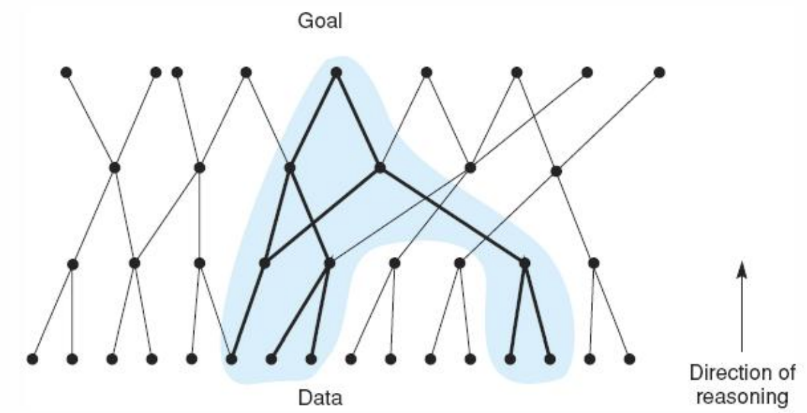
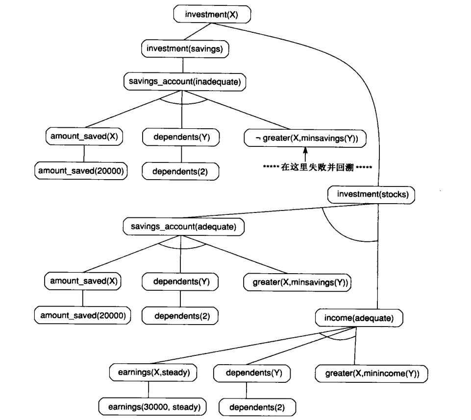

搜索策略
- 人工智能要解决的问题大多数是结构不良或者非结构的问题，对这样的问题一般不存在成熟的求解算法，而只能利用已有的知识一步步地摸索着前进。
- 在这个过程中，存在着如何寻找一条推理路线，使得付出的代价尽可能地少，而问题又能够得到解决。我们称寻找这样路线的过程为搜索。

图搜索结构与技术
- 状态图搜索
- 与或树搜索
- 博弈树搜索（第四章）

## 3.0 简介
- 问题求解器保证可以找到解吗？
- 问题求解器总是可以终止吗，也就是说它是否可能陷人无限循环？
- 当找到解时，能保证这个解是最优解吗？
- 搜索过程的时间复杂度如何？内存使用呢？

通过将问题表示为状态空间图（state space graph），我们可以利用状态空间搜索（state space search）理论来回答这些问题。

哥尼斯堡七桥问题是：一个散步者能否在仅经过每座桥一次的情况下遍历七座桥。


## 3.1 状态空间搜索的结构

### 3.1.1 图论（选读）
带标签的有向图


有根树：双亲（parent）、孩子（child）、兄弟（siblings）


### 3.1.2 有限状态自动机（选读）
有限状态自动机：
一个有限状态自动机是一个有序三元组 $(S, I, F)$，其中：
- S是连通图中状态的有限集合 $S_1, S_2, S_3, ..., S_n$。
- I是输入值的有穷集合 $i_1, i_2, i_3, ..., i_m$。
- F是状态转换函数，描述任意 $i \in I$ 对机器状态S的作用，即 $\forall i \in I, F_i: (S \to S)$。
- 如果机器正处于状态 $S_j$，此时输入i，那么机器的下一个状态是 $F_i(s_j)$。

触发器的有限状态图和状态转换表


有限状态接受器（摩尔机）：
一个有限状态接受器是一个有限状态自动机 $(S, I, F)$，其中：
- $\exists s_0 \in S$ 使得输入流从 $s_0$。状态开始。
- $\exists s_n \in S, s_n$ 是接受状态。输入流被接受，如果它使机器停止在接受状态。实际中很可能有一个接受状态的集合。
- 有限状态接受器表示为 $(S, s_0, \{s_n\}, I, F)$。

字符串识别例子


### 3.1.3 问题的状态空间表示
状态空间搜索：
一个状态空间可表示为一个四元组 $[N, A, S, GD]$，其中：
- N是图的结点或状态的集合。图的结点对应于问题求解过程中的各个状态。
- A是结点之间弧（也就是连接）的集合。图的弧对应于问题求解过程中的各个步骤。
- S是N的非空子集，含有问题的起始状态。
- GD是N的非空子集，含有问题的目标状态。可以通过以下任一种方式来描述GD中的状态：
  1. 搜索中遇到的状态的一种可测量属性。
  2. 搜索中探索到的路径的一种可测量属性，例如路径的弧的穿越成本（transition cost）。

解路径是穿越图的一条特殊路径，它从S中的一个结点开始，到GD中的一个结点结束。

例：井字棋


通过移动空位产生的数字华容道的状态空间


巡回推销员问题（Traveling Salesperson Problem, TSP）


穷举搜索TSP的复杂度是 $(N-1)!$。
有几种技术可以降低这种搜索复杂度。
- 一种称为分支限界（branch and bound）。
- 另一种控制搜索的策略称为最近邻（nearest neighbor）。

最近邻算法是一种贪婪算法，搜索策略是：前往最近的未访问的城市。


注：图中的粗线是最近邻方法找到的最低成本路径。
这个路径的成本是550英里，并不是最短的路径。弧(C,A)相对很高的成本使这种启发失败。


## 3.2 用于状态空间搜索的策略

### 3.2.1 数据驱动搜索和目标驱动搜索
数据驱动搜索（data-driven search）（有时也称为正向追索（forward chaining））中，问题求解器从问题的给定事实和改变状态的合法移动或规则的集合人手。
然后把规则应用到事实产生新的事实，接下来新的事实又被规则用来产生更多新的事实。
搜索便如此继续下去，直到（我们希望）产生满足目标条件的一条路径。


数据驱动搜索适用于：
1. 问题的初始陈述给出了所有或大部分数据。
2. 潜在目标的数量非常庞大，但是使用特定问题实例的给定信息和事实的方式很有限。
3. 难以组成目标或假设。

目标驱动搜索（goal-driven search）（或者称为反向搜索（backward chaining））从想要求解的目标入手。
先分析怎样使用规划或合法移动来产生这个目标并求出要应用这些规则或移动必须具有的条件。
这些条件成为要搜索的新目标，或者称为子目标（subgoal）。
然后继续反向追溯相继的子目标，直到（我们希望）返回到问题中的事实。


目标驱动搜索适用于：
1. 目标或假设是在问题陈述中给出的，或者它们很容易被形式化。
2. 与问题事实匹配的规则数量非常多，因而产生的结论或目标也越来越多。
3. 问题数据不是给定的，而是要由问题求解器来获取的。

### 3.2.2 图搜索的实现
对假想状态空间的回溯搜索


下面定义一种回溯算法，使用3个列表来记录状态空间中的结点：
- SL：状态列表，列出当前正在试验路径的状态。如果发现了目标，那么SL便包含了解路径上状态的有序列表。
- NSL：新状态列表，含有等待评估的结点，也就是其后代还没有被产生和搜索的结点。
- DE：用来记录死端，列出已经发现其后代不包含目标的状态。如果再次遇到这些状态，它们会被检测为是DE中的元素并立刻不再考虑。

```
function backtrack;
begin
  SL:=[Start]; NSL:=[Start]; DE:=[ ]; CS:=Start;           % initialize
  while NSL ≠ [ ] do                                       % while there are states to be tried
    begin
      if CS = goal (or meets goal description)
        then return SL;                                    % on success, retuen list of states in path
      if CS has no children (excluding nodes already on DE, SL, and NSL)
        then begin
          while SL is not empty and CS = the first element of SL do
            begin
              add CS to DE;                                % record state as dead end
              remove first element from SL;                % backtrack
              remove first element from NSL;
              CS := first element of NSL;
            end
          add CS to SL;
          end
          else begin
            place children of CS on NSL;
            CS := first element of NSL;
            add CS to SL;
          end
    end;
  return FAIL;
end.
```

| 迭代后 | CS  | SL     | NSL        | DE       |
| ------ | --- | ------ | ---------- | -------- |
| 0      | A   | [A]    | [A]        | []       |
| 1      | B   | [BA]   | [BCDA]     | []       |
| 2      | E   | [EBA]  | [EFBCDA]   | []       |
| 3      | H   | [HEBA] | [HIEFBCDA] | []       |
| 4      | I   | [IEBA] | [IEFBCDA]  | [H]      |
| 4'     | E   | [EBA]  | [EFBCDA]   | [IH]     |
| 4''    | F   | [BA]   | [FBCDA]    | [EIH]    |
| 5      | F   | [FBA]  | [FBCDA]    | [EIH]    |
| 6      | J   | [JFBA] | [JFBCDA]   | [EIH]    |
| 7      | C   | [CA]   | [CDA]      | [BFJEIH] |
| 8      | G   | [GCA]  | [GCDA]     | [BFJEIH] |

搜索状态空间图的思想：
1. 未处理状态列表（NSL）的使用使算法可以返回（回溯）到这些状态中的任一个状态。
2. “bad”状态列表（DE）防止算法重试无用的路径。
3. 如果发现了目标，就返回当前解路径的结点列表（SL）。
4. 显式检查新的状态是否是这些列表的成员以防止死循环。

### 3.2.3 深度优先搜索和宽度优先搜索

#### 1. 宽度优先搜索


open：列出已经产生但是它的孩子还未被分析的状态
- NSL：回溯算法Backtracking的新状态列表
- FIFO：（队列：先进先出）
- Right（插入Open表的右端）

closed：记录已经分析过的状态
- SL、DE（回溯算法Backtracking的状态列表、死端）

```
function breadth_first_search;
begin
  open := [ Start ] ;                                      % initialize
  closed := [ ] ;
  while open ≠ [ ] do                                      %states remain
    begin
      remove leftmost state from open, call it X;
        if X is a goal then return SUCCESS                 % goal found
          else begin
            generate children of X;
            put X on closed;
            discard children of X if already on open or closed; % loop check
            put remaining children on right end of open    % queue
          end
    end
  return FAIL                                              % no states left
end.
```

深度优先搜索和宽度优先搜索例子中所用的图


```
1) open=[A];             closed=[ ]
2) open=[B,C,D];         closed=[A]
3) open=[C,D,E,F];       closed=[B,A]
4) open=[D,E,F,G,H];     closed=[C,B,A]
5) open=[E,F,G,H,I,J];   closed=[D,C,B,A]
6) open=[F,G,H,I,J,K,L]; closed=[E,D,C,B,A]
7) open=[G,H,I,J,K,L,M]; closed=[G,F,E,D,C,B,A]
8) open=[HIJKLMN];       closed=[G,F,E,D,C,B,A]
9) 以此类推，直到找到了U或open=[]
```

一个状态可以与它的父状态一起保存，即保存为（状态，父）对。
当找到目标状态时，可以很容易地构造解路径。
```
1) open=[(A, nil)];                        closed=[ ]
2) open=[(B, A), (C, A), (D, A)];          closed=[(A, nil)]
3) open=[(C, A), (D, A), (E, B), (F, B)];  closed=[(B, A), (A, nil)]
```

图中突出显示了第6次迭代时的open和closed中的状态


#### 2. 深度优先搜索


```
function depth_first_search;
begin
  open := [ start ] ;
  closed := [ ] ;
  while open ≠ [ ] do
    begin
      remove leftmost state from open ,call it X;
      if X is a goal then return SUCCESS
        else begin
          generate children of X;
          put X on closed;
          discard children of X if already on open or closed;
          put remaining children on left end of open
        end
    end
  return FAIL
end.
```

```
1)  open=[A];         closed=[ ]
2)  open=[B,C,D];     closed=[A]
3)  open=[E,F,C,D];   closed=[B,A]
4)  open=[K,L,F,C,D]; closed=[E,B,A]
5)  open=[S,L,F,C,D]; closed=[K,E,B,A]
6)  open=[L,F,C,D];   closed=[S,K,E,B,A]
7)  open=[T,F,C,D];   closed=[L,S,K,E,B,A]
8)  open=[F,C,D];     closed=[T,L,S,K,E,B,A]
9)  open=[M,C,D];     closed=[F,T,L,S,K,E,B,A]
10) open=[C,D];       closed=[M,F,T,L,S,K,E,B,A]
11) open=[G,H,D];     closed=[C,M,F,T,L,S,K,E,B,A]
12) 以此类推，直到找到了U或open=[]
```

#### 有界深度优先搜索
有界深度优先搜索的搜索过程为：
1. 把初始节点 $S_0$ 放入OPEN表中，置 $S_0$ 的深度 $d(S_0)=0$。
2. 如果OPEN表为空，则问题无解，退出。
3. 把OPEN表的第一个节点（记为节点n）取出放入CLOSED表。
4. 考察节点n是否为目标节点。若是，则求得了问题的解，退出。
5. 如果节点n的深度 $d(节点n)=S_m$ ，则转第2步。
6. 若节点n不可扩展，则转第2步。
7. 扩展节点n，将其子节点放入OPEN表的首部，并为其配置指向父节点的指针，然后转第2步。

求最优解的有界擦度优先搜索流程示意图


### 3.2.4 迭代加深的深度优先搜索
迭代加深的深度优先（depth-first iterative deepening）对空间进行一种深度界限为1的深度优先搜索。
如果它找不到目标，便进行另一个深度界限为2的深度优先搜索。这样继续下去，每次迭代把深度界限加1。
在每一次迭代中，算法执行一次当前深度界限范围内的完全深度优先搜索。在两次迭代之间不保存任何状态空间信息。

深度优先迭代加深搜索（每个迭代深度加1）

节点访问顺序: 1, 1, 2, 3, 4, 1, 2, 5, 6, 3, 7, 4, 8, 9,
1, 2, 5, 6, 10, 11, 3, 7, 12, 13, 4, 8, 9


## 3.3 利用状态空间来表示命题演算和谓词演算的推理

### 3.3.1 逻辑系统的状态空间描述
```
q -> p
r -> p
v -> q
s -> r
t -> r
s -> u
s
t
```


### 3.3.2 与或图


与或图实际上是超图（hypergraph）的特例，在超图中各个结点是由一系列弧而不是由单一弧连接的。
超图由下列要素组成：
- N：结点集合。
- H：由有序偶定义的超孤集合，有序偶的第一个元素是来自N的一个结点，第二个元素是N的一个子集。
- 普通图是当超图的所有后继，点集合的势为1时的特例。

超弧又被称作k连接符（k-connector），其中k是后继结点集合的势。
如果 $k=1$，那么可以认为后继集合元素是或结点。如果 $k>1$，那么可以认为后继集合元素是与结点。

```
a, b, c,
a∧b -> d,
a∧c -> e,
b∧d -> f,
f -> g,
a∧e -> h
```


#### 与/或树表示法
与/或树是用于表示问题及其求解过程的又一种形式化方法，也称为问题归约方法。它把初始问题通过一系列变换最终变为一个子问题集合。

**1、分解**
例如，把问题P分解为三个子问题P1、P2、P3，如图：


**2、等价变换**
问题的等价变换过程也可以用一个图表示出来，称为“或”树。
例如，问题P被等价变换为新问题P1、P2、P3，如图：


上述两种方法也可以结合起来使用，此时的图称为 “与/或”树。其中既有“与”节点，也有“或”节点，如图：


**3、本原问题**
不能再分解或变换，而且直接可解的子问题称为本原问题。

**4、端节点与终止节点**
- 端节点概念：在与/或树中，没有子节点的节点称为端节点;
- 终止节点概念：本原问题所对应的节点称为终止节点。
- 显然，终止节点一定是端节点，但端节点不一定是终止节点。

**5、可解节点**
在与/或树中，满足下列条件之一者，称为可解节点。
1. 它是一个终止节点(本原问题）。
2. 它是一个“或”节点，且其子节点至少有一个是可解节点。
3. 它是一个“与”节点，且其子节点全部是可解节点。

**6、不可解节点**
关于可解节点的三个条件全部不满足的节点称为不可解节点。

**7. 解树**
- 可解节点所构成的，并且由这些可解节点可推出初始节点（它对应于原始问题）为可解节点的子树称为解树。
- 在解树中一定包含初始节点。

#### 用与/或树表示问题的步骤
1. 对所要求解的问题进行分解或等价变换。
2. 若所得的子问题不是本原问题，则继续分解或变换，直到分解或变换为本原问题。
3. 在分解或变换中，若是不等价的分解，则用“与树”表示，若是等价变换，则用“或树”表示。

#### 与/或树的搜索策略
**1、与/或树的一般搜索过程**
1. 把原始问题作为初始节点S0，并把它作为当前节点。
2. 应用分解或等价变换算符对当前节点进行扩展。
3. 为每个子节点设置指向父节点的指针。
4. 选择合适的子节点作为当前节点，反复执行第2步和第3步，在此期间要多次调用可解标示过程和不可解标示过程，直到初始节点被标示为可解节点或不可解节点为止。

**2、与/或树的宽度优先搜索**
1. 把初始节点 $S_0$ 放入OPEN表。
2. 把OPEN表中的第一个节点（记为节点n）取出放入CLOSED表。
3. 如果节点n可扩展，则：
   - ①扩展节点n，将其子节点放入OPEN表的尾部，并为每个节点配置指向父节点的指针。
   - ②考察这些节点中是否有终止节点。若有，则标示这些终止节点为可解节点，并应用可解标示过程对其父节点、祖父节点等先辈节点中的可解节点进行标示。若初始节点 $S_0$ 也被标示为可解节点，就得到了解树，搜索成功，退出搜索过程；若不能确定 $S_0$ 为可解节点，则从OPEN表中删去具有可解先辈的节点。
   - ③转第2步。
4. 如果节点n不可扩展，则：
   - ①标示节点n为不可解节点。
   - ②应用不可解标示过程对节点n的先辈节点中不可解的节点进行标示。若初始节点 $S_0$ 也被标示为不可解节点，则搜索失败，表明原始问题无解，退出搜索过程；若不能确定 $S_0$ 为不可解节点，则从OPEN表中删去具有不可解先辈的节点。
   - ③转第2步。

**3、与/或树的深度优先（有界）搜索**
1. 把初始节点 $S_0$ 放入OPEN表。
2. 把OPEN表中的第一个节点（记为节点n）取出放入CLOSED表。
3. 如果节点n的深度大于等于深度界限，则转第5步的第①点。
4. 如果节点n可扩展，则：
   - ①扩展节点n，将其子节点放入OPEN表的首部，为每个节点配置指向父节点的指针，以备标示过程使用。
   - ②考察这些节点中是否有终止节点。若有，则标示这些终止节点为可解节点，并应用可解标示过程对其先辈节点中的可解节点进行标示。若初始节点 $S_0$ 也被标示为可解节点，则搜索成功，退出搜索过程；若不能确定 $S_0$ 为可解节点，则从OPEN表中删去具有可解先辈的节点。
   - ③转第2步。
5. 如果节点n不可扩展，则：
   - ①标示节点n为不可解节点。
   - ②应用不可解标示过程对节点n的先辈节点中不可解的节点进行标示。若初始节点 $S_0$ 也被标示为不可解节点，则搜索失败，表明原始问题无解，退出搜索过程；若不能确定 $S_0$ 为不可解节点，则从OPEN表中删去具有不可解先辈的节点。
   - ③转第2步。

与或树的有界深度优先搜索流程示意图


### 3.3.3 进一步的例子和应用
积分问题的部分状态空间与或图


目标驱动与或搜索


财务顾问程序搜索的与或图


英语语法分析程序和语句生成程序

