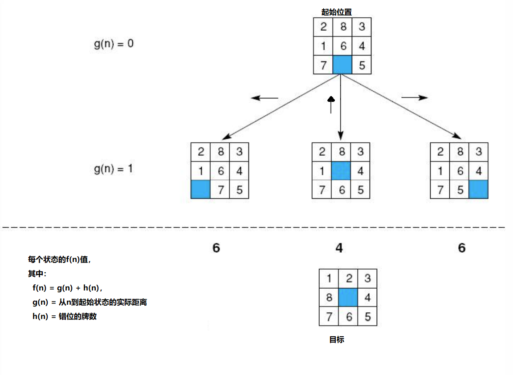
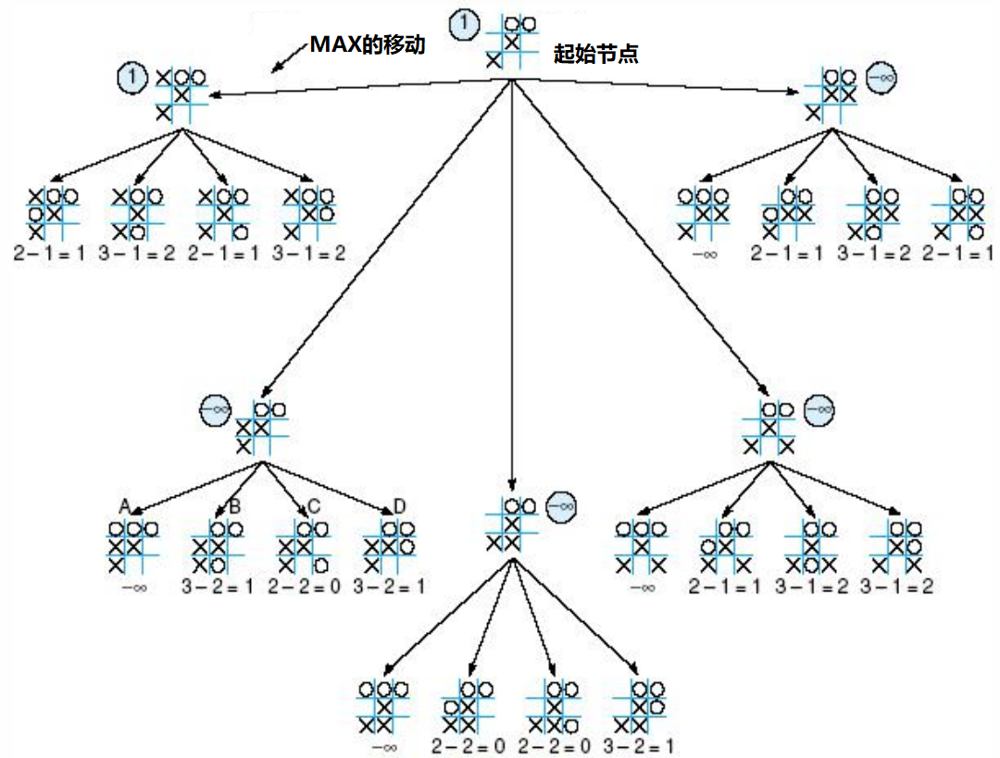

## 4.0 简介
在状态空间搜索中，启发被形式化定义为一些规则，这些规则能选取状态空间中最可能产生可接受解的分支。

AI问题求解器在以下两种基本情况下将采用启发：
1. 因为在问题陈述或现有数据中存在固有的模糊性，所以问题可能没有精确解。
   - 医疗诊断就是这样的一个例子。对于已知的一系列症状，可以有很多种可能的导致原因；
   - 医生必须使用启发来选取最可能的诊断并制定治疗计划。
2. 问题可能有精确解，但是找到这个解的运算开销可能是让人难以承受的。
   - 在许多问题（比如国际象棋）中，状态空间的组合增长是爆炸性的，可能状态的数量随着搜索深度的增大呈指数或阶乘增长。

专家系统的研究已经证实了启发作为问题求解的关键要素具有不可替代的重要性。

人类专家用以高效解决问题的“经验法则”很大程度上来说就是启发式的。


## 4.1 爬山法和动态规划法

### 4.1.1 爬山
爬山策略在搜索中先扩展当前状态，然后再评估它的孩子。
选择最佳子项进行进一步的扩展，在这个过程中既不保留它的兄弟姐妹，也不保留它的双亲。
之所以叫爬山策略是因为一个积极的盲人登山者可能使用这种策略：沿尽可能陡峭的路向上爬，直到无法继续向上。
因为这种策略不保存任何历史记录，所以它不具有从失败中恢复的能力。

爬山策略的一个主要问题是容易陷入局部最大值。如下是一个例子：


### 4.1.2 动态规划
动态规划有时也称为前前后后算法，当使用概率时称为韦特比算法。
用于解决由多个互相影响互相关联的子问题构成的问题中的受限内存搜索。
动态规划在大问题的解决方案中不断记录和重用已被解决的子问题的解决方案。
为重用而采用子问题缓存的技术有时称为记录部分子目标解决方案。


## 4.2 最佳优先搜索算法

### 4.2.1 实现最佳优先搜索
和深度优先搜索和宽度优先搜索一样，最佳优先搜索也使用列表来维护状态：
- open：记录搜索的当前搜索带；
- closed列表：记录已经访问过的状态。

新加的一步：对open中的状态进行排序，
- 排序的依据：对状态与目标“接近程度”的某种启发性估计。

每一轮循环都是考虑open列表中最“有希望的”状态。

伪代码如下
```
function best-first-search;
begin
  open := [Start];                      % initialize
  closed := [ ];
  while open ≠ [ ] do                   % state remain
    begin
      remove the leftmost state from open, call it X;
      if X=goal then return the path from Start to X
      else begin
        generate children of X;
        for each child of X do
        case
          the child is not on open or closed:
            begin
              assign the child heuristic value;
              add the child open
            end;
          the child is already on open:
            if the child was reached by a shorter path
            then give the state on open the shorter path
          the child is already on closed:
            if the child was reached by a shorter path then
              begin
                remove the state from closed;
                add the child to open
              end;
      end;                              % case
      put X on closed;
      re-order states on open by heuristic merit ( best leftmost )
      end
    end;
return FAIL                             % open is empty
end.
```

对一个假想状态空间的启发式搜索


对上图执行best-first-search的跟踪结果：
```
1)              open=[A5];                closed=[ ]
2) evaluate A5; open=[B4,C4,D6];          closed=[A5]
3) evaluate B4; open=[C4,E5,F5,D6];       closed=[B4,A5]
4) evaluate C4; open=[H3,G4,E5,F5,D6];    closed=[C4,B4,A5]
5) evaluate H3; open=[O2,P3,G4,E5,F5,D6]; closed=[H3,C4,B4,A5]
6) evaluate O2; open=[P3,G4,E5,F5,D6];    closed=[O2,H3,C4,B4,A5]
7) evaluate P3; the solution is found!
```

### 4.2.2 实现启发评估函数
现在我们评估几种不同的求解数字华容道问题的启发。
下图显示了数字华容道的起始状态和目标状态，以及搜索中产生的前三个状态。


最简单的启发是数出每个状态与目标状态相比错位的牌数。
一个“更好一点”的启发是对错位的牌必须要移动的距离求和，为了到达目标位置，每张牌必须要移动的每个方格算为1个距离单位。

这两种启发都存在一种不足，就是没有认识到颠倒牌的难度。
也就是说，如果两张牌是彼此相邻的，而且目标是要求互相颠倒它们的位置，那么要把它们放到适当的位置需要远不止两次的移动，因为这些牌必须彼此间“绕来绕去”。

一种把这个问题纳入考虑的启发对每个直接颠倒（两张相邻的牌要满足目标顺序必须交换位置）乘以一个小的数（比如2）。

下图显示了对上图中的三个孩子状态应用这三种启发的结果。


第四种启发是把错位牌的距离和与直接颠倒数的二倍相加，这样就克服了单纯颠倒启发的不足。

如果两个状态具有相同的或接近相同的启发值，那么通常优先分析最靠近图中根结点的状态。这个状态更有可能位于通往目标的最短路径上。
可以通过维护每个状态的深度计数来衡量从起始状态到其后继的距离。对起始状态来说，这个计数是0，搜索每深入一层便递增1。
如果希望搜索优先考虑图中的较浅层状态，那么可以把这个值加入到每个状态的启发值中。

综上，有评估函数：f(n) = g(n) + h(n)
- g(n)是从任意状态n到起始状态的实际路径长度，
- h(n)是对状态n到目标的距离的启发性估计。

在数字华容道中，我们可以用h()表示错位的牌数。当把这个评估函数应用到上图中的三个孩子状态时，它们的f值分别是6、4和6，如下图所示。


下图给出了使用上面定义的启发f对数字华容道图进行最佳优先搜索的全过程。图中用字母标出了每个状态以及它的启发权f(n)=g(n)+h(n)。每个状态上面的数字指出了它被从open列表中取出的顺序。


下面给出了产生这个图的各个阶段open和closed列表中的状态：
```
1) open=[a4]                      closed=[ ]
2) open=[c4,b6,d6]                closed=[a4]
3) open=[e5,f5,b6,d6,g6]          closed=[a4,c4]
4) open=[f5,h6,b6,d6,g6,i7]       closed=[a4,c4,e5]
5) open=[j5,h6,b6,d6,g6,k7,i7]    closed=[a4,c4,e5,f5]
6) open=[l5,h6,b6,d6,g6,k7,i7]    closed=[a4,c4,e5,f5,j5]
7) open=[m5,h6,b6,d6,g6,n7,k7,i7] closed=[a4,c4,e5,f5,j5,l5]
8) m=goal! success
```

归纳起来，最佳优先搜索算法就是：
1. 操作当前状态以产生新的孩子。
2. 检查每个新的状态，看其是否已经（在open或closed中）出现过，以防止循环。
3. 给出每个状态n的f值，这个值等于该状态在搜索空间中的深度g()和它与目标距离的启发性估计h()的和。h值把搜索引向更有希望的状态，而g值防止搜索沿无用的路径无限跑下去。
4. open中的状态是按它们的f值排序的。在分析了所有状态或发现目标之前，所有的状态都被保存在open中，这样做使算法可以从死端恢复。
5. 从实现的角度来看，可以通过改善维护open和closed列表的方法来提高算法的效率，比如可以把它们维护为堆（heap）或左撇子树。

### 4.2.3 启发式搜索和专家系统
像数字华容道这样的简单博弈问题是用于探索启发式搜索算法的设计和行为的理想工具，原因有以下几点：
1. 搜索空间很大，足以需要启发式剪枝。
2. 大多数博弈问题都足够复杂，蕴涵了丰富多样的启发评估方法用于分析和比较。
3. 博弈通常不涉及复杂的表示问题。
4. 因为状态空间的每个结点都有共同的表示（也就是棋盘描述)，所以可以把一种简单的启发应用到整个搜索空间。

$savings\_account(adequate) \wedge income(adequate) \Rightarrow investment(stocks)$


## 4.3 可采纳性、单调性和信息度
如果只要存在到达一个目标的最短路径，启发就可以找到这条最短路径，那么就可以说这些启发是可采纳的。
我们可能想知道是否还有更好的启发。从什么意义上来说一个启发好于另一个启发？这就是启发的信息度。
当启发式搜索发现了一个状态时，是否有什么可以保证继续搜索也不会以一个更低廉的开销（从起始状态经过一条更短的路径）到达同样状态？这就是单调性。

### 4.3.1 可采纳性度量
如果只要存在到达目标解的最短路径，搜索算法就可找到这样的路径，那么这个算法就是可采纳的。

定义一个评估函数 $f^{*}$：
$$
f^{*}(n) = g^{*}(n) + h^{*}(n)
$$
$g^{*}(n)$ 是从起始结点到结点n的最短路径的代价，$h^{*}(n)$ 是从n到目标的最短路径的实际代价。
这样 $f^{*}(n)$ 就是从起始结点经过结点n到达目标的最优路径的实际代价。

考虑评估函数f(n)=g(n)+h(n)，其中：
- n是搜索中遇到的任意状态。
- g(n)是从起始状态到n的代价。
- h(n)是对n到目标状态代价的启发式估计。

如果best-first-search算法中使用了这个评估函数，那么就把这种算法称为A算法。
如果在A算法中使用的评估函数满足h(n)小于等于从n到目标的最短路径代价，那么就把这种算法称为 $A^{*}$ 算法。
$A^{*}$ 算法的一个特性是：所有的A算法都是可采纳的。

### 4.3.2 单调性
启发函数h单调的条件是：
1. 对于所有的状态 $n_i$ 和 $n_j$，其中 $n_j$ 是 $n_i$ 的后继，$h(n_i)-h(n_j) \le cost(n_i, n_j)$
   - 其中：$cost(n_i, n_j)$ 是从状态 $n_i$ 到 $n_j$ 的实际代价（以移动次数为单位）。
2. 目标状态的启发值为零，即h(Goal)=0。

如果启发函数是单调的，则算法为“局部可采纳的”。
也就是说，当展开时，它将始终找到每个状态x的最小路径，$g(x) = g^{*}(x)$，这意味着当在CLOSED中寻找到节点x的新路径时，我们不需要更新g(x)的值。

一个简单的证明可以说明任何单调的启发是可采纳的。
可以把空间中的任何路径看作是状态 $s_1, s_2, ..., s_g$ 的序列，其中 $s_1$是起始状态，$s_g$是目标状态。
对于这条任意选择的路径中的移动序列：
根据单调属性，
$$
从 s_1 到 s_2 h(s_1) – h (s_2) \le cost(s_1, s_2) \\
从 s_2 到 s_3 h(s_2) – h (s_3) \le cost(s_2, s_3) \\
从 s_3 到 s_4 h(s_3) – h (s_4) \le cost(s_3, s_4) \\
... \\
从 s_{g-1} 到 s_g h(s_{g-1}) – h (s_g) \le cost(s_{g-1}, s_g)
$$
汇总每一列，并应用单调性中的 $h(s_g)=0$：从 $s_1$ 到 $s_g$ 的路径有 $h(s_1) \le cost(s_1, s_g)$
这意味着单调启发h满足 $A^{*}$ 算法的要求，即它是可采纳的。

### 4.3.3 信息度更高的启发是更好的启发
信息度：对于两个 $A^{*}$ 启发 $h_1$ 和 $h_2$，如果对于搜索空间中的所有状态n都满足 $h_1(n) \le h_2(n)$，那么就说 $h_2$ 比 $h_1$，具有更高的信息度。

通常，$A^{*}$ 算法的信息度越高，要得到最优解而需要展开的空间就越小。

### $A^{*}$算法小结
估价函数概念：用于估价节点重要性的函数称为估价函数。
一般形式：f(x)=g(x)+h(x)
- g(x)为从初始节点 $S_0$ 到节点x已经实际付出的代价；
- h(x)是从节点x到目标节点的最优路径的估计代价，它体现了问题的启发性信息，其形式要根据问题的特性确定。

- $A^{*}$ 算法引入了估价函数f(n)，它是对价值函数 $f^{*}(n)$ 估计。
- 价值函数 $f^{*}(n)$ 表示从初始结点经过结点n而到达目标结点最小花费的代价。
- $f^{*}(n)$ 它分为两部份，一是从初始结点到结点n的最小代价，记为 $g^{*}(n)$，另一部份是从结点n到目标结点的最小代价，记为 $h^{*}(n)$；所以 $f^{*}(n)=g^{*}(n)+h^{*}(n)$。
- f(n)是对函数 $f^{*}(n)$ 估计。

- f(n)=g(n)+h(n)，其中f(n)是节点n的估价函数。g(n)是在状态空间中从初始节点到n节点的实际代价，h(n)是从n到目标节点最佳路径的估计代价。
- 条件：$h(n) \le h^{*}(n), g(n) \ge g^{*}(n)$
- 宽度优先搜索算法就是 $A^{*}$ 算法的特例。f(n)=g(n)+h(n)，其中g(n)是节点所在的层数，h(n)=0。
- $A^{*}$ 算法找到的是初始状态到目标状态的最优路径，而并非在路径上每个状态都最优。而如果h(n)满足单调性，则在这个路径上的每一处都是可纳的。


## 4.4 在博弈中使用启发

### 4.4.1 在可穷举搜索图上的极小极大过程
考虑状态空间足够小的适合穷举搜索的博弈。

考虑余一棋的一种变体，它的状态空间是可以穷举搜索的。在每一步，棋手必须把一堆筹码分成不等数量的非空两堆将牌。
最先无法继续分堆的棋手失败。

一种余一棋变体的状态空间：


我们把博弈中的对手分别称为MIN和MAX。
- MAX代表努力争取胜利的棋手，也就是要最大化（MAXimize）它的优势。
- MIN是对手，它总是试图最小化（MINimize）MAX的得分。

每个叶结点有一个1或0的值，代表是MAX胜利了还是MIN胜利了。
极小极大搜索根据下面的规则沿连续的父结点向上传播这些值：
- 如果父状态是一个MAX结点，那么把孩子中的最大值赋给它。
- 如果父状态是一个MIN结点，那么把孩子中的最小值赋给它。

对余一棋应用穷举式的极小极大算法：


### 4.4.2 固定层深的极小极大过程
在对更复杂的博弈应用极小极大算法时，很多时候都不可能把状态空间一直展开到叶结点。
而是搜索状态空间中预先定义的一定层数，具体数字是由可用的时间和内存资源来决定的。
我们把这种策略称为n-层预判（n-ply look-ahead），其中n是要探索的层数。
根据某个启发评估函数给每个结点赋一个值。
这个向上传播的值并不表示是否可以胜利，它只代表从当前起始结点通过次移动可以达到的最佳状态的启发值。

假想状态空间的极小极大过程：

注：叶结点显示了启发值，内部状态显示了向上传播的值

地平线效应：由于被搜索有限层深度时所发现的特别好状态引诱而遭到还击。

极小极大过程在井字棋中的应用。
- 在这个应用中使用了一个更复杂的启发，这个启发数出对于MAX来说存在的所有胜利路线，然后减去对于MIN来说的所有胜利路线。
- 搜索的任务就是努力使这种差异最大化。
- 如果一个状态对于MAX来说是必胜的，那么它被评估为 $+\infty$，如果一个状态对于MIN来说是必胜的，那么它被评估为 $-\infty$。

应用到井字棋中各个状态的度量对抗的启发：

- 应用到井字棋开局移动的两层极小极大过程
  
- 两层极小极大过程和两种可能的MAX第二步移动
  
- 对X在接近终局的移动应用两层极小极大过程
  

### 4.4.3 α-β过程
单纯的极小极大过程需要对搜索空间进行两遍分析，
- 第一遍是向下降到预判层并在那里应用启发评估，
- 第二遍是沿树向上传播评估值。

极小极大过程追索空间中的所有分支，包括许多可以被更智能算法所忽略或修剪掉的分支。
为此，博弈研究者开发出一种称为 $\alpha-\beta$ 剪枝的技术来提高双人博弈的搜索效率。

$\alpha-\beta$ 搜索的基本思想是很简单的：$\alpha-\beta$ 搜索并不搜索预判深度的整个空间，而是以深度优先的方式前进。
在搜索中产生两个值，分别称为 $\alpha$ 和 $\beta$。
$\alpha$ 值与MAX结点相关联从不减小，而 $\beta$ 值与MIN结点相关联从不增大。

假定MAX结点的 $\alpha$ 值为6。那么MAX不必考虑其下任何关联值小于等于6的MIN结点。$\alpha$ 是假定MIN也尽最大努力时MAX可以获得的最差“分数”。
类似地，如果MIN的 $\beta$ 值为6，那么它不需要考虑它下面的关联值等于或大于6的MAX结点。

建立在 $\alpha$ 和 $\beta$ 值基础上的两条搜索终止规则如下：
1. 在任一个MIN结点下，如果发现了一个 $\beta$ 值小于或等于它的任一个MAX祖先的 $\alpha$ 值，就可以终止搜索。（$\beta \le \alpha$）
2. 在任一个MAX结点下，如果发现了一个 $\alpha$ 值大于或等于它的任一个MIN祖先的 $\beta$ 值，就可以终止搜索。（$\alpha \ge \beta$）


## 4.5 复杂度问题
分支因子：可以从空间中的任意状态展开的平均分支数（孩子数）。

下图为B（分支因子）、L（路径长度）和T（搜索的状态总数）之间的关系（较小值的情况）。
- 产生下图所示关系的数学公式：$T = B + B^2 + B^3 + ... + B^L$
- 公式简化：$T = B(B^L - 1) / (B - 1)$


搜索开销和计算启发评估的开销相对启发信息度的粗略曲线：

