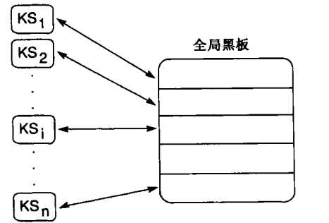

## 6.0 简介
总结一下，第二部分介绍了以下内容：
1. 把问题的解表示为从起始状态到目标的一条路径。
2. 通过使用搜索，系统地检验通往目标的候选路径。
3. 回溯或其他某种机制使算法可以从无法找到目标的路径恢复。
4. 使用列表显式记录纳入考虑的状态。
   - open列表使算法可以在必要时探索还未试验过的状态。
   - 记录已访问过的状态的closed列表使算法可检测循环，避免重复没有希望的路径。
5. open列表在深度优先搜索中实现为堆栈（stack），在宽度优先搜索中实现为队列（queue），在最佳优先搜索中实现为优先级队列（priority queue）。


## 6.1 基于递归的搜索（选读）

### 6.1.1 递归
一个递归过程由以下两部分组成：
1. 递归步骤：过程调用自身来重复一系列动作。
2. 使递归过程从无限递归（无穷循环的递归）中停止的终止条件。

```
function depthsearch;                                 % open & closed global
  begin
    if open is empty
      then return FAIL;
    current_state := the first element of open;
    if current_state is goal state
      then return SUCCESS
      else
        begin
          open := the tail of open;
          closed := closed with current_state added;
          for each child of current_state
            if not on closed or open                  % build stack
              then add the child to the front of open
        end;
    depthsearch                                       % recur
  end.
```

```
function depthsearch(current_state);                  % closed is global
  begin
    if current_state is a goal
      then return SUCCESS;
    add current_state to closed;
    while current_state has unexamined children
      begin
        child := next unexamined child;
        if child not member of closed
          then if depthsearch(child) = SUCCESS
            then return SUCCESS
      end;
    return FAIL                                       % search exhausted
  end
```

**二阶梵塔问题**
设有三根柱子，在1号柱子上穿有A、B两个盘片，盘A小于盘B，盘A位于盘B的上面。要求把两个盘片全部移到另一根柱子上，而且规定每次只能移动一片，任何时刻都不能使盘B位于盘A的上面。

设用 $S_k = (S_{k0}, S_{k1})$ 表示问题的状态，$S_{k0}$ 表示盘A所在的柱子号，$S_{k1}$ 表示盘B所在的柱子号。
全部可能的状态有以下9种：


问题的初始状态集合为 $S = \{ S_0 \}$，目标状态集合为 $G= (S_4, S_8)$。
算符分别用 $A(i, j)$ 及 $B(i, j)$ 表示。$A(i, j)$ 表示把盘A从i号柱移到j上；$B(i, j)$ 表示把盘B从i号柱移到j号柱上。
共有12个算符，它们分别是：
$A(1, 2), A(1, 3), A(2, 1), A(2, 3), A(3, 1), A(3, 2)$
$B(1, 2), B(1, 3), B(2, 1), B(2, 3), B(3, 1), B(3, 2)$

根据9种可能的状态和12种算符，可构成二阶梵塔问题的状态空间图，如图所示。


**三阶梵塔问题**
设有A、B、C三个盘片以及三根柱子，三个盘片按从小到大的顺序穿在1号柱子上，要求把他们全部移到3号柱子上，而且每次只能移动一个盘片，任何时刻都不能把大的盘片压在小的盘片上面。

可把原问题分解为三个子问题：
1. 把盘片A及B移到2号柱的双盘片问题。
2. 把盘片C移到3号柱的单盘片问题。
3. 把盘片A及B移到3号柱的双盘片问题。
- 其中，子问题1与子问题3又分别可分解为三个子问题。

为了用与/成树把问题的分解过程表示出来，需要先定义问题的状态表示。
设用三元组：$(i, j, k)$ 表示状态，其中i表示盘片C所在的柱号：j表示盘片B所在的柱号；k表示盘片A所在的柱号。
这样初始问题就可表示为：$(1,1,1) \Rightarrow(3,3,3)$


### 6.1.2 一个递归搜索的例子：模式驱动推理
假定我们想要编写一个算法判断一个谓词演算表达式是否为某个断言集合的逻辑结论。

```
function pattern_search(current_goal)
  begin
    if current_goal is a member of closed            % test for loops
      then return FAIL
      else add current_goal to closed;
    while there remain in data base unifying facts or rules do
      begin
        case
          current_goal unifies with a fact:
            return SUCCESS;
          current_goal is a conjunction(p∧...):
            begin
              for each conjunct do
                call pattern_search on conjunct;
              if pattern_search succeeds for all conjuncts
                then return SUCCESS
                else return FAIL
            end;
          current_goal unifies with rule conclusion(p in q → p):
            begin
              apply goal unifying substitutions to premise(q);
              call pattern_search on premise;
              if pattern_search succeeds
                then return SUCCESS
                else return FAIL
            end;
        end;                                         % end case
      end;
    return FAIL
  end.
```

为了使用谓词演算进行推理，需要一种控制策略来系统地搜索空间，以避免分析毫无意义的路径和陷入循环。

第二个问题是在规则的前提中存在逻辑连结词：$p \leftarrow q \wedge r; p \leftarrow q \vee (r \wedge s)$。
- $\wedge$ 运算符，表示两个表达式都必须为真。此外，还必须用一致的变量绑定来求解表达式的合取。
- $\vee$ 运算符，表示任何一个表达式都必须为真。

对算法的最后一个补充是使它能够求解含有逻辑非（$\neg$）操作符的目标。

最后，这个算法不该返回success，而该返回解中所包含的绑定。

```
function pattern_search(current_goal);
  begin
    if current_goal is a member of closed              % test for loops
      then return FAIL
      else add current_goal to closed;
    while there remain unifying facts or rules do
    begin
      case
        current_goal unifies with a fact:
          return unifying substitutions;
        current_goal is negated (非p);
          begin
            call pattern_search on p;
            if pattern_search returns FAIL
              then return {};                    % negation is true
              else return FAIL;
          end;
        current_goal is a conjunction (p∧...):
          begin
            for each conjunct do
              begin
                call pattern_search on conjunct;
                if pattern_search returns FAIL
                  then return FAIL;
                  else apply substitutions to other conjuncts;
              end;
            if pattern_search returns SUCCESS for all conjuncts
              then return composition of unifications;
              else return FAIL;
          end;
        current_goal is a disjunction (p∨...):
          begin
            repeat for each disjunct
              call pattern_search on disjunct
            until no more disjuncts or SUCCESS;
            if pattern_search returns SUCCESS
              then return substitutions
              else return FAIL;
          end;
        current_goal unifies with rule conclusion (p in p←q):
          begin
            apply goal unifying substitutions to premises(q);
            call pattern_search on premises;
            if pattern_search returns FAIL
              then return composition of p and q substitutions;
              else return FAIL;
          end;
      end;                                       % end case
    end                                          % end while
    return FAIL
  end.
```

**反向推理过程**
反向推理过程描述如下：（递归算法）
`procedure achieve(G)`
将规则库中的规则后件同当前数据库内容进行匹配，若匹配成功，则找出一条可用规则送入可用规则集S；否则，用下一条规则进行匹配。

```
if S为空
  then 向用户直接询问假设G的真假性，若用户确认G为真或假，则问题已求解；否则，把用户回答的有关G的证据添加到数据库中。
  else
  while G未求解 do
    begin
      调用choose-rule(S)，从S中选择一条规则R:
      G' ← R的前件;
      if G'未求解
        then 调用achieve(G')
      if G'为真
        then 把规则R的后件添加到数据库中
    end
```

反向推理示意图


## 6.2 产生式系统

### 6.2.1 定义和历史
一个产生式系统由以下三部分定义：
1. 产生式规则集合（the set of production rules）。
   - 这些规则经常简称为产生式（production）。
   - 一个产生式就是一个条件—动作对，定义了求解问题的一个知识块。
   - 规则的条件部分是一种模式，用来确定何时可以把这个规则应用到问题实例。
   - 规则的动作部分定义了相关联的求解问题步骤。
2. 工作内存（working memory）包含了推理过程中对世界当前状态的描述。
   - 这个描述就是要和产生式的条件部分匹配的模式，以选择合适的问题求解动作。
   - 当一个规则的条件要素和工作内存的内容相匹配时，便可以执行和这个条件相关联的动作。
   - 设计产生式规则的动作时也特意将其设计为用来改变工作内存的内容。
3. 识别—动作循环（the recognize-act cycle）。产生式系统的控制结构是很简单的：
   - 先使用问题描述初始化工作内存，并把求解问题的当前状态维护为工作内存中的模式集合。
   - 然后把这些模式与产生式规则的条件进行匹配；条件和工作内存中的模式相匹配的规则形成一个子集，称为冲突集合（conflict set）。冲突集合中的产生式称为是使能的。
   - 然后在冲突集合中选择一个产生式（冲突消解（conflict resolution）），并激发这个产生式。激发一个规则就是执行它的动作，修改工作内存的内容。在选择的产生式规则激发之后，对修改后的工作内存重复这个控制循环。
   - 当工作内存的内容不与任何规则的条件匹配时这个过程终止。

冲突消解（conflict resolution）就是从冲突集合中选取一个要激发的规则。
冲突消解策略可以很简单，比如选取条件与世界状态匹配的第一个规则；它也可以很复杂，包含复杂的启发性选取策略。后者是在产生式系统中向搜索算法加入启发控制的一种重要方式。

纯粹的产生式系统模型不包含任何从搜索死端恢复的机制；它只是不断执行识别—动作循环直到不再有任何已经使能的产生式便停止。
在实践中，许多产生式系统的实现允许在这种情况下回溯到工作内存的前一个状态。

产生式系统：

> 注：重复这个循环，直到工作内存中的规则不再与任何产生式的条件匹配

一个简单产生式系统的执行过程：
- 产生式集合：$ba \rightarrow ab \qquad ca \rightarrow ac \qquad cb \rightarrow bc$
  | 迭代 | 工作内存 | 冲突集合      | 激发的规则 |
  | ---- | -------- | ------------- | ---------- |
  | 0    | cbaca    | 1,2,3         | 1          |
  | 1    | cabca    | 2             | 2          |
  | 2    | acbca    | 2,3           | 2          |
  | 3    | acbac    | 1,3           | 1          |
  | 4    | acabc    | 2             | 2          |
  | 5    | aacbc    | 3             | 3          |
  | 6    | aabcc    | $\varnothing$ | Halt       |

### 6.2.2 产生式系统的例子
**数字华容道问题**
- 产生的搜索空间，不仅其复杂度足以引起我们的兴趣，而且其空间较小足以驾驭。
- 经常被用来试验不同的搜索策略，比如深度优先搜索、宽度优先搜索以及启发式搜索。

```
起始状态：2  8  3      目标状态：1  2  3
         1  6  4               8     4
         7     5               7  6  5
```

产生式集合：
| 条件                 | 动作         |
| -------------------- | ------------ |
| 目标状态在工作内存中 | 终止         |
| 空位不在左侧的边上   | 向左移动空位 |
| 空位不在靠上的边上   | 向上移动空位 |
| 空位不在右侧的边上   | 向右移动空位 |
| 空位不在靠下的边上   | 向下移动空位 |

控制制度（机制）：
1. 依次试验每个产生式。
2. 不允许循环。
3. 当发现目标时停止。

产生式系统对数字华容道问题空间的搜索：

> 注：这个系统采用循环探测，并且搜索的深度限制不超过5。

**骑士周游问题**
国际象棋中骑士的合法移动

- 传统定义：找一个合法移动序列使骑士走过棋盘的每一个方格恰好一次。
- 简化版本：在一个缩小的棋盘上(3×3)，是否存在一系列合法移动使骑士可以从一个方格移动到另一个方格。

简化骑士周游问题的3×3棋盘以及相应的移动规则


3×3版本骑士周游问题的产生式规则
| 规则编号 | 条件         | 动作             |
| -------- | ------------ | ---------------- |
| 1.       | 骑士在方格 1 | 移动骑士到方格 8 |
| 2.       | 骑士在方格 1 | 移动骑士到方格 6 |
| 3.       | 骑士在方格 2 | 移动骑士到方格 9 |
| 4.       | 骑士在方格 2 | 移动骑士到方格 7 |
| 5.       | 骑士在方格 3 | 移动骑士到方格 4 |
| 6.       | 骑士在方格 3 | 移动骑士到方格 8 |
| 7.       | 骑士在方格 4 | 移动骑士到方格 9 |
| 8.       | 骑士在方格 4 | 移动骑士到方格 3 |
| 9.       | 骑士在方格 6 | 移动骑士到方格 1 |
| 10.      | 骑士在方格 6 | 移动骑士到方格 7 |
| 11.      | 骑士在方格 7 | 移动骑士到方格 2 |
| 12.      | 骑士在方格 7 | 移动骑士到方格 6 |
| 13.      | 骑士在方格 8 | 移动骑士到方格 3 |
| 14.      | 骑士在方格 8 | 移动骑士到方格 1 |
| 15.      | 骑士在方格 9 | 移动骑士到方格 2 |
| 16.      | 骑士在方格 9 | 移动骑士到方格 4 |

通用的递归路径定义：
$$
\forall X path (X, X) \\
\forall X, Y[\operatorname{path}(X, Y) \leftarrow \exists Z[\operatorname{move}(X, Z) \wedge \operatorname{path}(Z, Y)]]
$$

3×3版本骑士周游问题的一个产生式系统解


递归的path算法：产生式系统


改进的递归路径定义：
$$
\forall X path (X, X) \\
\forall X, Y[\operatorname{path}(X, Y) \leftarrow \exists Z[\operatorname{move}(X, Z) \wedge \neg (been(Z)) \wedge assert(been(Z)) \wedge \operatorname{path}(Z, Y)]]
$$
- assert(x)：把X移进工作内存
- been(x)：代表棋盘一方格

**完整的骑士周游问题**
骑士向下移动两个方格并向右移动一个方格定义：
- 条件：$当前行 \le 6 \wedge 当前列 \le 7$
- 动作：$新的行 = 当前行 + 2 \wedge 新的列 = 当前列 + 1$

规则重写：
$$
move(square(Row, Column), square(Newrow, Newcolumn)) \leftarrow \\
  less_than_or_equals (Row, 6) \wedge \\
  equals(Newrow, plus(Row, 2)) \wedge \\
  less_than_or_equals(Column, 7) \wedge \\
  equals(Newcolumn, plus(Column, 1))
$$

**以产生式系统实现财务顾问程序**
...

### 6.2.3 产生式系统中的搜索控制
产生式系统模型为向搜索算法中加人启发式控制提供了广泛的机会。

**通过选取数据驱动或目标驱动搜索策略来控制搜索**
产生式系统的数据驱动搜索


产生式系统的目标驱动搜索


双向搜索相互遗漏导致了额外搜索


双向搜索在中间相遇，排除了绝大部分非双向搜索所分析的空间


**通过规则结构控制搜索**
产生式系统的规则结构——包括规则和动作的区分以及试验条件的顺序——决定了搜索空间的方式。

例：
- $\forall X(foo(X) \wedge goo(X) \rightarrow moo(X))$
- $\forall X(foo(X) \rightarrow moo(X) \vee \neg goo(X))$

尽管这两个公式是逻辑等价的，但是当把它们解释为产生式时就会产生不同的结果，因为产生式系统的实现对规则的匹配和激发强加了顺序性。

**通过冲突消解策略控制搜索**
OPS5所支持的冲突消解策略包括：
1. 折射（refraction）：一个规则一旦被激发，就不可以再次被激发，除非与其条件匹配的工作内存元素已经修改了。这样可以抵制循环。
2. 最新性（recency）：最新性策略优先选择规则条件与最近加人到工作内存中的模式相匹配的规则。这使搜索的焦点集中在一条推理路线上。
3. 特殊性（specificity）：这个策略假定使用一个更特殊的问题求解规则会比使用更一般的规则更合适。一个规则比其他规则更特殊的标准是其条件更多，这也意味着与其匹配的工作内存模式会更少。

### 6.2.4 AI产生式系统的优点
- 知识和控制的分离
- 可以自然地映射到状态空间搜索
- 产生式规则的模块性
- 模式导向控制
- 有很多种方式可以用于对搜索的启发式控制
- 易于跟踪和解释
- 语言独立性
- 为人类问题求解提供了一种合理的模型


## 6.3 用于问题求解的黑板结构
黑板扩展了产生式系统，允许我们把工作内存组织成多个独立的模块，每个模块对应于产生式规则的不同子集。
黑板把这些产生式规则的独立集合集成起来，并在一个全局的结构（及黑板）中协调这些问题求解器（有时也称为知识源）的动作。


黑板是一个全局性的中央数据库，用来实现各个独立异步知识源间的通信。
每个知识源集中表示一个特定问题的有关方面，是独立的、异步的。


## 产生式系统小结
产生式：一种知识表示方法，常用来表示有因果关系的知识。

形式：
- 条件 → 行动
- 前提 → 结论
- if...then...

> →左边表示条件（左半部分），右边表示结论（右半部分）。

> 一般可以写成 $A_1 \wedge A_2 \wedge ... A_n \rightarrow B$ 的形式。

产生式系统：把一组产生式放在一起，让它们互相配合，协同作用，一个产生式的结论可以供另一个产生式作为前提使用，以这种方式求解问题的系统称为产生式系统。

产生式系统的构成
- 一组产生式规则（set of rules）
- 综合数据库（global database）
- 控制机制（control system）

综合数据库
- 存放已知的事实和推导出的事实；
- 和database（数据库）不同：
  - database：强调数据的管理（存取、增、删、改等）
  - 产生式系统：抽象的概念
    - 只是说明数据在此存放，和物理实现没关系。
    - 具体实现时，用DBMS和文件等都可以。
    - 数据是广义的，可以是常量、变量、谓词、图像等。
- 数据结构:
  - 符号串、向量、集合、数组、树、表格、文件等；

控制机制完成的工作
- 匹配规则条件部分；
- 多于一条规则匹配成功时，选择哪条规则执行（点燃）；
- 如何将匹配规则的结论部分放入综合数据库（是直接添加到数据库中，还是替换其中的某些东西）；
- 决定系统何时终止；

产生式系统的运行过程
- 建立产生式规则；
- 将已知的事实放入综合数据库；
- 考察每一条产生式规则，如果条件部分和综合数据库中的数据匹配，则规则的结论放入综合数据库；

算法
- 令DATA为综合数据库
  1. 初始化DATA；
  2. 如果满足终止条件，终止。否则：
     1. 选择一个可应用于DATA之上的规则R；
     2. R应用于DATA之上产生的结果→DATA。


一般应用程序与产生式系统的区别
- 前者把问题求解的知识隐含地编入程序，而后者则把其应用领域的问题求解知识单独组成一个实体，即为知识库。
- 更明确地说，一般应用程序把知识组织为两级：数据级和程序级；
- 产生式系统则将知识组织成三级；数据、知识库和控制。

知识获取：


产生式系统的特点
- 规则的表示形式固定：
  - 规则分为左半部分和右半部分；
  - 左半部分是条件，右半部分是结论；
- 知识模块化：
  - 知识元：通俗的说，知识元是产生式规则的条件中的独立部分，Ai；所有的规则或数据库中的数据都是由知识元构成；
- 产生式之间的相互影响是间接的
  - 产生式之间的作用通过综合数据库的变化完成，因此是数据驱动的；
  - 易扩展: 规则的添加和删除较为自由，因为没有相互作用；
  - 添加规则不能造成矛盾；`A→B，A→~B`。

