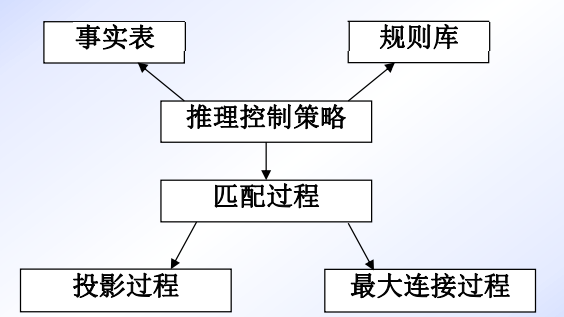

> 关于知识

**知识的价值**：信息社会是知识驱动的社会
知识是一种重要的资源。传统的“生产要素”（土地、劳动力和资本）已经变为次要的因素。只要有知识，就可以很容易获得这些要素。

**数据、信息、知识**
- 数据，是我们每时每刻感觉到的大量的没有经过解释的信号。计算机里装满了数据。
- 信息，是具有意义的数据。一位汽车司机，红色的交通灯不仅仅是一个具有某种颜色的物体的信号，而应解释为一个停车的指示。一个来自太空的外星人，不可能把红色交通灯理解为停车。数据相同，但信息不同。
- 知识，增加了两个不同的方面：第一，目的感，因为知识是用来达到一个目标的。第二，再生能力，因为知识的主要功能之一就是产生新的信息。

| 术语 | 特征                               | 例子                 |
| ---- | ---------------------------------- | -------------------- |
| 数据 | 未经处理的原始材料                 | ...---...            |
| 信息 | 有意义的数据                       | SOS                  |
| 知识 | 具有一定目的的信息，产生一定的行动 | 紧急警报->开始营救行 |

知识紧密地依赖语境（context） 。一个人的知识可能是另外一个人的数据。数据、信息和知识之间的分界线并不是很清晰的，因为它们与所使用的语境有关。

**知识的层次结构**


**明确的知识和不言而喻的知识**
- 大部分知识是不言而喻的，其拥有者不能清晰描述的，不易解释并无法正式表述在书中的。
- 但是，这是一种“背景”能力，它是无意识的，是在行动中的知识。它起源于完成其他人类任务所获得的经验。

**四种知识生产的模式**（知识创建动态模型）

1. 从不言而喻的知识到不言而喻的知识（＝社会化）：人们可以通过互相展示，而不是通过对话互相教会关于某主题的内容。
2. 从不言而喻的知识到明确的知识（＝知识外化）：知识密集型的活动通过写在纸上而被阐明，并形成正式的产品等。
3. 从明确的知识到明确的知识（＝组合）：通过集成不同的明确的知识片断而产生知识。
4. 从明确的知识到不言而喻的知识（＝内化）：频繁地完成一项任务导致不假思索就成功地完成一项任务的个人状态。

**知识工程**——把不言而喻的知识转化成明确的知识
- 知识创造需要不断地进行这四种形式的知识生产过程。知识管理的目的非常有利于并刺激这些知识过程，所以螺旋式动态上升的知识便出现了。
- 在这一观点下，知识工程是一个在“外化”方面特别有用的方法学，即把不言而喻的知识转化成明确的知识。这是知识工程学的独一无二的特征。

**知识的定义**（难以给出明确的定义只能从不同侧面加以理解）
- Feigenbaum：知识是经过消减、塑造、解释和转换的信息。
- Bernstein：知识是由特定领域的描述、关系和过程组成的。
- Hayes-roth：知识是事实、信念和启发式规则。
- 知识库的观点：知识是某领域中所涉及的各有关方面的一种符号表示。

**知识的种类**
- 事实性知识：采用直接表示的形式。
- 判断性知识
- 过程性知识：描述做某件事的过程。
- 对象级知识，或称为领域相关的知识。
- 元知识：有关知识的知识。最重要的元知识是如何使用知识的知识，如何从知识库中找到想要的知识。

**知识的要素**
- 事实：事物的分类、属性、事物间关系、科学事实、客观事实等。（最低层的知识）
- 规则：事物的行动、动作和联系的因果关系知识。（启发式规则）
- 控制：当有多个动作同时被激活时，选择哪一个动作来执行的知识。（技巧性）
- 元知识：高层知识。怎样使用规则、解释规则、校验规则、解释程序结构等知识。

> 关于知识表示

**知识表示目的与思路**
知识表示的目的——使用知识。它是问题求解和专家系统的基础。


...

**知识表示在软件系统开发中的作用**


**知识获取过程中知识表示的地位**


## 7.0 知识表示问题
历史观点：
- 把知识库描述为“问题域中的对象和关系”与“程序中的计算对象和关系”间的映射。
- 知识库中的推理结果应该和现实世界中的动作或观察结果对应。
- 知识表示语言就是计算对象、关系和程序员可用推理间的媒介。


## 7.1 AI表示模式的简要历史

### 7.1.1 语义关联理论
- 逻辑所关心的问题是开发出具有可靠且完备的推理规则的形式表示语言。
- 另一种研究路线起源于心理学家和语言学家为刻画人类理解的本质所做的努力。
- 这类研究不太关心能否建立出正确推理的规则，更关心如何描述人类用来获取、关联和使用所处世界知识的实际方式。
- 联想论者（associationist）通过一个对象与其他对象间的关联网络来定义这个对象的含义。
- 人类还可以分层地组织知识，把信息放在最合适的分类层次上。

语义网

- 语义网把知识表示为一种图
- 结点对应事实或者概念
- 弧对应概念之间的关系或关联

雪和冰属性的网络表示：


**用语义网络表示知识的步骤**
1. 确定问题中所有的对象以及各对象的属性。
2. 分析并确定语义网中所论对象间的关系。
3. 根据语义网络中所涉及的关系，对语义网络中的节点和弧进行整理，包括增加节点、弧和归并节点等。
4. 分析检查语义网络中是否含有要表示知识中的所有对象，若有遗漏，则须补全。并将各对象间的关系作为网络中各节点间的有向弧，连接形成语义网络。
5. 根据第1步的分析结果，为各对象标示属性。

### 7.1.2 语义网的早期研究
Quillian编写了一个程序，以几乎和字典相同的方式定义英语单词：
- 一个单词是通过其他单词定义的，定义中的各个部分也是按这种方式定义的。
- 不是使用基本公理来定义单词，每个定义只是以一种没有固定结构的而且可能循环的方式引向其他的定义。
- 在查一个单词时，遍历这个“网络”，直到我们已经满意于对原来单词的解释。

表示单词“plant”三种含义的三个平面


“cry”和“comfort”之间的相交路径


这种面向语义的方法，可以提供具有如下能力的自然语言理解系统：
1. 通过建立相交结点判断一段英语文本的含义。
2. 选择多义词在句子中的语义，方法是寻找到达句中其他单词的相交路径，选取具有最短相交路径的语义。例如，对于“Tom went home to water his new plant”中的“plant”，可以根据单词概念“water”和“plant”相交选出它的含义。
3. 以查询中的单词概念和系统中概念之间的关联为基础回答各种查询。

### 7.1.3 网络关系的标准化
Simmons把研究的焦点集中到英语动词的格结构（case structure）上，以解决对标准关系的需要。
- 格关系包括主体、对象、工具、位置以及时间。
- 一个句子表示为一个动词结点，并用不同的格连接指向参与动作的其他结点。
- 这一结构称为案例框架（case frame）（格框架）。

句子“Sarah fixed the chair with glue”的案例框架表示


概念依赖（conceptual dependency）理论提供了一个包含4种原子概念的集合，根据这4种原子来建立语义世界。
这些概念是平等而且独立的。它们是：
- ACT：动作
- PP：对象（picture producers）
- AA：动作的修饰语（action aiders）
- PA：对象的修饰语（picture aiders）

所有动作都可以简化为一个或多个原子ACT。下面列出的这些原语作为基本的动作部件，通过修改和组合这些部件可以形成更多的特定动词。
- ATRANS：转移一种关系（give）
- PTRANS：转移一个对象的物理位置（go）
- PROPEL：对一个对象施加力（push）
- MOVE：拥有者移动身体部件（kick）
- GRASP：行动者抓取个对象（grasp）
- INGEST：动物摄取一个对象（eat）
- EXPEL：从一个动物的体内排出（cry）
- MTRANS：转移精神信息（tell）
- MBUILD：产生新的精神信息（decide）
- CONC：概念化或者思考一个想法（think）
- SPEAK：产生声音（say）
- ATTEND：集中感觉器官（listen）

概念依赖关系（conceptual dependency relationship）


时态和模式修饰符的部分列表
- p：过去
- f：将来
- t：转换
- k：进行
- $t_s$：开始转换
- ?：疑问
- $t_f$：完成转换
- c：条件
- /：反义
- nil：现在
- delta?：不受事件影响的（永恒的）

一些基本的概念依赖关系以及如何使用它们表示比较复杂的英语句子


“John ate the dog”

- $\leftarrow$：指出依赖性的方向
- $\Leftrightarrow$：表明“主体-动词”关系
- O：对象关系
- D：指出动作中的对象方向

“John prevented Mary from giving a book to Bill”

- R：指示操作中对象的接收者和赠送者

概念依赖理论的影响
- 为自然语言语义提供了一套形式理论，减少了歧义问题。
- 为语句的含义提供了一种范式（canonical form），直接捕获了自然语言的大部分语义。

概念依赖理论的不足
- 把独异点（monoid）（一种比自然语言简单的代数群）简化为范式，在计算来说是不可行的。
- 这些原语还不足以表示出自然语言中一些很重要的微妙概念。

### 7.1.4 脚本
脚本（script）是一种结构化的表示，用来描述特定上下文中固定不变的事件序列。
- 进入条件（entry condition）：要调用这个脚本必须满足的世界描述。
- 结果（result）：脚本一旦终止就成立的事实。
- 道具（prop）：支持脚本内容的各种“东西”。
- 角色任务（role）：各个参与者所执行的动作。
- 场景（scene）。Schank把脚本分解成一系列场景，每一场景呈现一段脚本。

饭店脚本


### 7.1.5 框架
当一个人遇到新的情况（或其看待问题的观点发生实质性变化）时，他会从记忆中选择一种结构，即“框架”。这是一种记忆下来的轮廓，按照需要改变其细节就可以用其拟合真实情况。

宾馆房间的框架描述（部分）
注：“特化”指出了一个指向超类的指针


框架中的槽通常包含以下信息：
1. 框架标识信息。
2. 这个框架和其他框架的关系。
3. 框架的特征描述。
4. 关于描述结构用法的过程信息。
5. 框架的默认信息。
6. 新实例信息。

观察立方体的立体框架


## 7.2 概念图：网络语言

### 7.2.1 概念图简介
- 概念图是一种有限、连接、二部图。
- 图的结点要么是概念；要么是概念关系。
- 为了区分这两种类型的结点，我们将概念表示成矩形，将概念关系表示为椭圆。

不同“目”的概念关系


### 7.2.2 类型、个体和名字
- 在概念图中，所有的概念都是特定类型的惟一个体。
- 每个概念矩形都带有一个类型标签，用来指出这个结点所表示的个体的类型或类。

一只名为艾玛的狗是棕色的


- 我们还可以用概念图来表示特定但未命名的个体。
- 用一种称为标志的记号来指出话语世界中的每个个体。
- 标志以“#”号开始，后面跟一个数字。标志不同于名字，因为标志是惟一的：个体可以有一个名字、多个名字、或者根本没有名字，但是它的标志有且仅有一个。

一只特定的（但未命名）狗是棕色的


一只名为艾玛的狗是棕色的


一个人有三个名字


- 除了用标志或名字来指示个体外，我们还可以用标志\*来表示未指定的个体。
- 根据约定，可以经常省略\*标志，因此仅给出类型标签dog的结点等价于标有“dog:\*”的结点。
- 除了一般标志外，概念图还允许使用命名变量。变量以星号开始，后面跟随变量名（例如\*X或\*foo）。
- 如果两个分隔开的结点表示同一个未指定的个体，那么这时变量是很有用的。

总而言之，每个概念结点可以表示特定类型的一个个体。这个个体是这个概念的指向。这种指向既可以是个别的，也可以是泛指的。
如果这个指向使用了个体标志，那么这个概念就是一个个体概念；如果指向使用了一般标志，那么概念就是一般概念。

### 7.2.3 类型层次
如果s和t是两种类型，并且 $t \le S$，那么就说t是s的子类型；s是t的超类型。
如果s、t和u都是类型，并且 $t \le s, t \le u$，那么就说t是s和u的公共子类型。
类似地，如果 $s \le v, u \le v$，那么v便是s和u的公共超类型。

格：每个类型对必须有一个最小公共超类型和一个最大公共子类型。

通用类型（universal type）是所有类型的超类型，用T表示。
荒谬类型（absurd type）是所有类型的子类型，用 $\perp$ 表示。

说明子类型、超类型、通用类型和荒谬类型的类型网格（注：弧代表关系）


### 7.2.4 泛化和特化
1. 复制（copy）规则可以形成一幅新图g，是 $g_1$ 的精确拷贝。
2. 限定（restrict）运算使我们可以用结点的特例来替换结点。这有两种情况：
   1. 如果概念带有一般标志，那么可以把一般标志替换为个别标志。
   2. 可以把类型标签替换为它的子类型之一，但条件是和这个概念的指向一致。
3. 联合（join）规则可以把两幅图组合为一幅。
4. 筒化（simplify）规则：如果图中包含两个重复的关系，那么可以删除其中之一以及它的所有弧。

限定、联合和简化运算的例子


限定规则的一种用途是使两个概念匹配以便进行联合。
同时使用联合和限定便可以实现继承。

概念图中的继承


### 7.2.5 命题结点
概念图包含了一种命题（proposition）概念类型，它以概念图集合作为指向，使我们可以定义包含命题的关系。

陈述“汤姆相信简喜欢比萨”的概念图（注：该图显示了命题概念的用法）


### 7.2.6 概念图和逻辑
可以使用命题概念和称为neg的一目操作来实现非。neg以一个命题概念为参数，断言这个概念是假的。

命题“There are no pink dogs”的概念图


从表达能力来看，概念图等价于谓词演算。
总是存在一个直接的映射，把概念图表示映射到谓词演算表示。

把概念图g转化到谓词演算表达式的算法：
1. 为g中的n个一般概念中的每一个分配一个惟一变量 $x_1, x_2, ..., x_n$。
2. 为g中的每个个体概念分配一个惟一的常量。
3. 用一元谓词表示每个概念结点，谓词的名字和结点的类型相同，谓词的参数是赋给该结点的变量或常量。
4. 将g中的所有n元概念关系表示为n元谓词，谓词的名字和该关系的名字相同。
5. 取第3步和第4步形成的所有原子语句的合取。

**语义网络应用——概念图表示法及其推理**
概念图知识表示方法，是由美国的John F Sowa提出的面向自然语言处理的知识表示方法，它属于语义网络的范畴，具有结构简单、易读、表示范围广、接近自然语言、能确切地表示自然语言的语义等多种特点。

No student read his own books的概念图


两个具有相同概念节点的概念图可以通过恒等线（用虚线“......”表示）把两个概念图连接在一起，形成一个合成图。没有恒等线的图叫做简单图。
注意，用恒等线连接的两个概念必须概念类型相同，类型所指相同。因此，恒等线也叫做共同所指线。
例如“No student read the teacher's book”的概念图如下：


一个概念图有显示和线性两种表示方法


其线性形式如下：


**概念图的存储结构**
一个概念节点用具有4个属性的一个记录表示：
1. 标记：指出记录是一个概念；
2. 类型：指出概念类型记录；
3. 所指域：指出个体概念的所指域或一般概念的量词；
4. 关系表：指出当前概念所连的每一个关系记录。

一个关系节点用具有3个属性的记录表示：
1. 标记：指出记录是一个关系；
2. 类型：指出关系类型记录；
3. 弧指针：指出与关系相连（相联）的每个概念。

**概念图的逻辑存储结构**


一个简单概念图的prolog实现
$[PERSON:(john,joe,*)] \leftarrow (AGNT) \leftarrow [PLAY] \rightarrow (OBJ) \rightarrow [BALL]$

相应的prolog事实表示如下：
```
concept(person:[pse,john,joe],[agnt],1000).
concept(play:g,[gnt,obj],1001).
concept(ball:g,[obj],1002).
relation(agnt,1001,1000,1003).
relation(obj,1001,1002,1004).
graph(dsl,[1000,1001,1002],[1003,1004],1005).
```

**嵌入概念图的存储结构**
嵌入的概念图是指某个概念的所指对象域，又是一个概念图。一个概念的所指对象也可以是多个嵌入的概念图。所有嵌入的概念图都出现在概念`[PROPOSITION]`的所指对象域中。其存储结构与简单图的类似，只是概念`[PROPOSITION]`的记录中有指向所嵌入图的指针。


Prolog存储结构
其prolog事实又增加了以下几个：
```
concept(proposition:[gr,1005],[obj],1006).
concept(person:mary,[agnt],1007).
concept(belief:g,[agnt],1008).
relation(obj,1008,1006,1010).
relation(agnt,1008,1007,1009).
graphs(ds2,[1006,1007,1008],[1009,1010],1011)
```

**概念图的匹配**
概念图上的匹配操作如下：
设u和v是两个概念图，若存在u的一个子图u'满足：
1. u'中的概念关系与v中对应的概念关系相同。
2. 对于u和v中的概念关系r连接的两个概念分别是 $c_i$ 和 $c_j$ 及 $d_i$ 和 $d_j$，存在着最大的公共限制概念 $e_i$ 和 $e_j$ 即 $e_i \le c_i$ 和 $e_i \le d_i, e_j \le c_j$ 和 $e_j \le d_j$，且 $e_i \neq ABS \cup RD, e_J \neq ABS \cup RD$。就说概念图v能匹配到概念图u。

应用以上定义在概念图u上和概念图v上进行下列替换：
- $\theta_1 = (c_1/e_1, c_2/e_2, ..., c_n/e_n)$在图u上。
- $\theta_2 = (d_1/e_1, d_2/e_2, ..., d_n/e_n)$在图v上。

**概念图的投影运算**
投影的定义：设u和v是两个概念图。如果 $u \le v$，则存在一个u的子图u'和v同构。$u' = v \rightarrow u$，则称作v在u上的投影。
如果 $u' = v \rightarrow u$，则下列3条成立：
1. u'中的概念关系和v中的相同。
2. u'中的概念 $c_1, ..., c_n$ 是v中相应概念 $d_1, ..., d_n$ 的某些限制。
3. 若v中的一个关系r连着两个概念 $d_i$ 和 $d_j$，则在u中，r连着概念 $c_i$ 和 $c_j$。

例如，规则图v：$IF [ANIMAL: *x] \leftarrow (AGNT) \leftarrow [FLIES] THEN[ANIMAL：*x] \rightarrow (TYPE) \rightarrow [BIRD]$
事实图u：$[ANIMAL: peter] \leftarrow (AGNT) \leftarrow [FLIES] \rightarrow (AGNT) \rightarrow [LOVE]$
则v在u上的投影图u'：$[ANIMAL: peter] \leftarrow (AGNT) \leftarrow [FLIES]$
这个事实与规则的合一参数为：$\theta = \{peter / x\}$
那么，这个规则与事实匹配后的结论图：$[ANIMAL: peter] \rightarrow (TYPE) \rightarrow [BIRD]$。
当然这个例子中只有一个合一参数。一般情况，$\theta$ 是一个合一参数的集合，这个集合叫做一个替换。它的一般形式为：$\theta = \{a_1/x_1, ..., a_n/x_n\} \quad (n \ge 1)$
其中，分子 $a_i$ 是分母 $x_i \quad (1 \le i \le n)$ 的一个特殊化，要用分子替换分母在规则中的出现。

**概念图的最大连接运算**
最大连接是指一个在最大扩充的相容投影上的连接。它是两个原始图信息的混合，是在这两个原始图的最大连通子部分上的连接。

例如：$[PERSON] \leftarrow (AGNT) \leftarrow [LIKE] \rightarrow (OBJ) \rightarrow [ELEPHANT]] \rightarrow (COLOR) \rightarrow [GRAY]$
和 $[John] \leftarrow (NAME) \leftarrow [PERSON] \leftarrow (AGNT) \leftarrow [LIKE] \rightarrow (OBJ) \rightarrow [MAMMAL]$
的最大连接是：$[John] \leftarrow (NAME) \leftarrow [PERSON] \leftarrow (AGNT) \leftarrow [LIKE] \rightarrow (OBJ) \rightarrow [ELEPHANT] \rightarrow (COLOR) \rightarrow [GRAY]$

一个最大连接运算的算法（求u和v的最大连接）
1. 对v中的每个关系做下列循环：
   - 如果r不在u中，则找下一个关系。
   - 否则，设 $c_1$ 和 $c_2$ 是u中被r所连的两个概念，$d_1$ 和 $d_2$ 是v中被r所连的两个概念。
   - 如果 $c_1$ 和 $d_1$ 是相容的，$c_2$ 和 $d_2$ 是相容的，则关系 $relation(r, e_1, e_2, -)$ 放到结果图中。这里，$e_1$ 是 $c_1$ 和 $d_1$ 的最大公共子类型，$e_2$ 是 $c_2$ 和 $d_2$ 的最大公共子类型。否则，回溯到1。
2. 将v的余下部分连到结果图上。
3. 将u的余下部分连到结果图上。

这样，就得到了u和v的最大连接。
最大连接时，两个图的替换分别为：
- 图u中，$\theta_1 = (c_1/e_1, c_2/e_2, ..., c_n/e_n)$
- 图v中，$\theta_2 = (d_1/e_1, d_2/e_2, ..., d_n/e_n)$

最大连接算法中，对要合一的两个概念 $c_i$ 和 $d_i$ 的条件比投影算法条件宽。投影算法中要求 $c_i$ 是 $d_i$ 的限制，最大连接要求 $c_i$ 和 $d_I$ 是相容的。
例如，$[PERSON: 'John']$ 和 $[BOY: *x]$ 在投影时不能合一。而在最大连接时，可合一成$[BOY: 'John']$。

出基于图的匹配算法：
1. 设v是规则前提中的一个图，u是事实表中的一个图。如果，v=u，则匹配成功。
2. 如果 $u \le v$，则调用投影运算过程，求出v在u上的投影，以及合一参数 $\theta$。则匹配成功。
3. 否则，调用最大连接运算过程。如果u和v的最大连接存在。则求出此最大连接，以及合一参数集合 $\theta$，匹配成功；反之，匹配失败。

整个推理过程中，各部分之间的相互关系可用下图说明：


**限制合一**
定义：限制合一是以类型层次为基础，将两个图合并成一个图。

有关动物分类的部分类型层次
$[TIGER] \leftarrow (TYPE) \leftarrow [ANIMAL]$ 和 $[LION] \leftarrow (TYPE) \leftarrow [ANIMAL]$ 可合一成：
$[WILD-FELINE] \leftarrow (TYPE) \leftarrow [ANIMAL]$。

$[TIGER]$ 和 $[LION]$ 在最大连接和投影时都不能匹配。


- 两个类型标记的语义距离小于等于规定值时，方可合一。根据上述定义，在上图中有：
  - $SD(ANIMAL, WILD-ANLMAL) = 1$
  - $SD(CARNIVORE, WILD-ANIMAL) = 2$
  - $SD(WILD-ANIMAL, FELINE) = 3$
- 假设规定值为2，则图 $[TIGER] \leftarrow (TYPE) \leftarrow [ANIMAL]$ 和 $[CARNIVORE] \leftarrow (TYPE) \leftarrow [ANIMAL]$ 不能合一，因为 $SD(CARNIVORE, TIGER) = 3$。
- 但这时可以通过最大连接匹配。
- 投影匹配是精确推理，而最大连接和限制合一匹配实现了非精确推理。

**语义网络与产生式系统结合运用**
用概念图表示规则是一种简单直观的方法。规则是IF——THEN结构，而IF部分和THEN部分又都是概念图的集合。
在IF部分和THEN部分，每个概念图之间都是'AND'($\wedge$)关系。所以，规则的一般形式可表示为：


...


## 7.3 其他表示方法和本体

### 7.3.1 Brooks的包容结构
Brooks认为，智能是一个合理设计的系统与其环境之间相互作用的产物。
此外，Brooks赞成这样的观点，智能行为是在具有更简单行为的结构的交互过程中涌现出来的，这种有组织的结构就是Brooks的包容结构。

**罗德尼·布鲁克斯 Rodney Brooks**
美国著名机器人制造专家罗德尼·布鲁克斯（Rodney Brooks）。包容体系结构的发明者，MIT's 电脑科学和人工智能实验室（MIT AI Lab）的现任领导。20世纪90年代设计了第一个火星机器人。Rodney Brooks在1986年发表的论文中提到的包容式结构表明了基于行为的编程方法的正式起源。

有“坏小子”之称的罗德尼·布鲁克斯出身于澳大利亚，MIT人工智能实验室的教授。从80年代起，他就反对“机器人必须先会思考，才能做事”的信条。为了证实自己的观点，他研制出一系列的异形机器人。这些机器人没有思考能力，但却无所不能，比如能偷桌上的苏打罐，穿越四周发烫的地面等。
——机器人领域最有争议的人物

从科学家的角度，Brooks解释了许多科幻作家和爱好者关注的问题，机器人能思考、感觉、活着吗？人工智能何时不再是人工的？有意识和无意识的区别是什么？

Dr. Brooks在南澳大利亚Flinders大学获得数学学位，在斯坦福大学获计算机博士学位，美国人工智能研究协会(AAAI)的创建者，美国高级科学协会(AAAS)的会员。

三层包容结构的功能（注：这些层是用“回避”、“漫步”和“探索”这三个行为描述的。）


1. 在每个系统层都存在局部信息的充足性问题。
2. 如果绝对不存在关于整个环境的任何“知识”或“模型”，那么关于局部环境的有限输入怎么能足以决策出适合全局情况的动作呢？
3. 一个具有有限状态的纯反应组件如何来学习所处的环境呢？
4. 存在一个规模问题。

...
