## 8.0 简介
本章继续研究智能表示问题，探讨AI的一个重要组成部分：求解问题的知识密集型方法，即强方法（strong method）。
- 人类专家能够表现出很高的推理水平是因为他们对自己所处的专业领域了解得非常透彻。
- 专家系统就是这样的程序，它使用针对某一问题域的知识为该领域提供“专家级”的服务。
- 专家系统设计者首先在人类专家的帮助下获取知识，然后再用专家系统来模仿人类专家的方法和能力。
- 和人类专家一样，专家系统往往是专门针对某一狭窄领域的。
- 和人类一样，他们的知识既是理论的，也是实践的。

使用专家系统求解的一些常见的问题：
- 解释——从大量原始数据总结出高层结论。
- 预测——推测出给定情况下可能发生的结果。
- 诊断——根据可观察的症状决定复杂环境中的故障原因。
- 设计——对系统组件进行配置，以达到目标性能，同时要满足一系列设计约束。
- 规划——根据给定的起始条件和运行期约束，设计出一系列动作以实现目标。
- 监控——将观察到的系统行为和它的期望行为进行比较。
- 指导——对技术领域的教学过程提供帮助。
- 控制——对复杂环境下的行为进行管理。


## 8.1 专家系统技术概览

### 8.1.1 基于规则的专家系统设计
专家系统的典型体系结构
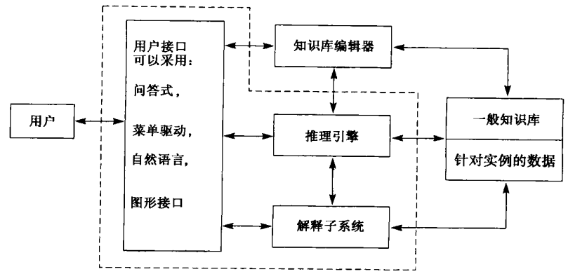

上图展示了典型专家系统的各个组成模块。
用户接口是用户与系统之间的交互渠道，它简化了通信过程并隐藏了大多数复杂细节，比如规则库的内部结构。

专家系统的核心是包含特定应用领域知识的知识库。

### 8.1.2 问题选择和知识工程的步骤
确定一个问题是否适合用专家系统来求解的指导准则：
1. 需求程度决定了开发专家系统值得投入的成本和精力。
2. 人类专家无法出现在所有需要他们的地方。
3. 利用符号推理可以求解的问题。
4. 结构性好而且不需要常识推理的领域。
5. 使用传统计算机技术不可以解决的问题。
6. 有乐于合作又善于表达的专家。
7. 问题的大小和范围很合适。

探索性开发循环
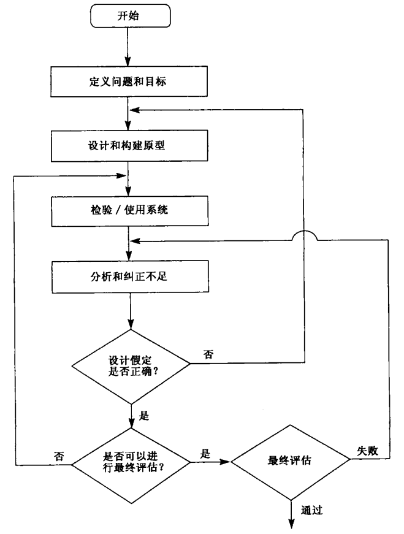

专家系统开发过程的瀑布模型
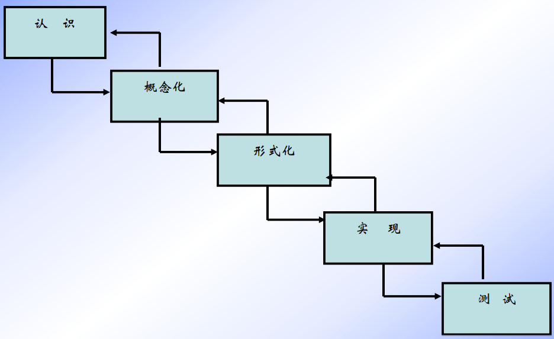

### 8.1.3 概念模型及其在知识获取中的作用
概念模型：专家头脑中的模型再设计者头脑中的反应。

下图（专家系统的建立过程）给出了知识获取过程的一个简化模型，可以将其当作一个“初步近似”，以帮助我们理解如何获得并形式化人类的专业技能。
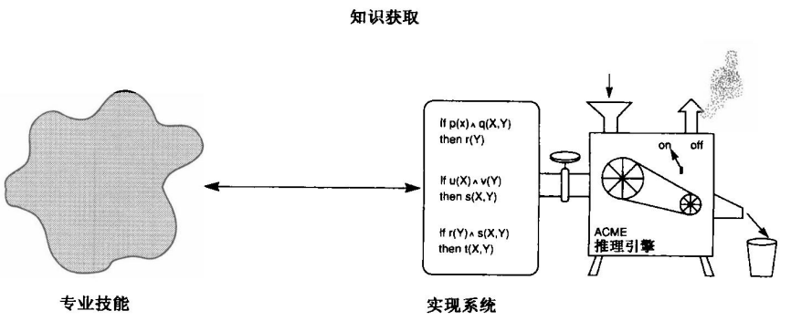

在形式化人类技能时会遇到很多重要的问题：
1. 人类的技能经常是下意识的（难以表述的）。
2. 人类专家经常是知道如何处理某种情况，但却不知道这种情况的理性特征是什么。
3. 我们通常把知识获取看成是取得关于客观实体（即所谓的“真实世界”）的事实知识的过程。
4. 专业技能是变化的。

概念（或智力）模型在问题求解中的作用
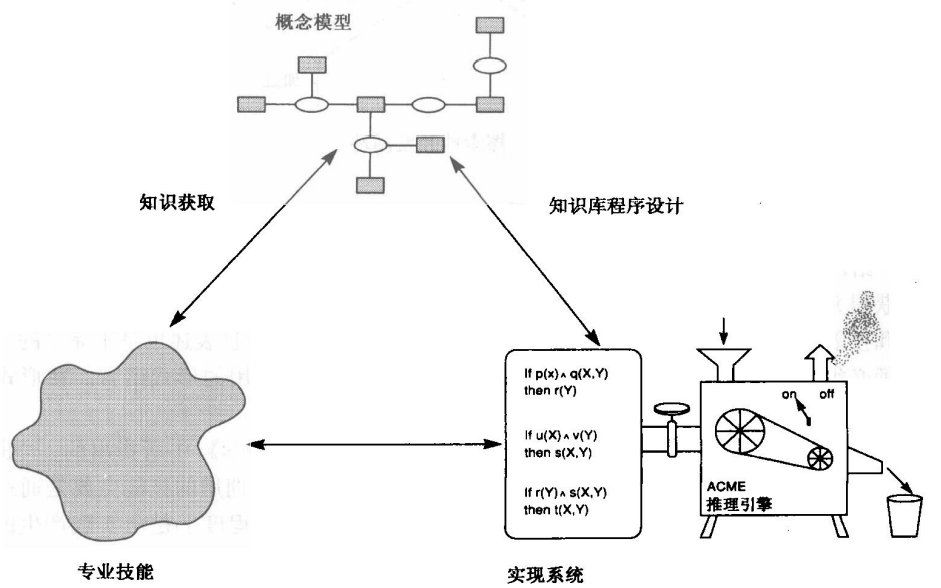


## 8.2 基于规则的专家系统
基于规则的专家系统把求解问题的知识表示为“如果…那么…”形式的规则。

### 8.2.1 产生式系统和目标驱动问题求解
下面举一个分析汽车传动系统故障的专家系统例子，以此来说明目标驱动的问题求解方法（可以向用户询问）。
- 规则1：如果&nbsp;发动机在抽油而且发动机会旋转，&nbsp;&nbsp;那么&nbsp;火花塞有问题。
- 规则2：如果&nbsp;发动机不旋转而且灯不亮，&nbsp;&nbsp;&nbsp;&nbsp;&nbsp;&nbsp;&nbsp;&nbsp;&nbsp;&nbsp;&nbsp;&nbsp;&nbsp;那么&nbsp;电池或电缆有问题。
- 规则3：如果&nbsp;发动机不旋转而且灯亮，&nbsp;&nbsp;&nbsp;&nbsp;&nbsp;&nbsp;&nbsp;&nbsp;&nbsp;&nbsp;&nbsp;&nbsp;&nbsp;&nbsp;&nbsp;&nbsp;那么&nbsp;启动马达有问题。
- 规则4：如果&nbsp;油箱中有油而且化油器中有油，&nbsp;&nbsp;&nbsp;&nbsp;&nbsp;那么&nbsp;发动机在抽油。

用来诊断汽车故障的产生式系统的初始状态
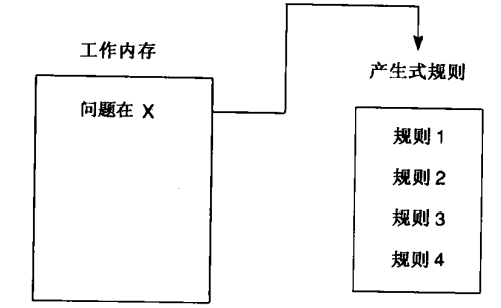

在规则1被激发后：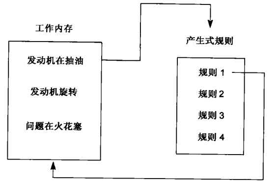
规则4被激发后：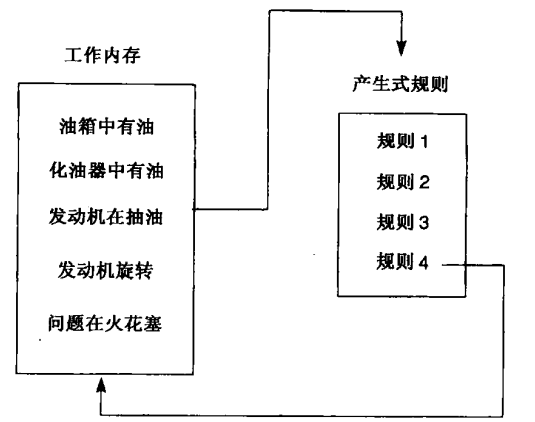

注：注意这种缩小目标的方法是以堆栈为基础的

诊断汽车例子中搜索的与或图（注：规则4的结论与规则1的第一个前提匹配）
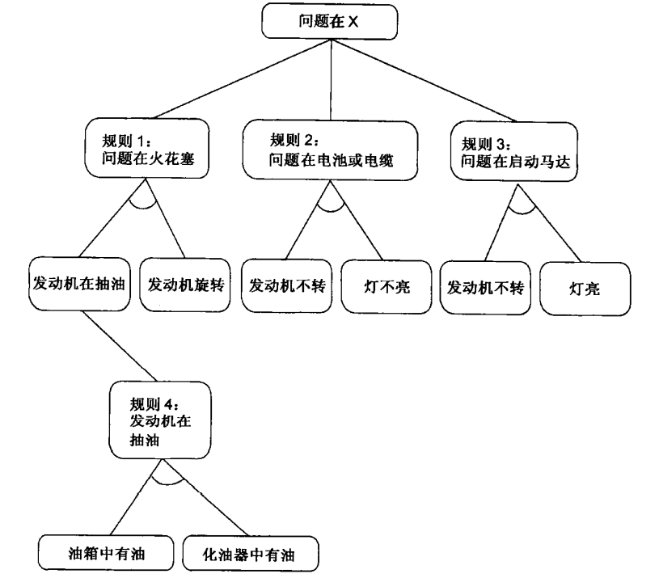

### 8.2.2 目标驱动推理中的解释和透明性
假定咨询过程已经到了“规则4被激发后”的阶段。下面的对话是从计算机向用户询问工作内存中的目标开始的。用户反馈用下划线表示。
- 油箱中有油吗？<u>是的</u>
- 化油器中有油吗？<u>是的</u>
- 发动机旋转吗？<u>为什么</u>
- 已经确认：1.发动机在抽油，所以，如果2.发动机旋转，那么就是火花塞有问题。
- <u>是怎样得出“发动机在抽油”这个结论的？</u>
- 这是从规则4得出的：如果；油箱中有油，而且；化油器中有油；那么；发动机在抽油；油箱中有油是用户给出的；化油器中有油是用户给出的

### 8.2.3 利用产生式系统进行数据驱动推理
宽度优先搜索在数据驱动推理中更加常见。其算法非常简单：
1. 按照规则库中的顺序把工作内存中的内容和规则库中每个规则的条件进行匹配。
2. 如果工作内存中的数据支持激发某个规则，那么便把其结果放人工作内存，然后把控制移向下一个规则。
3. 一旦已经考虑过了所有规则，搜索便再次从规则集合的头开始。

注：必要时询问用户；如果构成规则前提的某个信息不是其他任何规则的结论，那么便认为这个信息是“可询问的”。

用产生式系统进行数据驱动推理时的初始状态
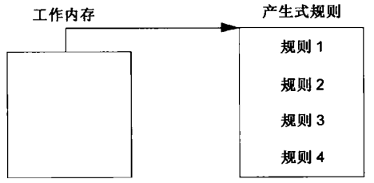

在规则2因第一个前提为假而失败后的产生式系统
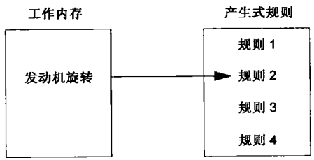

在考虑规则4后，数据驱动的产生式系统开始第二轮扫描规则
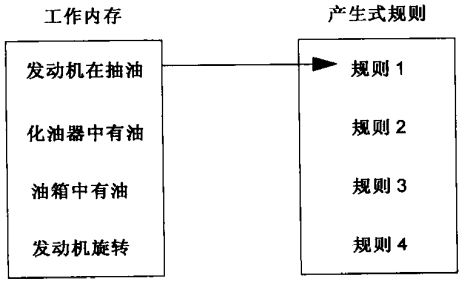

8.2.1节数据驱动宽度优先搜索规则集的搜索图（注：结点是通过工作内存(WM)中的内容来描述的）
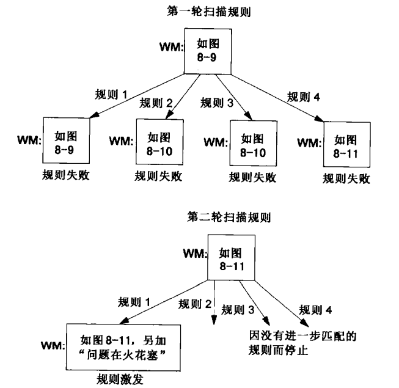

### 8.2.4 专家系统的启发和控制
因为知识库和推理引擎是分离的，而且推理引擎所提供的控制体制是固定的，所以程序员控制搜索的一种重要方法就是改变知识库中规则的结构和顺序。
因此，规则顺序的规划、规则前提的组织、不同检验的成本通常都是基本的启发。


**通过规则结构控制搜索**
生产系统中规则的结构，包括条件和动作之间的区别，决定了空间被搜索的方式。
示例两个逻辑上等价的规则：
- $\forall X (foo(X) \wedge goo(X) \rightarrow moo(X))$
- $\forall X (foo(X) \rightarrow moo(X) \vee \neg goo(X))$

它们在搜索实现中没有相同的行为。
条件的尝试顺序也决定了搜索方式。

例如：当一个机修工说“如果引擎不转，并且灯不亮，那么检查电池”时，他指出了动作的特定顺序。一条逻辑上等价的语句“引擎转动或者车灯亮或者检查电池”并没有捕捉到这种信息。

正向（Data-Driven Reasoning）推理示意图
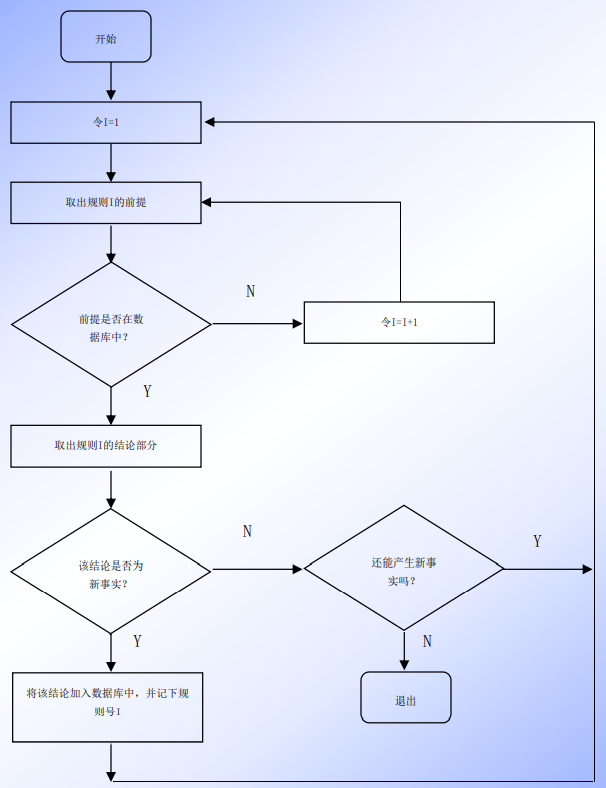

反向推理示意图
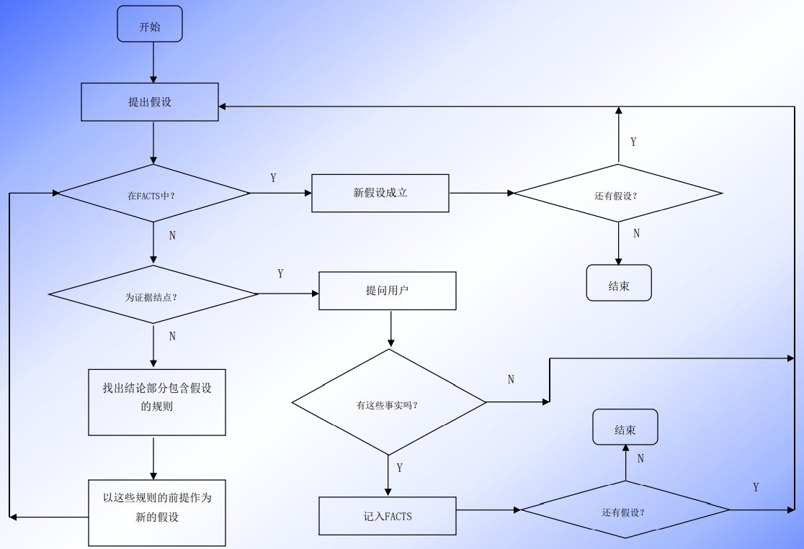

**基于规则专家系统应用举例——动物识别专家系统**
建立动物识别专家系统的规则库，并用与/或图描述这个规则库。规则库由15条规则组成，规则名分别是rule1, rule2 , ...,  rule15，规则库的符号名为rules。

把若干条规则写入一个规则库的最简单方法是使用setq函数，直接把若干条规则组成一个表赋值给一个规则库符号名。
1. 若动物有毛发（F1），则动物是哺乳动物（M1）。
2. 若动物有奶（F2），则动物是哺乳动物（M1）。
3. 若动物有羽毛（F9），则动物是鸟（M4）。
4. 若动物会飞（F10），且生蛋（F11），则动物是鸟（M4）。
5. 若动物吃肉（F3），则动物是食肉动物（M2）。
6. 若动物有犀利牙齿（F4），且有爪（F5），且眼向前方（F6），则动物是食肉动物（M2）。
7. 若动物是哺乳动物（M1），且有蹄（F7），则动物是蹄类动物（M3）。
8. 若动物是哺乳动物（M1），且反刍（F8），则动物是蹄类动物（M3）。
9. 若动物是哺乳动物（M1），且是食肉动物（M2），且有黄褐色（F12），且有暗斑点（F13），则动物是豹（H1）。
10. 若动物是哺乳动物（M1），且是食肉动物（M2），且有黄褐色（F12），且有黑色条纹（F15），则动物是老虎（H2）。
11. 若动物是蹄类动物（M3），且有长脖子（F16），且有长腿（F14），且有黑斑点（F13），则动物是长颈鹿（H3）。
12. 若动物是蹄类动物（M3），且有黑色条纹（F15），则动物是斑马（H4）。
13. 若动物是鸟（M4），且不能飞（F17），且有长脖子（F16），且有长腿（F14），且有黑白二色（F18），则动物是鸵鸟（H5）。
14. 若动物是鸟（M4），且不能飞（F17），且会游泳（F19），且有黑白二色（F18），则动物是企鹅（H6）。
15. 若动物是鸟（M4），且善飞（F20），则动物是信天翁（H7）。

动物识别专家系统规则库与/或图
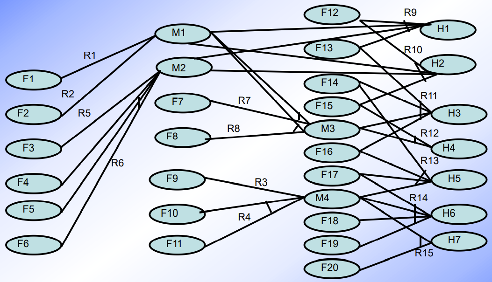

仿真实验（略）

**实例分析——汽车故障诊断（用产生式系统实现）**
汽车故障诊断领域的知识片段
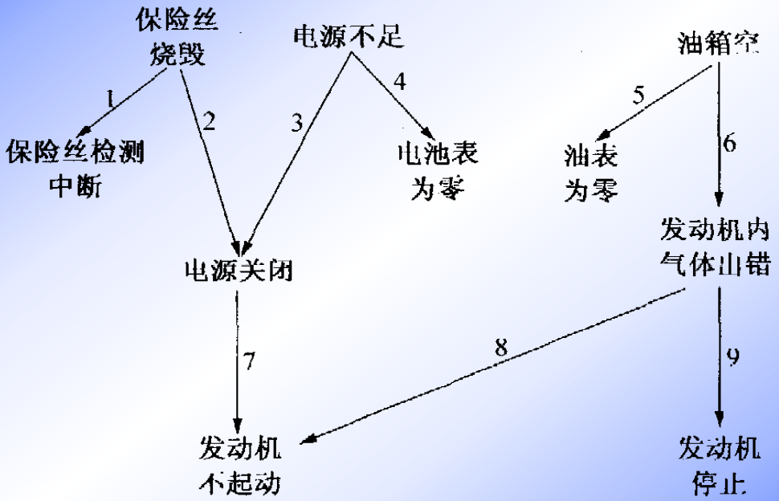

**一般应用程序与专家系统的区别**
- 前者把问题求解的知识隐含地编入程序，而后者则把其应用领域的问题求解知识单独组成一个实体，即为知识库。
- 更明确地说，一般应用程序把知识组织为两级：数据级和程序级；
- 专家系统则将知识组织成三级；数据、知识库和控制。

知识获取
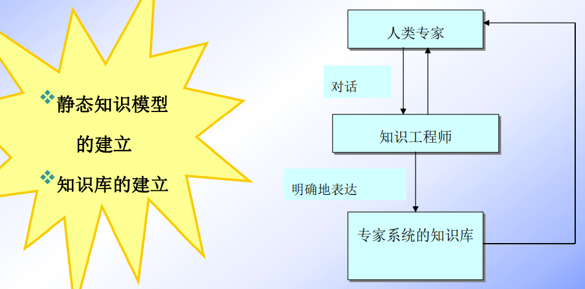

**术语标注和概念抽象**
- 可观察的方面：保险丝检测、电池表、油表
- 汽车状态：
  - 不可见状态：保险丝、电池、油箱、电源、发动机汽体
  - 可见状态：发动机行为。

汽车诊断领域中概念之间的子类型关系
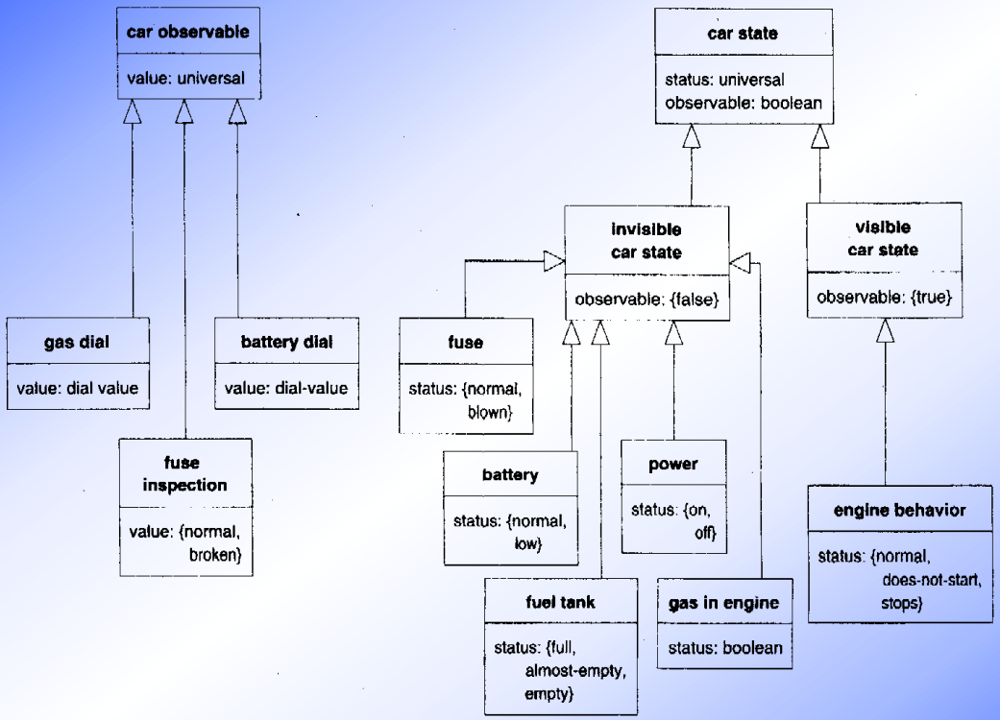

...

**正向推理机的实现——LISP程序**
产生式规则与规则库的存储结构
- 一般产生式规则的前件或后件可能是有限个事实或结论的合取式的析取。
- 在规则库中，允许有前件不同但后件相同的规则。但是产生式规则的一致性要求要求规则库中的规则之间满足：凡是后件相同的规则，它们的前件没有包含关系，即一条规则的前件不是另一条规则的前件的子集。
- 可以用一个与/或图表示产生式的规则的事实和结论之间的与或关系。
- 在LISP中，一条产生式规则的存储结构是一个表，通常一条规则存储形式是：
  ```
  （规则名
    （if（条件1）（条件2）…（条件n））
    （then（结论1）（结论2）…（结论m）））
  ```
  一条规则的表有3个顶层元素，第一个元素是规则名，第二个元素是包括if在内的规则前件，第三个元素是包括then在内的规则后件。第二个元素和第三个元素是表，元素个数分别为n+1和m+1。

```
procedure respond
// 将知识库中规则的前件同当前工作寄存器内容匹配，若匹配成功，则找到一条可用规则送入可用规则集S；否则，用下一条规则进行匹配。
  while S非空且问题未求解 do
  begin
    调用select-rule(S)，从S中选择一条规则，
    将该规则的结论添加到数据库中。
    调用respond。
  end
```
1. 正向过程respond是递归的。
2. 若可用规则集S中有两条或两条以上的规则，则由select-rule(S)从S中选择一条规则，select-rule(S)按设计的冲突消解策略来选择规则。

正向推理示意图
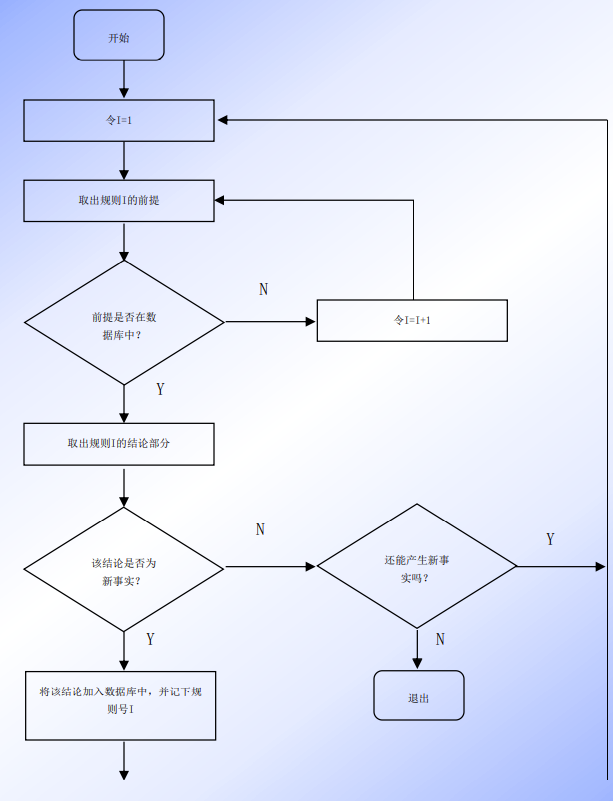

1. 函数recall
   - 函数表达式 `(recall fact)`
   - 函数功能：判断变量fact中的一个事实是否在表facts中，若是，recall返回值是fact中的事实；否则，返回nil。
   - 函数定义：
     ```
     (defun (recall fact)
       (cond ((member fact facts) fact)
         (t nil)))
     ```

2. 函数test-if
   - 函数表达式 `(test-if rule)`
   - 函数功能：判断变量rule中的一条规则的前件包含的全部事实是否在表facts中，若是，test-if返回t；否则，返回nil。
   - 函数定义：
     ```
     (defun (test-if rule)
       (prog (ifs)
       (setq ifs (cdadr rule))
       loop
       (cond ((null ifs) (return t))
         (recall (car ifs))
         (t (return nil)))
       (setq ifs (cdr ifs))
       (go loop)))
     ```

3. 函数remember
   - 函数表达式：`(remember new)`
   - 函数功能：判断变量new中的一个事实是否在表facts中，若是，remember返回nil，否则，将new中的事实添加到表facts的表头，且remember返回new中的事实。
   - 函数定义：
     ```
     (defun (remember new)
       (cond ((member new facts) nil)
         (t (setq facts (cons new facts)) new)))
     ```

4. 函数use-then
   - 函数表达式：`(use-then rule)`
   - 函数功能：判断变量rule中的一条规则的后件包含的全部结论是否在表facts中，若全部的结论都在facts中，则use-then返回nil；否则，将不在facts中的结论逐一添加到表facts中，则use-then返回t。
   - 函数定义：
     ```
     (defun (use-then rule)
      (prog (thens success)
        (setq thens (cdddr rule))
        loop
        (cond ((null thens) (return success))
          ((remember (car thens))
          (print (car rule))
          (print |DEDUCES| (car thens))
          (setq success t)))
        (setq thens (cdr thens))
        (go loop)))
     ```

5. 函数 try-rule
   - 函数表达式：`try-rule rule`
   - 函数功能：判断规则变量rule中的一条规则的前件包含的全部事实是否在表facts中，若全部事实都在facts中，且规则后件有不在facts中的结论，则把不在facts中的结论逐一添加到表facts中，try-rule返回t；否则，try-rule返回nil。
   - 函数定义：
     ```
     (defun (try-rule rule)
       (and (test-if rule) (use-then rule)))
     ```

6. 函数step-forward
   - 函数表达式：`(step-forward rules)`
   - 函数功能：逐次扫描规则库rules中的规则，若发现rules中有一条可用规则，即该规则的前件包含的全部事实在表facts中，则把规则后件中不在facts中的所有结论添加到表facts中，且step-forward返回t；若rules中没有一条可用规则，则step- forward返回nil。
   - 函数定义：
     ```
     (defun (step-forward rules)
       (prog (rule-list)
         (setq rule-list rules)
         loop
         (cond ((null rule-list) (return nil))
           ((try-rule (car rule-list)) (return t)))
         (setq rule-list (cdr rule-list))
         (go loop)))
     ```

7. 正向推理函数deduce
   - 函数表达式：`(deduce facts)`
   - 函数功能：连续不断的从规则库rules中选择可用规则，每选择到一条可用规则，就把该规则的后件中不在facts中的所有结论添加到facts中，对facts扩充，用更新后的facts来选择下一条可用规则对facts再次扩充，直到没有可用规则为止。若曾找到一条规则对facts进行一次扩充，则deduce返回t；否则，deduce返回nil。
   - 函数定义：
     ```
     (defun (deduce facts)
     (prog (progress)
     loop
     (cond ((step-forward rules) (setq progrss t))
       (t (return progress)))
     (go loop)))
     ```

仿真实验（略）

**反向推理机**
- 反向推理是对给定的一个假设fact，判断其是否为真。确定一个假设fact是否为真的函数为verify。

Verify定义
1. 若fact已在facts中，则fact为真，函数verify终止。
2. 若fact不在facts中，则从rules中选出所有的后件含有fact的可用规则组成可用规则表relevant1。若relevant1为空，则直接向用户询问fact的真假，若用户确认fact为真，则把fact放到facts中，函数verify终止。
3. 若relevant1不为空，则调用函数try-rule逐条作用于relevant1中的可用规则，试看是否直接最终推出fact，若推出fact，则fact为真，把fact添加到facts中，函数verify终止。
4. 若不能直接推出fact，则调用函数try-rule+逐条作用于relevant1中的可用规则，试看能否间接最终推出fact，若推出fact，则fact为真，把fact添加到facts中，函数verify终止。

函数try-rule+的间接推出与函数try-rule的直接推出两者不同之处
- try-rule调用函数test-if来判断一条规则的前件包含的全部事实是否在facts中，test-if函数调用函数recall来判断前件中一个事实是否为真。
- try-rule+调用函数test-if+来判断一条规则的前件包含的全部事实是否在facts中，而test-if+调用函数verify来判断前件中的一个事实是否为真。

反向推理用到的几个函数
1. 函数thenp
   - 函数表达式：`(thenp fact rule)`
   - 函数功能：判断fact是否存在于规则变量rule中的一条规则的后件中，若是，则函数thenp返回规则后件从fact开始的余下表；否则，thenp返回nil。
   - 函数定义：
     ```
     (defun (thenp fact rule)
       member fact (cdddr rule))
     ```
2. 函数inthen
   - 函数表达式：`(inthen fact)`
   - 函数功能：从规则库表rules中选出所有可用规则组成一个可用规则表，表中每一个元素是一条可用规则。若规则后件含有fact，则这条规则是一条可用规则，且函数inthen返回可用规则表。若没有一条可用规则，则返回空表。
   - 函数定义：
     ```
     (defun (inthen fact)
       (apply 'append
         (mapcar '(lambda (rule)
           (cond ((thenp fact rule)(list rule))
             (t nil))
             (rules)))))
     ```
3. 函数test-if+
   - 函数表达式：`(test-if+ rule)`
   - 函数功能：直接或间接地反向推理确定规则变量rule中的一条规则的前件包含的所有的条件是否都为真，若是，则函数test-if+返回t；否则，test-if+返回nil。
   - 函数定义：
     ```
     (defun (test-if+ rule)
       (prog (ifs)
       (setq ifs (cdadr rule))
       loop
       (cond ((null ifs) (return t))
         (verity (car ifs))
         (t (return nil)))
       (setq ifs (cdr ifs))
       (go loop)))
     ```
4. 函数try-rule+
   - 函数表达式：`(try-rule+ rule)`
   - 函数功能：若规则变量rule中的一条规则的前件包含的所有条件都能直接或间接地反向推理确认为真，且规则后件中有不在 facts中的结论，则把规则中不在facts中的结论添加到facts中，函数try-rule+返回t；否则， try-rule+返回nil。
   - 函数定义：
     ```
     (defun (try-rule+ rule)
       (and (test-if+ rule) (use-then rule)))
     ```
5. 函数verify
   - 函数表达式：`(verity fact)`
   - 函数功能：直接或间接地反向推理确定变量fact中的一个假设是否为真，若为真，函数verify返回t；否则verify返回nil。
   - 函数定义：
     ```
     (defun (verify fact)
       (prog (relevant1 relevant2)
         (cond ((recall fact) (return t)))
         (setq relevant1 (inthen fact))
         (setq relevant2 relevant1)
         (cond ((null relevant1)
           (cond ((member fact asked) (return nil))
             ((and (print |IS THIS TRUE:|fact) (read)) (remember fact) ;第二个分句的判断条件
               (return t)) ;第二个分句
             (t (setq asked (cons fact asked)) ;回答为假
               (return nil))))
           loop1
             (cond ((null relevant1) (go loop2))
             ((try-rule (car relevant1)) (return t)))
             (setq relevant1 (cdr relevant1))
             (go loop1)
           loop2
             (cond ((null relevant2) (go exit))
             ((try-rule+ (car relevant2)) (return t)))
             (setq relevant2 (cdr relevant2))
             (go loop2)
           exit
             (return nil))))
     ```

6. 反向推理机函数diagnose
   - 函数表达式：`(diagnose hypo)`
   - 函数功能：逐一确定假设表hypo中多个假设的真或假，对确定为真的假设给出屏幕说明。
   - 函数定义：
     ```
     (defun (diagnose hypo)
       (prog (poss)
       (steq poss hypo)
       loop
       (cond ((null poss)
         (print |NO HYPOTHESES CAN BE CONFIRMED|)
         (return))
         ((verify (car poss))
         (print |HYPOTHESES| (car poss))
         (print |IS TRUE|)))
         (setq poss (cdr poss))
         (go loop)))
     ```

**解释机制与解释器**
- 专家系统的解释：是对系统设计者或用户提出的问题给出解释或说明。
- 专家系统的解释器：是专家系统中为完成解释而设置的程序模块。

解释的方法

1、预置文本与路径跟踪法
- 最简单的解释方法是预置文本。
- 即把问题的解释预先用自然语言或其他易于理解的形式写好，插入程序段或相应的数据库中。在推理过程中或推理之后，一旦用户询问到已有预置解释文本的问题，只要把相应的解释文本添入解释框架，组织成对这个问题的解释提交给用户。
- 预置文本方法的缺点：对每一个可能的问题都要编制解释预置文本，甚至对一个问题要编制几个解释预置文本，大大增加了系统开发的工作量。

路径跟踪法
- 是对推理过程进行跟踪，将问题求解所使用的知识自动记录下来。当用户提出需要解释时，解释器向用户显示问题求解路径。
- 路径跟踪法向用户提供why和How解释。

正向推理机中函数try-rule的重新定义
```
(defun (try-rule rule)
  (cond ((and (test-if rule) (use-then rule))
    (setq rules-used (cons rule rules-used)) 
    t)))
```

反向推理机中函数try-rule+的重新定义
- 函数表达式：`(try-rule+ rule)`
- 函数功能：若规则变量rule中的一条规则的前件包含的所有条件都能直接或间接地反向推理确认为真，且规则后件中有不在 facts中的结论，则把规则中不在facts中的结论添加到facts中，并把rule中的这条规则添加到表rules-used的表头，函数try-rule+返回t；否则，try-rule+返回nil。
- 函数定义：
  ```
  (defun (try-rule+ rule)
    (cond ((and (test-if+ rule) (use-then rule))
      (setq rules-used (cons rule rules-used))
      t)))
  ```

函数usedp
- 函数表达式：`(usedp rulen)`
- 函数功能：若推理过程中使用过由规则名变量rulen记载的一个规则名指定的规则，则usedp返回t；否则，usedp返回nil。
- 函数定义：
  ```
  (defun (usedp rulen)
    (prog (poss)
    (setq poss rules-used)
    loop
    (cond ((null poss) (return nil)) 
      ((equal rulen (car poss)) (return t)))
    (setq poss (cdr poss))
    (go loop)))
  ```

2、How解释
- How解释用于回答用户关于“系统是怎样得出这一结论”的询问。
- 函数表达式：`(how fact)`
- 函数功能：告诉用户变量fact中结论是怎么得出的，若fact中的结论或假设是经推理确定为真，则找到支持这一结论或假设成立的规则，显示该规则前件的所有事实。若fact中的结论或假设是已在facts中给出的事实，则给出相应的说明。否则，fact中的结论或假设没有被确认。
- 函数定义：
  ```
  (defun (how fact)
    (prog (poss success)
    (setq poss rules-used)
    loop
    (cond ((null poss)
      (cond (success (return t))
        ((recall fact) (print fact |WAS GIVEN|) (return t))
        (t (print fact |IS NOT ESTABLISHED|) (return nil))))
      ((thenp fact (car poss))
      (setq success t)
      (print fact |IS DEMONSTRATED BY|)
      (mapcar ‘(lambda (a) (print a) (cdadr (car poss))))
      (setq poss (cdr poss))
      (go loop)))
  ```

- 若使用过规则表rules-used不为空，则调用函数thenp对规则表rule-used逐个规则判断fact是否是规则后件中的一个结论，若有这样的规则，则逐一把这些规则的前件包含的所有事实作为“是怎样得出fact结论”的解释。
- 屏幕上给出说明：fact中的结论“IS DEMONSTRATED BY”规则前件的所有事实

- 若使用过规则表rules-used为空或rules-used中没有一条规则的后件中有fact的结论，则调用函数recall判断fact是否是facts中的一个给出的事实，若是，则屏幕上给出说明：fact中的事实“WAS GIVEN”
- 若不是上述两种情况，则屏幕上给出说明：fact中的假设“IS NOT ESTABLISHED”

3、Why解释
- Why解释：用于回答用户关于“为什么需要这一个事实”的询问。
- 函数表达式：`(Why fact)`
- 函数功能：告诉用户为什么需要变量fact中的事实，若fact中的事实是在推理过程中作为一条规则的前件事实使用过，则找到这条规则，向用户说明fact中的事实用于支持这条规则的后件结论。若fact中的事实是以在facts中的给定事实，则给出相应的说明。否则，fact中的事实没有被确认。
- 函数定义：
  ```
  (defun (why fact)
    (prog (poss success)
    (setq poss rules-used)
    loop
    (cond ((null poss) 
      (cond (success (return t))
        ((recall fact) (print fact |WAS HYPOTHESIS|) (return t))
        (t (print fact |IS NOT ESTABLISHED|) (return nil))))
  
    ((ifp fact (car poss))
      (setq success t)
      (print fact |NEEDED TO SHOW|)
      (mapcar ‘(lambda (a) (print a) (cdaddr (car poss))))
    (setq poss (cdr poss))
    (go loop)))))
  ```

- 其中函数ifp用于判定fact是否在规则的if部分中。
- Ifp定义：`(defun (ifp fact rule) (member fact (cdadr rule)))`
- 若fact中的事实是在推理过程中作为使用过规则表rules-used中某些规则的前件事实使用过，则逐一把这些规则的后件结论作为“为什么需要fact事实”的解释，在屏幕上说明：fact中的事实“NEEDED TO SHOW”规则后件的结论。

- 若fact中的事实没有被规则使用过，则判断fact是否是facts中已被确认的事实，若是，则屏幕上给出说明：fact中事实“WAS HYPOTHESIS”
- 若不是上述两种情况，则屏幕上直接给出说明：fact中的事实“IS NOT ESTABLISHED”

...
