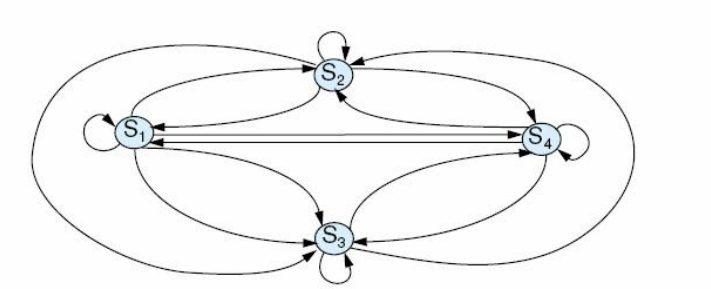
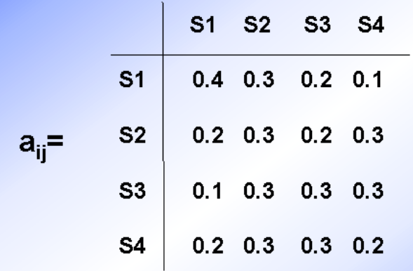

## 9.0 简介
我们必须用不可靠的推理规则从形式不规则和不确定的证据中得出有用的结论。
我们在现实生活中的几乎所有方面都做到了这一点。

如果发动机不转而且灯不亮，那么电池或电缆有问题。
有趣的是这条规则的逆为真：如果电池或电缆有问题，那么发动机不转而且灯不亮。

反绎推理是不可靠的推理，意思是说在前提为真的任一解释下，结论不一定为真。
反绎推理是不可靠的，但它对于解决问题来说确实重要的。

形式上反绎推理认为从 $P \rightarrow Q$ 和Q可能推出P。

**知识的不确定性**
专家系统中的不确定性表现在三个方面

证据的不确定性
- 证据的歧义性
- 证据的不完全性
  - 证据尚未收集完全
  - 证据的特征值不完全
- 证据的不精确性
- 证据的模糊性
- 证据的可信性
- 证据的随机性

规则的不确定性
- 构成规则前件的模式的不确定性
- 观察证据的不确定性
- 规则前件的证据组合的不确定性
- 规则本身的不确定性
- 规则结论的不确定

在规则使用过程中，有两种典型的使用规则的不确定性
- 在推理过程中，若有多条规则可用时，则需要通过冲突消解从多条可用规则中选择一条规则激发。冲突消解策略包含有使用规则的不确定性。
- 在反向推理过程中，若有多个假设需要通过推理来验证时，先选择哪一个假设进行反向推理验证同样包含有使用规则的不确定性。

**推理的不确定性**是指：由于证据的不确定性和规则的不确定性在推理过程中的动态积累和传播从而导致推理结论的不确定性。

不确定性测度的计算有以下三种基本的计算模式
1. 证据组合的不确定性测度计算模式
   - 己知证据 $e_1, e_2, ..., e_n$ 的不确定性测度为 $MU_1, MU_2, ..., MU_n$，求出逻辑组合的不确定性测度。（其中证据的逻辑组合有三种基本形式。）
   - 证据的合取组合的不确定性测度：$e_1, e_2, ...,e_n$ 的合取组合为 $e_1 \wedge e_2 \wedge ... \wedge e_n$，n个证据合取组合的不确定性测度为 $MU = f(MU_1, MU_2, ..., MU_n)$
   - 证据的析取组合的不确定性测度：$e_1, e_2, ...,e_n$ 的析取组合为 $e_1 \vee e_2 \vee ... \vee e_n$，n个证据析取组合的不确定性测度为 $MU = g(MU_1, MU_2, ..., MU_n)$
   - 证据的否定的不确定性测度：证据 $e_i$ 的否定为 $\bar{e_i}$，证据 $e_i$ 的否定的不确定性测度为 $MU = n(MU_i)$。
2. 并行规则的不确定性测度计算模式
   - 已知有多条规则if ei then h有相同的结论h，各条规则的不确定性测度为 $MU_i, i = 1, 2, ..., n$。若n条规则都被满足，那么，结论h的不确定性测度为 $MU = p(MU_1, MU_2, ...,MU_n)$。
   - 这一计算模式也称为并行法则。并行法则给出了推理过程中有多条路径导致同一结论的情况下，由规则的不确定性而导致结论的不确定性测度的计算模式。
3. 顺序（串行）规则的不确定性测度计算模式
   - 己知两条规则if e then e'和if e' then h的规则不确定性测度分别为 $MU_1$ 和 $MU_2$，那么，规则if e then h的规则不确定性测度为 $MU = s(MU_1, MU_2)$。
   - 这一计算模式也称为顺序法则。顺序法则给出了规则不确定性在推理链中传播的计算模式。

对于一个专家系统，给定上述三种计算模式的不确定性测度计算方法，就可获得证据不同组合的不确定性测度值，并根据在推理过程中使用规则的情况，由并行法则和顺序法则最终得出结论的不确定性测度值。
在不同的专家系统中，不确定性测度的计算方法可以不同。根据不确定性测度计算方法的不同，不确定推理可以有基于概率理论的不确定推理、基于可信度理论的不确定推理和基于模糊理论的不确定推理等。

## 9.2 反绎：逻辑之外的办法

### 9.2.1 Stanford确信度代数
第一个假定是把一个关系的支持度和不支持度分开：
- $MB(H|E)$ 称为给定证据E时假设H的可信度量。
- $MD(H|E)$ 称为给定证据E时假设H的不可信度量。

现在或者：
- 当 $MD(H|E) = 0$ 时 $1 > MB(H|E) > 0$，或者
- 当 $MB(H|E) = 0$ 时 $1 > MD(H|E) > 0$。

可信度量和不可信度量可以通过下面的公式连接在一起：
$CF(H|E) = MB(H|E) - MD(H|E)$

对规则前提P1和P2的组合确信度因子：
- $CF(P1 and P2) = MIN(CF(P1), CF(P2))$
- $CF(P1 or P2) = MAX(CF(P1), CF(P2))$

用上面的规则合并后的前提的CF乘上规则自身的CF就得到规则结论的CF。

另一项措施：当两个或多个规则支持同一结论R时，怎么来合并这么多个CF呢？
假定此时结论R的当前确定度为CF(R1)，以前没用到的规则也得出结论R，确信度为CF(R2)。那么R的新确定度CF用下面的公式来计算：
- 当CF(R1)和CF(R2)都为正时 $CF(R1) + CF(R2) - (CF(R1) \times CF(R2))$
- 当CF(R1)和CF(R2)都为负时 $CF(R1) + CF(R2) + (CF(R1) \times CF(R2))$
- 其他情况下，$\frac{CF(R1) + CF(R2)}{1 - MIN(|CF(R1)|, |CF(R2)|)}$，其中|X|代表X的绝对值。

**1. 信任度与不信任度**
定义1：信任度 $MB(h, e)$ 表示证据e出现时，对证据h成立的信任程度的增加量。不信任度 $MB(h, e)$ 表示证据e出现时，对结论h成立的不信任程度的增加量。$MB(h, e)$ 和 $MD(h, e)$ 的取值范围为 $[0, 1]$。他们形式化地定义为（记为1式和2式）：
$$
MB(h, e) = \left\{\begin{matrix}
 1 &,P(h) = 1 \\
 \frac{max(P(h|e), P(h))-P(h)}{1 - P(h)} &,P(h) \neq 1
\end{matrix}\right.
$$

$$
MD(h, e) = \left\{\begin{matrix}
 1 &,P(h) = 0 \\
 \frac{min(P(h|e), P(h))-P(h)}{- P(h)} &,P(h) \neq 0
\end{matrix}\right.
$$

其中，$P(h)$ 为结论h成立的先验概率；$P(h|e)$ 为在证据e出现的条件下，结论h成立的条件概率。

**$MD(h, e)$ 和 $MB(h, e)$ 的性质**
性质1（互斥率）：一个证据e不可能既支持又不支持某个结论h，因此有：
- 如果 $MB(h, e) > 0$，则 $MD(h, e) = 0$
- 如果 $MD(h, e) > 0$，则 $MB(h, e) = 0$

性质2：若 $P(h|e) > P(h)$，表明证据e的出现增加了对结论h成立的信任程度，但是，不改变对结论h成立的不信任程度。
若 $P(h|e) > P(h)$，由1式可见，有 $MB(h, e) > 0$；由2式可见，有 $MD(h, e) = 0$。

性质3：若 $P(h|e) = P(h)$，表明证据e的出现不改变对结论h成立的信任程度，也不改变对结论h成立的不信任程度，即表明证据e与结论h之间相互独立。
若 $P(h|e) = P(h)$，由1式可见 $MB(h, e) = 0$；由2式可见，有 $MD(h, e) = 0$。即信任程度与不信任程度都不变。

性质4：若 $P(h|e) < P(h)$，表明证据e的出现增加了对结论h成立的不信任程度，但是，不改变对结论h成立的信任程度。
若 $P(h|e) < P(h)$，由1式可见 $MB(h, e) = 0$；由2式可见，有 $MD(h, e) > 0$。

**2. 可信度**
在可信度不确定推理模型中，把信任度MB与不信任度MD组合成一个单一的不确定性测度，这就是可信度。

定义2：可信度形式化地定义为（式3）：
$$
CF(h, e) = MB(h, e) - MD(h, e)
$$
由 $CF(h, e), MB(h, e)m MD(h, e)$ 的定义3式、1式和2式以及 $MB(h, e)$ 与 $MD(h, e)$ 的互斥性质，可得出 $CF(h, e)$ 的计算公式为（式4）：
$$
CF(h, e) = \left\{\begin{matrix}
 1 &,P(h) = 1 \\
 \frac{P(h|e) - P(h)}{1 - P(h)} &,P(h|e) > P(h) \\
 0 &,P(h|e) = P(h) \\
 \frac{P(h|e) - P(h)}{P(h)} &,P(h|e) < P(h) \\
 -1 &,P(h) = 0
\end{matrix}\right.
$$

由4式可直观地看出可信度的意义
1. 若 $CF(h, e) > 0$，则 $P(h|e) > P(h)$。说明证据e的出现增加了结论h为真的概率，即增加了h为真的可信度，$CF(h, e)$ 的值越大，增加h为真的可信度就越大。若 $CF(h, e) = 1$，则可推出 $P(h|e) = 1$，即证据e的出现使h为真。
2. 若 $CF(h, e) < 0$，则 $P(h|e) < P(h)$。说明证据e的出现减少了结论h为真的概率，即增加了h为假的可信度，$CF(h, e)$ 的值越小，增加h为假的可信度就越大。若 $CF(h, e) = -1$，则可推出 $P(h|e) = 0$，即证据e的出现使h为假。
3. 若 $CF(h, e) = 0$，则 $P(h|e) = P(h)$。表示h和e独立，即证据e的出现对h没有影响。

当已知 $P(h)$ 和 $P(h|e)$ 时，通过上述计算公式就可求出 $CF(h, e)$。但是，在实际应用中，获得 $P(h)$ 和 $P(h|e)$ 的值是比较困难的，$CF(h, e)$ 的值反而比较容易通过领域专家直接给出。

**设定 $CF(h, e)$ 的值的原则**
若相应证据e能增加结论h为真的可信度，则使 $CF(h, e) > 0$，证据e越是支持h为真，就使 $CF(h, e)$ 越大；反之，使  $CF(h, e) < 0$，证据e越是支持h为假，就使 $CF(h, e)$ 值越小；若证据e与h无关，则使 $CF(h, e) = 0$。
1. 根据前提和规则的可信度求结论的可信度。
2. 使用两个独立证据和两条不同规则导出的同一结论的可信度。
3. 合取证据的可信度。
4. 析取证据的可信度。

...

## 9.3 处理不确定性的随机方法
...

### 9.3.5 马尔可夫模型：离散马尔可夫过程
在5.3节，我们介绍了概率有限状态自动机（probabilistic finite statemachine），状态自动机的下一个状态函数表示对当前状态的概率分布。
离散马尔可夫过程（discrete Markov process）就是这种方法的特例，系统忽略其输入值。
系统在规则间隔的离散时间点进行状态变化，并且有可能保持同一状态不变。

有 $s_1, s_2, ..., s_4$ 四个状态的马尔可夫状态机或者说马尔科夫链。

- 在马尔科夫链中，系统在任何特定状态 $\sigma_t$ 的概率是：$P(\sigma_t) = P(\sigma_t | \sigma_{t-1}, \sigma_{t-2}, \sigma_{t-3}, ...)$
- 在一阶马尔科夫链（first-order Markov chain）中，当前状态的概率是仅与直接前驱状态有关的函数：$P(\sigma_t) = P(\sigma_t | \sigma_{t-1})$

**（可观测的）马尔可夫模型**
- 一个图模型称为（可观测的）马尔可夫模型，当图为有向图，并且在某个离散时刻t，到达一组状态S中任一状态 $s_t$ 的概率是S中前一时刻对应状态的概率分布的函数。S中的每个状态 $s_t$，对应一个物理可观察的情况。
- 一个可观测的马尔可夫模型是一阶的，当其在任一时刻t处于状态 $s_t$ 的概率只是与前一时刻t-1所处状态 $s_{t-1}$ 有关的函数，$s_t$ 和 $s_{t-1}$ 都是S中可观察的状态。

给定 $S = \{s_1, s_2, ..., s_N\}$，我们能够建立任意两个状态 $s_i$ 和 $s_j$ 之间的转移概率 $a_{ij}$：
$a_{ij} = P(\sigma_t = s_j | \sigma_{t-1} = s_i), 1 \le i, j \le N$，对每个状态 $s_i$：$a_{ij} \ge 0, 且 \sum_{i=1}^{N} a_{ij} = 1$

**例：考虑一个特定地点的中午天气。**
- 假设这个地点的天气变量weather具有四个不同的离散状态：
  - s1 = sunny（晴）
  - s2 = cloudy（多云）
  - s3 = fog（雾）
  - s4 = precipitation（降水）
- 这个马尔可夫模型的时间间隔是连续的每天中午。

上述转移矩阵确定了一阶马尔可夫模型M。

$O = s_1, s_1, s_1, s_2, s_2, s_4$
$$
P(O|M) = p(s_1, s_1, s_1, s_2, s_2, s_4|M) \\
        = p(s_1) p(s_1|s_1) p(s_1|s_1) p(s_2|s_1) p(s_2|s_2) p(s_4|s_2) \\
        = 1 \times a_{11} \times a_{11} \times a_{12} \times a_{22} \times a_{24} \\
        = 0.0432
$$

已知今天天气，确定接下来的t天天气保持不变的概率，即天气在第t+1天发生变化。$P(O|M) = 1 \times a_{ii}^{t} \times (1 - a_{ii})$

基于这个值，给定任意一个可观察的状态 $s_i$，我们可以用模型M来计算该状态的期望值，或者说期望区间 $d_i$：$d_i = \sum_{d=1}^{n} d(a_{ii})^{(d-1)} (1 - a_{ii})$。当n趋向于无穷时，化为 $d_i = \frac{1}{a-a{ii}}$。

### 9.3.6 马尔可夫模型：变形
- 隐马尔可夫模型
- 半马尔可夫模型
- 马尔可夫决策过程

...
